<a href="https://velokey.ai?sourceChannel=github-awesome-seedream">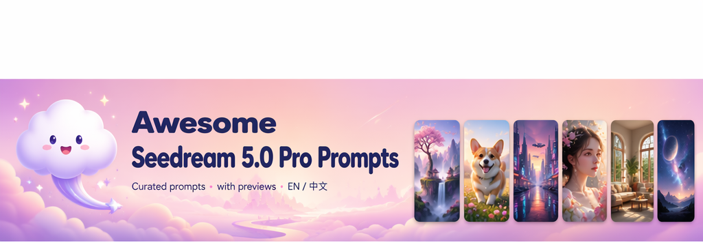</a>

# 🎨 Seedream 5.0 Pro 神级提示词合集

[English](README.md) · **简体中文**

[](https://github.com/sindresorhus/awesome) [](https://github.com/velokey-ai/awesome-seedream-5.0-pro-prompts/issues/new?template=submit-prompt.yml) [](https://creativecommons.org/licenses/by/4.0/)

> 精选社区疯传的 **Seedream 5.0 Pro** 创意提示词，全部标注原作者与出处。
>
> ⚡ 想直接跑这些提示词？**[Velokey](https://velokey.ai?sourceChannel=github-awesome-seedream)** 一个 API 调用 Seedream、Nano Banana、GPT Image 等主流模型，一个 Key，按量付费。

> ⚠️ **版权说明**：所有提示词与图片均收集自公开社区帖子，仅作学习交流，均已标注作者与来源。如有侵权请提 Issue，我们会第一时间删除。

## 📊 数据统计

| 📝 提示词总数 | ⭐ 精选 | 🏷️ 分类数 | 🔄 最近更新 |
|---|---|---|---|
| **47** | **14** | **6** | 2026-07-18 09:09 UTC |

## 🗂️ 按分类浏览

<details open><summary><b>🧑 人像与头像</b> (21)</summary>

- [⭐ No.16 电话亭 Y2K 暗系人像](#no16-电话亭-y2k-暗系人像)
- [⭐ No.19 林间国风神女](#no19-林间国风神女)
- [No.1 暗调梦幻高定全身像](#no1-暗调梦幻高定全身像)
- [No.2 真实车内自拍首帧](#no2-真实车内自拍首帧)
- [No.3 逆光雀斑特写自拍](#no3-逆光雀斑特写自拍)
- [No.6 湖边 Vespa 复古人像](#no6-湖边-vespa-复古人像)
- [No.9 静奢风街拍时尚](#no9-静奢风街拍时尚)
- [No.13 旧金山黄昏韩系人像](#no13-旧金山黄昏韩系人像)
- [No.17 咖啡馆街拍甜酷少女](#no17-咖啡馆街拍甜酷少女)
- [No.18 午后街拍侧逆光人像](#no18-午后街拍侧逆光人像)
- [No.23 极简高定时尚特写](#no23-极简高定时尚特写)
- [No.31 御姐风暗调时尚特写](#no31-御姐风暗调时尚特写)
- [No.35 柔光 pastel 室内人像](#no35-柔光-pastel-室内人像)
- [No.36 红金古风 cosplay](#no36-红金古风-cosplay)
- [No.37 雪中回眸人像](#no37-雪中回眸人像)
- [No.38 月夜檐廊人像](#no38-月夜檐廊人像)
- [No.40 摩天楼仰角街拍](#no40-摩天楼仰角街拍)
- [No.41 红纱丽宫廷人像](#no41-红纱丽宫廷人像)
- [No.43 古风书阁纪实人像](#no43-古风书阁纪实人像)
- [No.45 滑板运动风人像](#no45-滑板运动风人像)
- [No.47 摩天轮波西米亚夏日](#no47-摩天轮波西米亚夏日)

</details>

<details open><summary><b>🧊 产品与质感</b> (3)</summary>

- [⭐ No.8 未来运动鞋电商广告](#no8-未来运动鞋电商广告)
- [No.10 球衣质感产品静物](#no10-球衣质感产品静物)
- [No.25 保时捷911汽车广告](#no25-保时捷911汽车广告)

</details>

<details open><summary><b>🎴 卡片与海报</b> (8)</summary>

- [⭐ No.11 编辑风动感海报模板](#no11-编辑风动感海报模板)
- [⭐ No.12 真实产品×涂鸦创意广告](#no12-真实产品涂鸦创意广告)
- [⭐ No.29 科幻电影海报 Lazarus One](#no29-科幻电影海报-lazarus-one)
- [⭐ No.33 1980s 胡子膏广告分镜](#no33-1980s-胡子膏广告分镜)
- [⭐ No.42 City Jump 街头海报](#no42-city-jump-街头海报)
- [No.4 赛博朋克安卓海报](#no4-赛博朋克安卓海报)
- [No.5 玻璃花 editorial 海报](#no5-玻璃花-editorial-海报)
- [No.7 儿童黏土玩具广告](#no7-儿童黏土玩具广告)

</details>

<details open><summary><b>🎨 风格转绘</b> (6)</summary>

- [⭐ No.46 红底暗黑 webtoon 插画](#no46-红底暗黑-webtoon-插画)
- [No.15 日式田园电影感空镜](#no15-日式田园电影感空镜)
- [No.24 黏土定格烘焙师](#no24-黏土定格烘焙师)
- [No.26 雨中武士电影镜头](#no26-雨中武士电影镜头)
- [No.27 1970s 纪实人像](#no27-1970s-纪实人像)
- [No.30 80-90 年代 OVA 动漫](#no30-80-90-年代-ova-动漫)

</details>

<details open><summary><b>📊 信息图与教育</b> (3)</summary>

- [⭐ No.20 Seedream 杂志跨页信息图](#no20-seedream-杂志跨页信息图)
- [No.14 蓝图技术分解图](#no14-蓝图技术分解图)
- [No.34 多语言海报文字替换](#no34-多语言海报文字替换)

</details>

<details open><summary><b>🌀 创意脑洞</b> (6)</summary>

- [⭐ No.21 三视图角色设定](#no21-三视图角色设定)
- [⭐ No.32 四象眼眸四屏写真](#no32-四象眼眸四屏写真)
- [⭐ No.39 漫画等距剖面模型](#no39-漫画等距剖面模型)
- [⭐ No.44 云雾天狐幻境](#no44-云雾天狐幻境)
- [No.22 黑白漫画分格页](#no22-黑白漫画分格页)
- [No.28 3D 动画毛怪衣柜](#no28-3d-动画毛怪衣柜)

</details>

## 📋 全部提示词

### No.8 未来运动鞋电商广告

  

<div align="center">

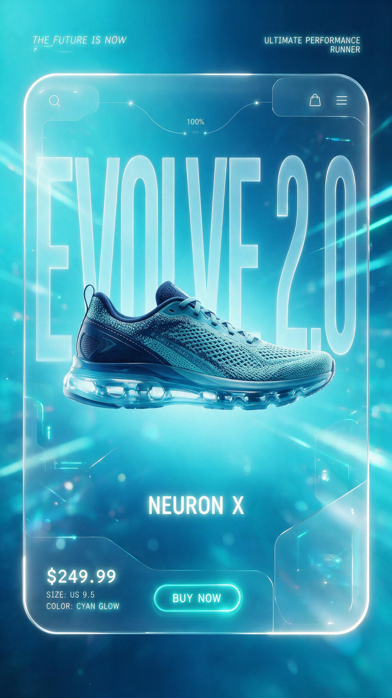 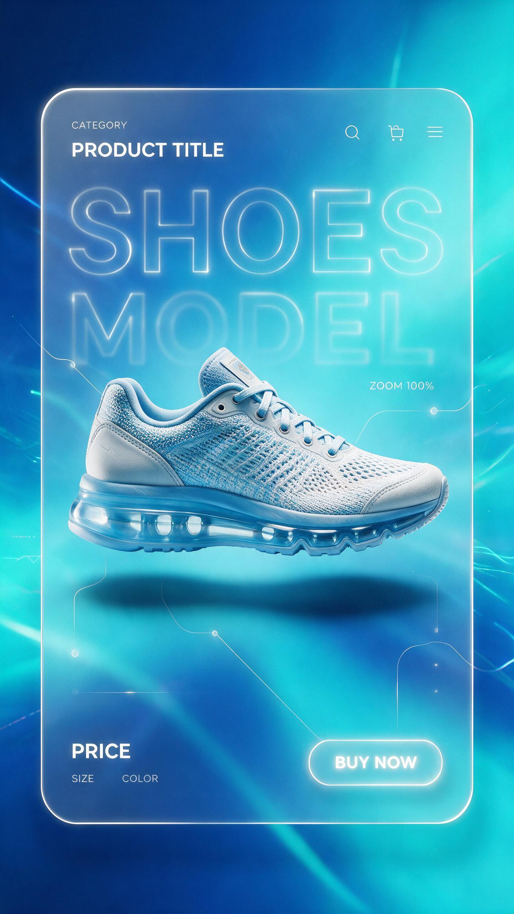

</div>

**📝 提示词:**

```
Ultra-realistic premium sports footwear commercial advertisement featuring a modern running shoe floating horizontally at the center of a futuristic cyan and deep blue gradient background. The sneaker is displayed in a clean side profile with ultra-detailed breathable knit mesh texture, glossy air-cushion sole, realistic stitching, premium materials, and crisp branding. Soft cinematic studio lighting creates realistic reflections, shadows, and depth.

The composition is designed as a futuristic e-commerce product showcase inside a rounded glass-inspired interface with glowing white borders and translucent frosted panels. Large semi-transparent typography spelling the shoe model fills the background, creating depth without overpowering the product.

Minimal modern UI elements surround the shoe, including elegant category labels, product title, search icon, shopping bag icon, menu icon, zoom percentage indicator connected by thin curved lines, price tag, size selector, color option, and a glowing rounded “BUY NOW” button. Add subtle neon cyan highlights, holographic interface accents, floating particles, soft bloom, and glassmorphism effects.

Use a premium blue color palette with turquoise gradients, high-end sports branding aesthetics, luxury product presentation, Apple-inspired minimalism, futuristic web UI, perfect spacing, clean typography, ultra-sharp details, cinematic lighting, soft ambient glow, 3D depth, photorealistic textures, commercial advertising quality, Behance award-winning layout, 8K, HDR, octane render, Unreal Engine, global illumination, ray-traced reflections, ultra-realistic product photography.
```

**👤 出处:** [@iamrealsnow](https://x.com/iamrealsnow) · [source](https://x.com/iamrealsnow/status/2075063569486598281)

▶️ **用 API 跑这条提示词** → [Velokey](https://velokey.ai?sourceChannel=github-awesome-seedream)（模型 id：`seedream-5.0-pro`）

---

### No.11 编辑风动感海报模板

  

<div align="center">

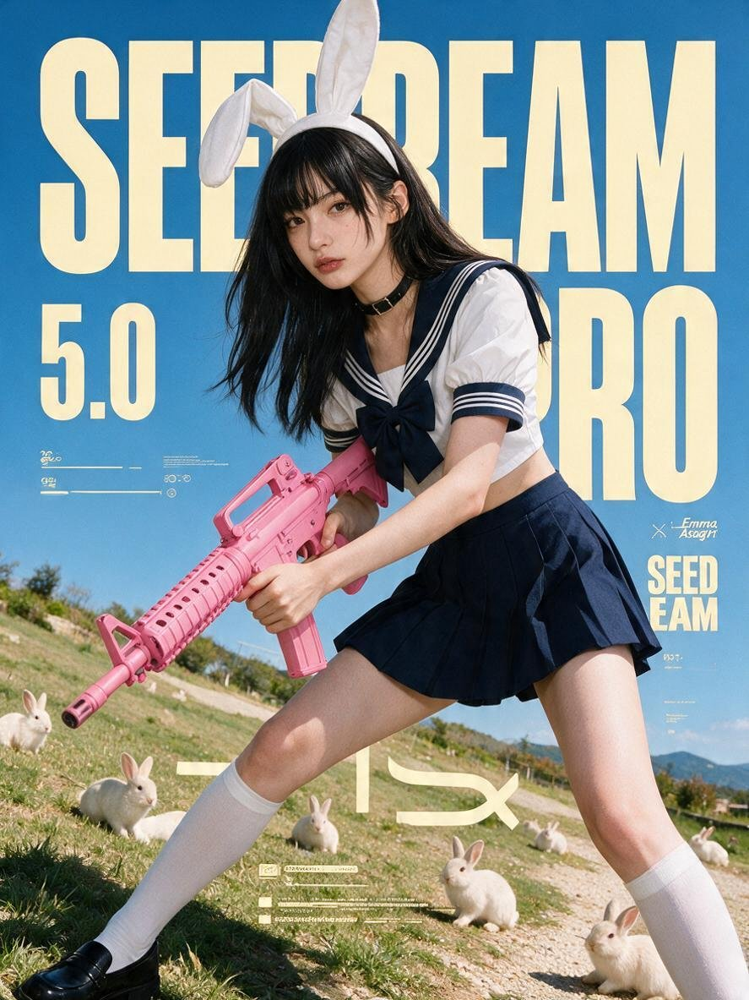

</div>

**📝 提示词:**

```
Create a {ASPECT_RATIO} full-bleed editorial action poster for [Brand Name]. The brand’s visual identity follows these must-visible traits: a bright outdoor photograph with a clear open sky dominating a large portion of the frame; enormous warm-cream extra-condensed block letters cropped by the canvas and sitting behind the main subject; one oversized action figure cutting diagonally across the layout and breaking through the text layer; a low or close wide-angle camera angle that makes the foreground feel physically imposing; secondary text, large numerals, or stacked words in cream placed along bottom and side edges; compact white editorial microcopy in short tight clusters anchored to strong grid positions; one vivid accent color concentrated on the hero product or outfit while the environment stays sky-blue and neutral; hard midday sunlight with crisp shadows and high-contrast edges; a layered structure alternating between flat graphic type and real photography; minimal ornament — only small marks, rules, or separators; a dense, kinetic layout with the action dominant, type second, and microcopy third.

Scene: {SUBJECT} is {SUBJECT_ACTION} with {PRODUCT_OR_PROP} in {LOCATION}, surrounded by {BACKGROUND_ELEMENTS}.

Camera & Composition: Low or close wide-angle outdoors, oversized foreground scale, decisive frozen motion, one strong diagonal, subject cropped by at least one canvas edge.

Typography: Place massive warm-cream ultra-condensed block sans lettering reading {MAIN_TEXT} behind the subject, filling over half the canvas, cropped by the frame and partially hidden by the action. Add compact white microcopy reading {SECONDARY_TEXT} in tight editorial blocks. Include a small generic {ACCENT_SYMBOL} mark and bottom information clusters in cream.

Wardrobe: {WARDROBE_STYLE}. Brand colors: saturated sky-blue or cyan dominant, warm cream type, crisp white microcopy, deep shadows, one vivid accent on the hero prop or wardrobe.

Lighting & Finish: Hard midday sun, crisp shadows, high-contrast commercial photo realism, slight print-grain texture. No illustration, 3D rendering, real logos, or watermarks.

Avoid: {SOURCE_CONTENT_TO_AVOID}. Also exclude: real brand logos, watermarks, QR codes, comic or halftone effects, 3D renders, dark studio scenes, muted palettes, or a tiny distant subject.

Generate as a 4K Ultra-high-resolution raster image.
```

> 💡 使用说明: 参数化模板 {占位符}

**👤 出处:** [@AI__TSUBAKI](https://x.com/AI__TSUBAKI) · [source](https://x.com/AI__TSUBAKI/status/2075128188964159539)

▶️ **用 API 跑这条提示词** → [Velokey](https://velokey.ai?sourceChannel=github-awesome-seedream)（模型 id：`seedream-5.0-pro`）

---

### No.12 真实产品×涂鸦创意广告

  

<div align="center">

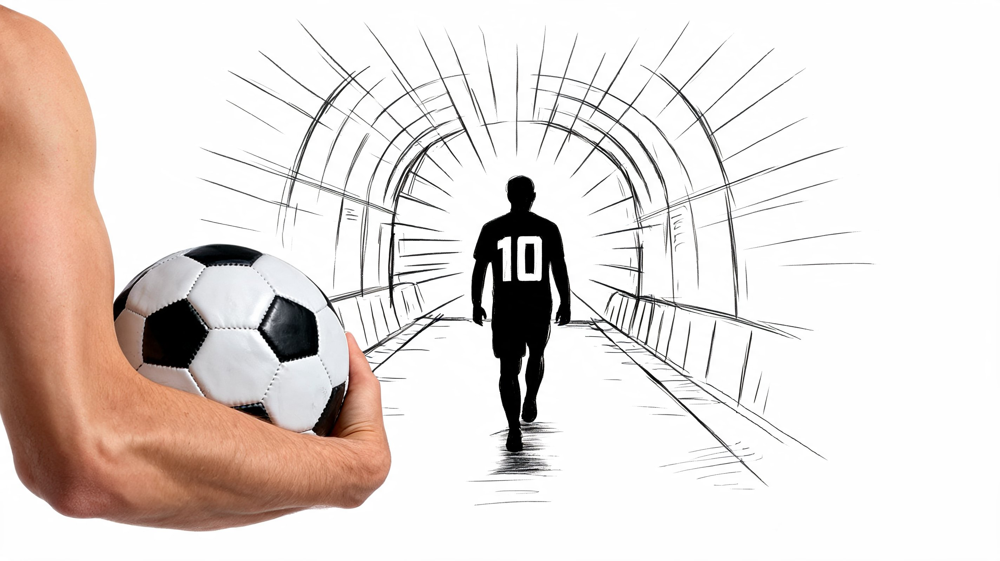 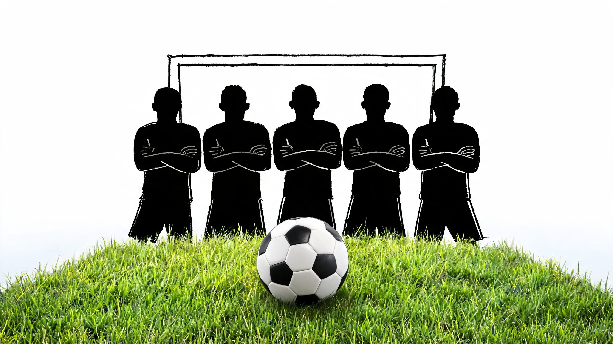

</div>

**📝 提示词:**

```
Creative composite brand advertisement, 16:9 horizontal aspect ratio, clean white background, studio lighting, sharp focus. A real-life photograph of a [BRAND PRODUCT] is physically placed and seamlessly integrated with a hand-drawn black ink cartoon illustration. The drawing is simple, expressive line art with minimal shading — like a quick sketch on paper. A cartoon character is [SCENE], interacting naturally with the real product as if it exists in their world. At the top, the [BRAND] slogan in clean bold sans-serif typography. At the bottom, the real brand logo rendered in full original colors and proportions. Photorealistic product + bold black doodle art, perfect seamless blend between drawn and real elements, witty scroll-stopping brand ad aesthetic, high contrast, minimalist composition, trending creative ad design.
```

> 💡 使用说明: 参数化模板 [占位符]

**👤 出处:** [@ZephyraLeigh](https://x.com/ZephyraLeigh) · [source](https://x.com/ZephyraLeigh/status/2075551476345442582)

▶️ **用 API 跑这条提示词** → [Velokey](https://velokey.ai?sourceChannel=github-awesome-seedream)（模型 id：`seedream-5.0-pro`）

---

### No.16 电话亭 Y2K 暗系人像

  

<div align="center">

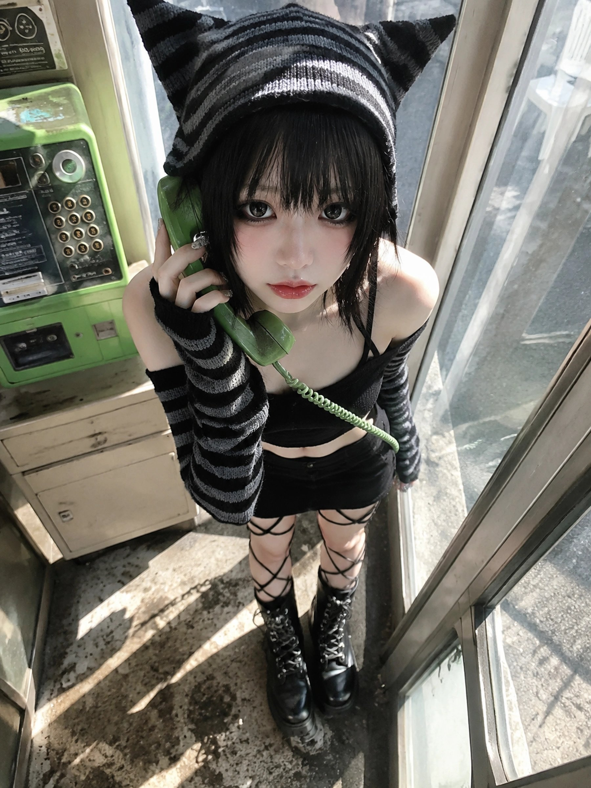 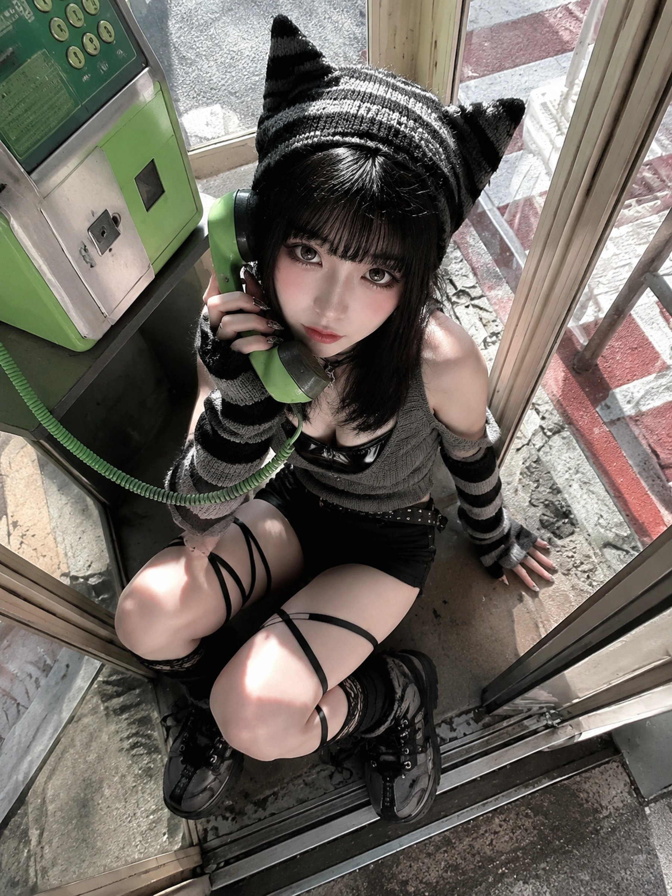

</div>

**📝 提示词:**

```
{   "subject": {     "description": "A young adult woman crouching inside a retro public phone booth, wearing a black-and-gray striped cat-ear knit hood and dark Y2K styling. She holds a green public phone receiver and looks up toward a camera shooting from above. The overall style mixes goth-lolita, Y2K emo, Japanese alternative doll fashion, and harsh-sunlight mobile snapshot realism.",     "mirror_rules": "Not a mirror selfie; do not show a mirror or a phone covering the face. Keep the direct upward gaze toward a high-angle camera.",     "age": "young adult, early 20s appearance; avoid underage or overly childlike styling",     "expression": {       "eyes": {         "look": "large glossy eyes with strong black eyeliner, quiet and slightly melancholic, with a doll-like hollow softness",         "energy": "low-intensity, focused, faintly distant, as if caught right after picking up the phone",         "direction": "looking upward into the camera from below"       },       "mouth": {         "position": "lips naturally closed or lightly relaxed",         "energy": "controlled, quiet, not smiling broadly"       },       "overall": "cool, sweet-dark, slightly emo and still"     },     "face": {       "preserve_original": "Preserve the small face, soft chin, large eye proportion, thick bangs across the forehead, heavy eyeliner, lower-eye shadow, pale pink blush, and softly glossy lip makeup.",       "makeup": "Makeup inspired by East Asian goth-lolita and Y2K emo styling: lifted black eyeliner, clear lower eyeliner, under-eye shadow, separated lashes, slight smoky eye contour, pale pink blush, and glossy cool-rose to nude-pink gradient lips."     }   },   "hair": {     "color": "black or very dark brown-black",     "style": "short to medium-length hair ending around the shoulders and neck, with thick broken bangs over the forehead and side strands close to the cheeks",     "effect": "slightly messy with real flyaways and mild frizz; strong sunlight creates fine highlights on the bangs and crown, while the shadowed areas stay deep black"   },   "body": {     "frame": "slender and small-framed, with a light shoulder and neck line; the high-angle wide lens makes the head and eyes more prominent while compressing the body downward",     "waist": "the waist and midriff are mostly covered by the top and bottom, with only a small edge of skin possibly visible between garments; do not make it the main exposed area",     "chest": "the chest is mostly covered by the gray knit cropped top and black glossy inner layer, with collarbones, shoulders, and the upper chest edge visible; do not exaggerate volume",     "legs": "both legs are clearly visible in a crouched pose, with large areas of front thigh and knee-adjacent skin exposed; black crisscross straps and lace or net-like hosiery details wrap the legs, with chunky high-top shoes or boots",     "skin": {       "visible_areas": "Visible skin includes the face, neck, collarbones and upper chest edge, both shoulders, parts of the upper arms, both hands and fingers, both thighs, knee-adjacent areas, and leg skin seen between the straps. The back, buttocks, and full waist-hip line are not visible.",       "tone": "fair cool ivory skin, extremely bright under direct sunlight, with slight overexposure on the thighs and hands; shadow areas carry subtle blue-gray and green glass reflections",       "texture": "the skin should feel soft, fine, and sun-warmed, with a faint powdery surface, real pores, and natural tonal transitions; the thigh skin should read as soft and warm under harsh light, not plastic or overly smoothed",       "lighting_effect": "hard direct sunlight enters diagonally through the phone booth glass and frame, hitting the face, shoulders, hands, thighs, and knees with crisp bright patches, sharp shadows, local overexposure, and strong light-dark separation"     }   },   "pose": {     "position": "crouching or half-kneeling on the narrow phone booth floor, body leaning slightly forward, head lifted toward the camera above",     "base": "one hand holds the green public phone receiver near the side of the face, while the other hand supports the body on the floor with naturally spread fingers; both legs bend into the lower part of the frame",     "overall": "the pose is constrained by the booth, quiet and slightly tense, as if she was suddenly photographed from above; keep the body tilt and cramped framing instead of a polished studio pose"   },   "clothing": {     "top": {       "type": "black-and-gray striped cat-ear knit hood, gray knit cropped top, black glossy inner or corset-like top, and black-gray striped long arm warmers",       "color": "black, charcoal gray, pale gray-white stripes, and gray knit",       "details": "the hood has clear pointed cat ears, the shoulders are exposed, the arm warmers have wide horizontal knit stripes, and the chest area layers gray ribbed knit over black glossy fabric, creating a dark academy and emo streetwear feeling",       "effect": "the knit fabric has visible ribbing, thickness, and yarn texture; the black glossy inner layer catches sunlight and contrasts with the matte knit"     },     "bottom": {       "type": "black shorts or mini bottom, crisscross leg straps, lace/net hosiery details, and chunky high-top shoes or boots",       "color": "mostly black with worn gray-black footwear",       "details": "black waist belt with metal buckle, thin black straps crossing around the legs, shoes with multiple laces, metal eyelets, buckles, and worn surfaces",       "effect": "the bottom and leg straps create strong graphic lines across the legs; the heavy footwear adds a rough worn streetwear texture"     }   },   "accessories": {     "headwear": "black-and-gray striped cat-ear knit hood fitted around the head, with clearly visible cat ears",     "device": "green public telephone receiver and green coiled phone cord, the receiver held in one hand",     "prop": "retro public phone booth or phone installation with a cream-colored body, green phone casing, glass panels, metal rail, and door frame"   },   "photography": {     "camera_style": "real wide-angle mobile-phone photo, as if a friend shot from above or just outside the booth at close range; keep the social-media snapshot feeling, slight compression, sharpening, noise, overexposure, and glass glare",     "angle": "strong high-angle overhead view, camera above and in front of the subject, focus near the face and phone receiver; wide-angle perspective makes the face, eyes, hand, and legs slightly distorted by proximity",     "shot_type": "close high-angle full-body-to-three-quarter composition, including the cat-ear hood, torso, legs, and shoes, with the subject boxed in by the phone booth structure",     "aspect_ratio": "vertical 3:4 mobile photo ratio",     "texture": "harsh sunlight phone snapshot texture, blown highlights, hard shadows, visible glass reflections, floor stains, wear marks, and edge compression",     "lighting": "the main light is hard direct sunlight entering diagonally from outside the phone booth, not studio soft light; the sun passes through glass and metal frames, creating blocky highlights and deep shadows on the face, shoulders, sleeves, hands, legs, and floor",     "depth_of_field": "moderate depth of field; the subject is clear, while the phone machine, glass, door frame, floor stains, and outdoor red-white ground pattern remain recognizable, not heavily blurred"   },   "background": {     "setting": "inside a retro public phone booth or street-side phone installation, a narrow space enclosed by glass, metal frames, and a green telephone",     "wall_color": "green phone casing, cream-colored structure, gray concrete floor, blue-gray glass reflections, and red-white ground patterns outside",     "elements": [       "green public telephone",       "green coiled phone cord",       "cream-colored booth structure",       "glass panels",       "metal rail and door frame",       "rectangular patches of strong sunlight",       "floor stains and worn marks",       "red-white outdoor ground pattern",       "blurred white chair or outdoor object"     ],     "atmosphere": "bright, cramped, retro public-facility atmosphere with an alternative fashion snapshot quality",     "lighting": "ambient light comes from strong outdoor sun and glass reflections; the booth interior has high contrast, and the green phone slightly tints the darker areas"   },   "the_vibe": {     "energy": "sweet-cold, quiet, dark-cute, cramped but tense",     "mood": "as if she had just crouched down to answer a phone call; the previous voice still sits inside the receiver, she looks up now, and she may hang up in the next second",     "aesthetic": "goth-lolita, Y2K emo, Japanese cat-ear street style, alternative doll-like fashion, harsh-sunlight mobile snapshot",     "authenticity": "keep imperfections: crowded framing, overhead pressure, blown highlights, floor stains, glass glare, and slight wide-angle distortion in the hands and legs",     "intimacy": "the photographer feels very close, looking down from above the booth, creating a private and suddenly discovered feeling",     "story": "She picked up the green receiver inside a retro phone booth, sunlight cut into the narrow space, and the shutter clicked the moment she looked up.",     "caption_energy": "“The call was not over yet, but the sunlight had already reached my knees.”"   },   "constraints": {     "must_keep": [       "black-and-gray striped cat-ear hood",       "black medium-short hair with broken bangs",       "large-eyed heavy eyeliner doll makeup",       "green public phone receiver",       "green coiled phone cord",       "high-angle overhead shot",       "narrow phone booth space",       "harsh direct sunlight and hard shadows",       "black-and-gray striped long arm warmers",       "gray knit cropped top",       "black glossy inner layer",       "black shorts or mini bottom",       "crisscross leg straps",       "chunky high-top shoes or boots",       "real mobile-phone photo texture"     ],     "avoid": [       "underage styling",       "oversexualized pose",       "commercial softbox lighting",       "over-smoothed skin",       "plastic skin",       "perfectly clean background",       "excessive blur",       "anime illustration style",       "missing green telephone",       "missing cat-ear hood",       "extra watermark or garbled text",       "wrong number of fingers"     ]   },   "negative_prompt": [     "underage look",     "oversexualized pose",     "plastic skin",     "over-retouched",     "studio softbox",     "perfect symmetry",     "clean empty background",     "missing green phone",     "missing cat-ear hood",     "wrong phone color",     "anime style",     "cartoon",     "excessive blur",     "extra fingers",     "distorted hands",     "fake watermark"   ] }
```

**👤 出处:** [@underwoodxie96](https://x.com/underwoodxie96) · [source](https://x.com/underwoodxie96/status/2075110445443338615)

▶️ **用 API 跑这条提示词** → [Velokey](https://velokey.ai?sourceChannel=github-awesome-seedream)（模型 id：`seedream-5.0-pro`）

---

### No.19 林间国风神女

  

<div align="center">

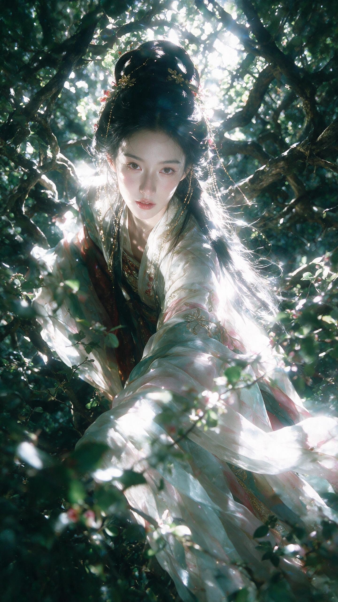 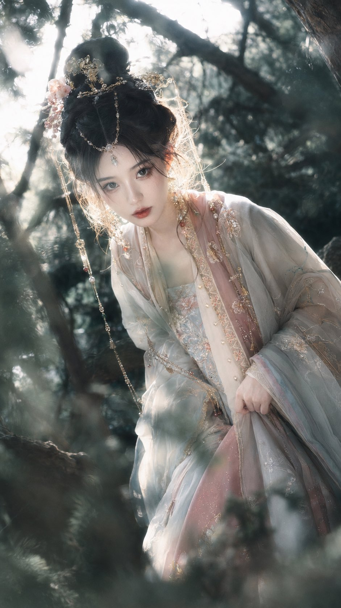

</div>

**📝 提示词:**

```
创作一张竖幅 9:16 的古风幻想人像，主题是林间神女。成年东方女性，精致清冷的古典美感，高挽发髻或半挽发，点缀金色发簪、玉石、珠链、少量红粉饰物。服装是多层汉服与幻想古装结合，不固定单一颜色和制式，可以是齐胸襦裙、交领襦裙、对襟衫裙、宽袖大袖衫、披帛、半透明纱罗外层、刺绣织锦内层等组合；衣服颜色可以多样变化，如月白、玉青、藕粉、朱砂红、黛蓝、浅紫灰、米杏、湖绿、古金等，但都被林间逆光和冷青灰空气统一起来，不要变成现代彩色舞台服。

采用近距离竖幅三分之四轻微俯拍，人物从幽深枝干和叶丛之间靠近镜头，脸部位于画面上半部视觉中心，身体和宽大袖摆向下延展。背景主要是盘曲老树枝、深绿色叶影、潮湿森林空气和斑驳光点，前景有少量虚化叶片形成遮挡；花只作为零星点缀，可以有一两簇小白花、淡粉花或细小野花，不要大量花海，不要让花抢走人物和枝干结构。

主要光线来自人物背后和上方的林间强逆光，穿过树叶形成碎裂的白色高光，高光带轻微过曝和柔和晕染，发丝、珠链、刺绣、纱袖边缘出现银白轮廓光；脸部保留柔和清亮的补光，肤色白皙偏粉但有真实皮肤层次，眼睛清澈，嘴唇淡红润泽，表情安静、微微凝视镜头。

综合色彩的重点不是固定服装颜色，而是统一的林间光色：深墨绿树影、冷青灰空气、乳白逆光、古金细节和低饱和衣料颜色互相融合。暗部要深而有层次，高光可以梦幻泛白，但眼睛、嘴唇、发丝、织物纹理和刺绣边缘保持清晰。真实摄影与东方 fantasy costume editorial 结合，浅景深、轻微柔焦、自然镜头眩光、细腻颗粒、湿润空气感，华丽但自然，不要现代物件，不要花海背景，不要统一模板化配色，不要平面插画感。
```

**👤 出处:** [@coco007ZUHA](https://x.com/coco007ZUHA) · [source](https://x.com/coco007ZUHA/status/2075252520784375873)

▶️ **用 API 跑这条提示词** → [Velokey](https://velokey.ai?sourceChannel=github-awesome-seedream)（模型 id：`seedream-5.0-pro`）

---

### No.20 Seedream 杂志跨页信息图

  

<div align="center">

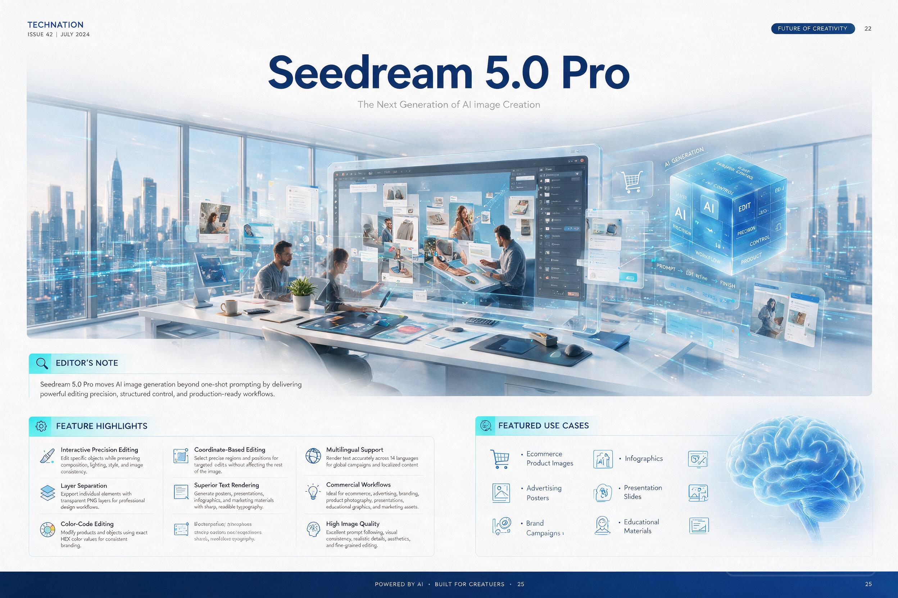

</div>

**📝 提示词:**

```
Create a premium double-page technology magazine spread introducing "Seedream 5.0 Pro": ultra-clean editorial layout, modern typography, white background with blue and cyan accents, luxury print magazine aesthetic, highly structured information hierarchy, flawless typography, perfectly readable text, crisp vector graphics, magazine-quality composition

Main cover headline:
"Seedream 5.0 Pro"

Subtitle:
"The Next Generation of AI Image Creation"

Hero illustration showing a futuristic creative workspace with AI-generated artwork, designers, transparent editing layers, interface elements, and visual workflow graphics.

Include the following magazine sections with perfectly rendered text:

EDITOR'S NOTE
Seedream 5.0 Pro moves AI image generation beyond one-shot prompting by delivering powerful editing precision, structured control, and production-ready workflows.

FEATURE HIGHLIGHTS

Interactive Precision Editing
Edit specific objects while preserving composition, lighting, style, and image consistency.

Layer Separation
Export individual elements with transparent PNG layers for professional design workflows.

Color-Code Editing
Modify products and objects using exact HEX color values for consistent branding.

Coordinate-Based Editing
Select precise regions and positions for targeted edits without affecting the rest of the image.

Superior Text Rendering
Generate posters, presentations, infographics, and marketing materials with sharp, readable typography.

Multilingual Support
Render text accurately across 14 languages for global campaigns and localized content.

Commercial Workflows
Ideal for ecommerce, advertising, branding, product photography, presentations, educational graphics, and marketing assets.

High Image Quality
Excellent prompt following, visual consistency, realistic details, aesthetics, and fine-grained editing.

FEATURED USE CASES
• Ecommerce Product Images
• Advertising Posters
• Brand Campaigns
• Social Media Creatives
• Infographics
• Presentation Slides
• Portrait Editing
• Educational Materials

Include elegant charts, workflow diagrams, iconography, comparison callout boxes, editorial pull quotes, numbered feature cards, print-ready CMYK aesthetic, ultra-sharp typography, perfect spelling, highly legible small text, sophisticated technology magazine design
```

**👤 出处:** [@azed_ai](https://x.com/azed_ai) · [source](https://x.com/azed_ai/status/2075263036856975743)

▶️ **用 API 跑这条提示词** → [Velokey](https://velokey.ai?sourceChannel=github-awesome-seedream)（模型 id：`seedream-5.0-pro`）

---

### No.21 三视图角色设定

  

<div align="center">

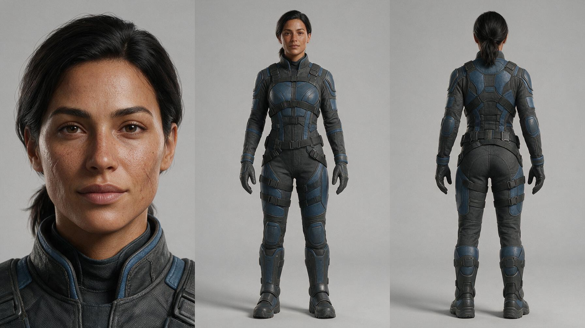

</div>

**📝 提示词:**

```
Create a realistic character sheet  with a strict three-column layout. The image must be divided into three equal vertical sections, each taking exactly 33.3% of the width. The same character must appear in all three sections with perfect consistency in face, body proportions, hairstyle, skin tone, and outfit design.

Left section: a close-up frontal portrait, head and shoulders only, facing directly forward, neutral expression, clear facial details, subtle scars, and visible material detail around the collar.

Center section: a full-body frontal view, standing upright in a neutral pose, full costume clearly visible from head to boots.

Right section: a full-body back view, standing upright, showing the rear design of the suit, utility belt, and boots.

Character: a female sci-fi bounty hunter in her early 30s, athletic build, tan skin, short dark hair tied back, sharp features, wearing a grounded futuristic tactical suit in dark gray and muted blue, with utility straps, reinforced panels, gloves, and heavy boots.

Style: highly photorealistic, realistic sci-fi character sheet, clean studio presentation, neutral background, soft even studio lighting, believable materials, realistic skin texture, no weapon in hand, no action pose, no illustration, no extra objects, no overlapping, precise clean layout
```

**👤 出处:** [@MayorKingAI](https://x.com/MayorKingAI) · [source](https://x.com/MayorKingAI/status/2075285324327219388)

▶️ **用 API 跑这条提示词** → [Velokey](https://velokey.ai?sourceChannel=github-awesome-seedream)（模型 id：`seedream-5.0-pro`）

---

### No.29 科幻电影海报 Lazarus One

  

<div align="center">

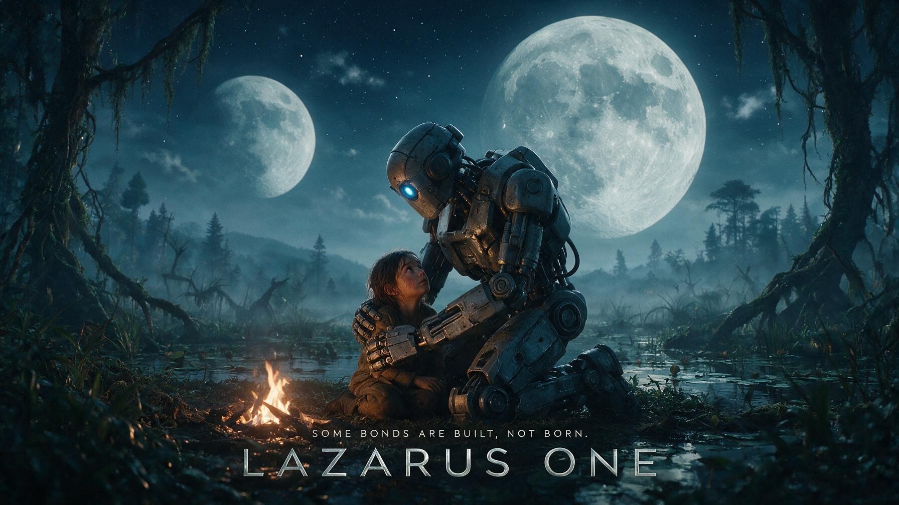

</div>

**📝 提示词:**

```
A highly photorealistic live-action sci-fi movie poster showing a battle-worn humanoid combat robot kneeling protectively over a small girl in a misty swamp on an alien planet. The robot feels physically real and heavy, with scratched metal armor, chipped paint, mud, dents, exposed pistons, hydraulic joints, worn cables, and subtle signs of battlefield damage. Its single glowing eye lens is the emotional focal point, locked onto the girl’s gaze. The girl looks real and human, with natural skin texture, slightly dirty cheeks, messy hair, damp clothing, and a soft warm firelight illuminating her face. Composition: robot and girl placed in the lower third, with a vast swamp landscape stretching behind them and two large moons dominating the upper two-thirds. Lighting is grounded and cinematic: pale moonlight from behind creates a realistic rim light across the robot’s silhouette and shoulders, while a low foreground fire casts warm light onto the girl’s face and reflects subtly on the robot’s damaged torso. Thick atmospheric fog, wet ground, shallow water reflections, muted blue-green color grade, emotional and solemn tone, realistic scale, practical texture detail, premium Hollywood poster finish. Bottom-center title in clean sci-fi serif: "LAZARUS ONE", with a small tagline above, ultra-realistic, no illustration, no painterly look, no cartoon styling
```

**👤 出处:** [@MayorKingAI](https://x.com/MayorKingAI) · [source](https://x.com/MayorKingAI/status/2075285197768286298)

▶️ **用 API 跑这条提示词** → [Velokey](https://velokey.ai?sourceChannel=github-awesome-seedream)（模型 id：`seedream-5.0-pro`）

---

### No.32 四象眼眸四屏写真

  

<div align="center">

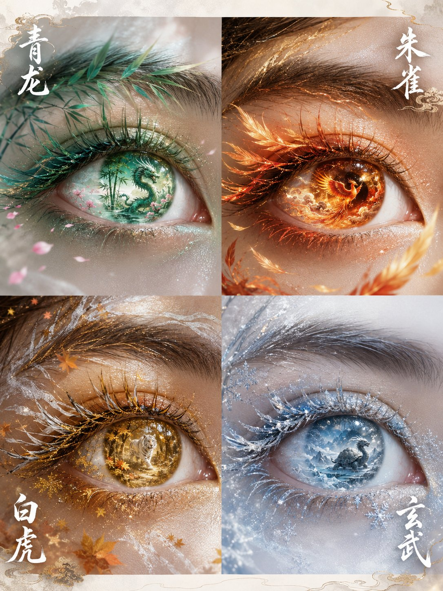 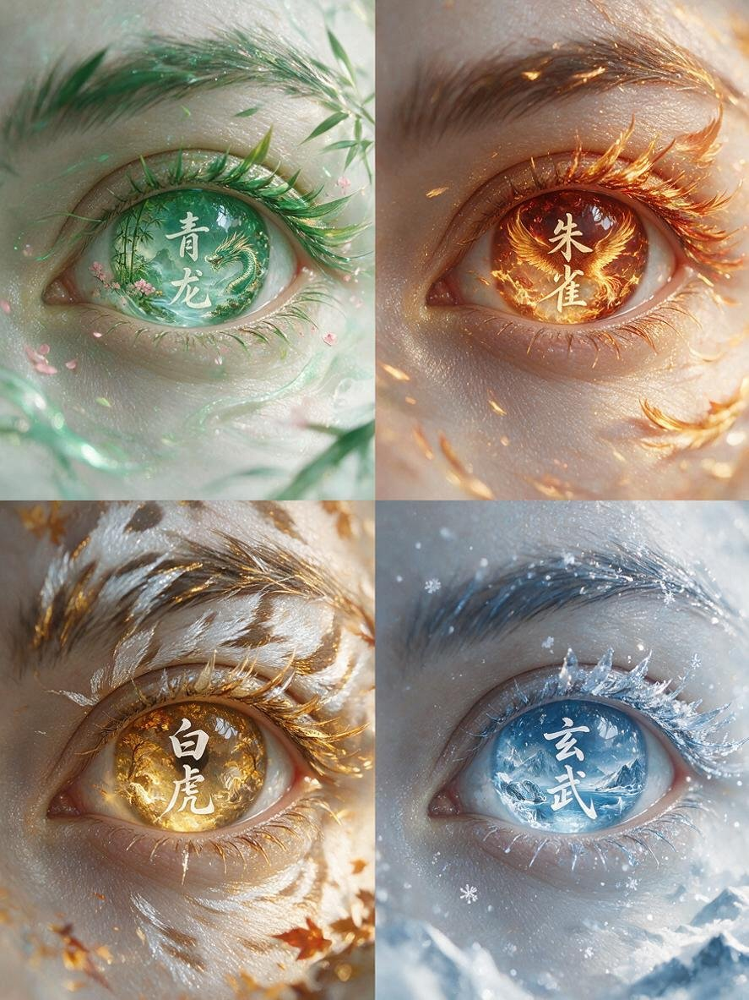

</div>

**📝 提示词:**

```
以眼部特写参考图作为唯一人物眼睛参考，生成一张 3:4 四屏构图东方幻想艺术眼眸写真。 四个画面分别代表中国传统四象：青龙、朱雀、白虎、玄武。 整体风格： 东方神话美学 × 高级美妆广告 × 超现实艺术摄影。 保持真实人类眼睛结构，高清微距摄影，真实皮肤纹理，精致睫毛，细腻眼妆，不改变眼型比例。 四屏人物眼睛保持同一身份，同一角度，同一构图。 第一屏：青龙 · 东方春生 眼眸呈现青绿色翡翠质感虹膜，仿佛一块天然东方玉石。 虹膜内部隐藏微型东方山水世界： 青龙盘旋于云雾之间，青竹、桃花、流水融入眼底。 睫毛化作细长竹叶与青色羽纹，眼角有细小桃花花瓣飘落。 脸部肌肤带有柔和春日光泽，青绿色流光环绕眼眸。 画面中央加入： “青龙” 白色东方篆刻艺术字体。 整体： 青绿色调，清雅、灵动、生命感。 第二屏：朱雀 · 炽焰盛夏 眼眸呈现赤金色琥珀质感。 虹膜内部像燃烧的小型凤凰世界： 朱雀展翅飞翔，金色火焰、凤凰羽毛、夕阳云霞融合其中。 睫毛带有细微火焰羽片质感，眼角漂浮金色羽毛。 皮肤被暖金色光线照亮，形成高级珠宝广告质感。 画面中央加入： “朱雀” 白色鎏金东方艺术字体。 整体： 红金色调，华丽、热烈、神圣。 第三屏：白虎 · 金秋肃杀 眼眸呈现金黄色琥珀瞳孔。 虹膜内部是一片东方秋日森林： 白虎身影隐藏于金色山林之间， 枫叶、古树、金色尘埃漂浮。 睫毛融合白色虎纹与秋叶纹理， 眉眼之间有银白色纹路若隐若现。 光线如夕阳穿过森林，形成电影感暖光。 画面中央加入： “白虎” 白色水墨艺术字体。 整体： 金黄、银白、深棕色调，神秘、高贵。 第四屏：玄武 · 冰雪玄境 眼眸呈现冰蓝色水晶质感。 虹膜内部是一片东方冰雪世界： 玄武神兽沉睡于冰川湖泊， 雪山、冰晶、寒雾融入眼底。 睫毛覆盖透明冰晶纹理， 眼角有细小雪花与银色光点。 冷蓝月光照射脸庞， 形成冰雪女神般的高级视觉。 画面中央加入： “玄武” 白色书法艺术字体。 整体： 冰蓝、银白色调，冷冽、纯净、空灵。 统一画面要求 四屏排列整齐，像高级艺术展览海报。 背景为极简东方留白空间， 加入淡淡水墨纹理、云雾、金属浮雕质感。 文字设计： 东方篆刻字体， 白色半透明艺术字， 不要现代商业字体。 摄影： macro eye photography, ultra realistic skin texture, cinematic lighting, luxury beauty campaign, 8K detail, high fashion editorial. 禁止： 卡通风格、动漫眼睛、夸张变形眼球、低质量CG、塑料皮肤、错误文字、额外眼睛。 比例： 3:4 生成图片
```

> 💡 使用说明: 对比 GPT Image 2

**👤 出处:** [@Chengzilhy](https://x.com/Chengzilhy) · [source](https://x.com/Chengzilhy/status/2075462701887930745)

▶️ **用 API 跑这条提示词** → [Velokey](https://velokey.ai?sourceChannel=github-awesome-seedream)（模型 id：`seedream-5.0-pro`）

---

### No.33 1980s 胡子膏广告分镜

  

<div align="center">

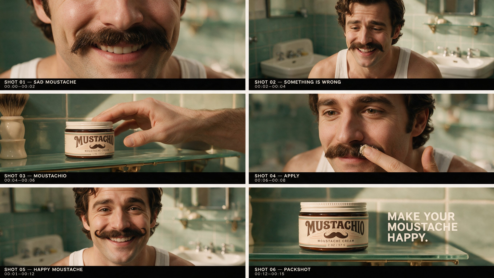

</div>

**📝 提示词:**

```
STYLE
Photorealistic cinematic advertising storyboard inspired by authentic 1980s American men’s grooming commercials. Warm 35mm film texture, soft natural grain, slightly faded color response, clean realistic skin and hair, understated visual comedy.

FORMAT
One 16:9 storyboard sheet divided into six equal cinematic panels in a clean 3×2 grid. Consistent character, bathroom, wardrobe, lighting and product design across every panel. Each panel has a small black caption strip with exact white text.

CHARACTER
A handsome 35-year-old American man with wavy dark-brown hair, a thick natural dark-brown moustache, expressive eyebrows and realistic facial texture. He wears a plain white ribbed tank top.

LOCATION
A stylish middle-class American bathroom from the 1980s: pale mint ceramic tiles, cream sink, chrome fixtures, glass shelf, warm morning sunlight and soft tungsten practical light.

PANELS
Panel 1 — Extreme close-up of the lower face. The man smiles, but both moustache tips droop downward like a sad frown. Caption: "SHOT 01 — SAD MOUSTACHE" and "00:00–00:02".

Panel 2 — Medium mirror shot. He smiles wider while the moustache remains visibly sad and drooping. His eyes look down toward it with mild confusion. Caption: "SHOT 02 — SOMETHING IS WRONG" and "00:02–00:04".

Panel 3 — Close product insert <<<image_1>>>. A stylish round jar of moustache cream <<<image_1>>> labeled "MUSTACHIO" and "MOUSTACHE CREAM" stands on the glass shelf as his hand reaches toward it. Caption: "SHOT 03 — MUSTACHIO" and "00:04–00:06".

Panel 4 — Tight facial close-up. He applies a small amount of cream through the moustache with one simple outward finger movement. Caption: "SHOT 04 — APPLY" and "00:06–00:08".

Panel 5 — Frontal close-up. The moustache becomes neat and full; both tips lift and curl upward like a smile. The man smiles with satisfied surprise. Caption: "SHOT 05 — HAPPY MOUSTACHE" and "00:08–00:12".

Panel 6 — Clean packshot of the same <<<image_1>>> "MUSTACHIO" jar centered on the glass bathroom shelf, softly blurred mint-tile background, warm sunlight, premium 1980s advertising composition. Text beside the product: "MAKE YOUR MOUSTACHE HAPPY." Caption: "SHOT 06 — PACKSHOT" and "00:12–00:15".

CONTINUITY
The moustache is naturally drooping in panels 1–4 and symmetrically lifted in panel 5. Preserve the exact same man, jar, label design, bathroom and morning lighting throughout. All typography must be clean, readable and limited to the exact quoted text.
```

> 💡 使用说明: 6 格分镜 storyboard

**👤 出处:** [@digitalwindai](https://x.com/digitalwindai) · [source](https://x.com/digitalwindai/status/2075505502230900856)

▶️ **用 API 跑这条提示词** → [Velokey](https://velokey.ai?sourceChannel=github-awesome-seedream)（模型 id：`seedream-5.0-pro`）

---

### No.39 漫画等距剖面模型

  

<div align="center">

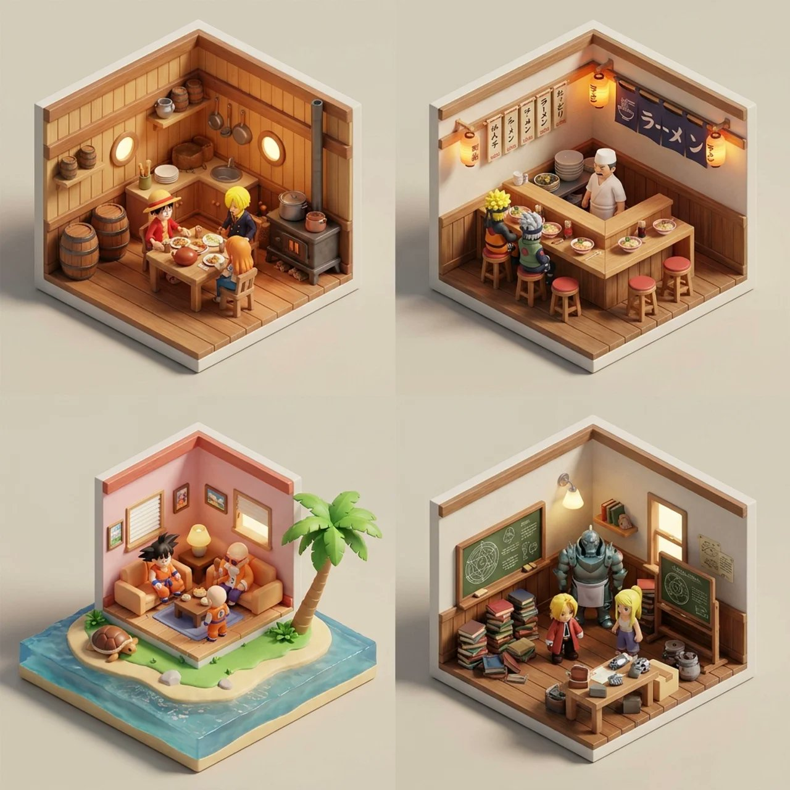 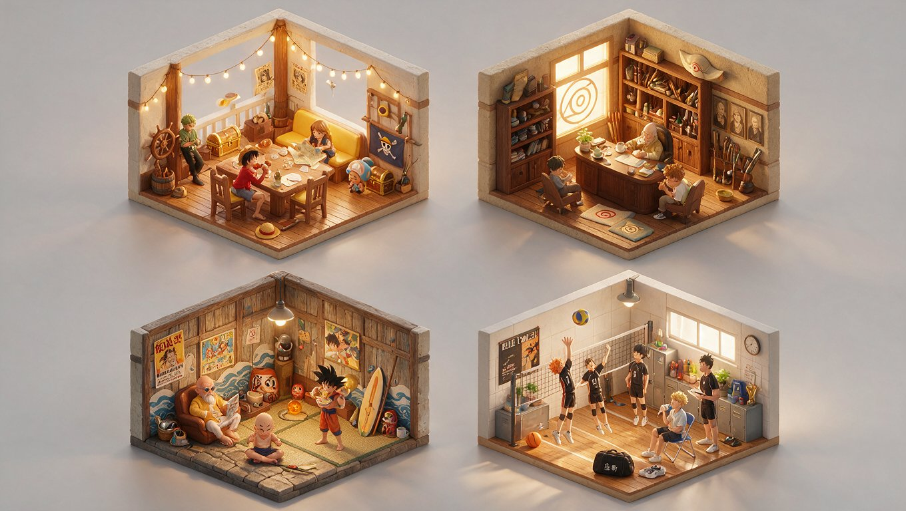

</div>

**📝 提示词:**

```
2x2 grid, do this for 4 famous manga: RENDER_CHAIN = "[$INPUT_TOPIC :: iconic_interior :: isometric_cutaway_diorama]"

TRANSFORM = {
    "floor_plan": "cube with two cut walls, floating on void, cross-section edges clean",
    "hero_space": "inferred iconic location rebuilt as hyper-detailed 3D room, architecture/materials true to source, warm interior light",
    "inhabitants": "2-4 miniature stylized characters, mid-activity, correctly scaled to furniture",
    "set_dressing": "8-15 recognizable props, furniture, signage, easter eggs; dense yet legible",
    "render_env": "clean 3D, soft GI, gentle AO, true isometric 45°, neutral bg, crisp focus"
}

NEGATIVE = "photorealism, off-model characters, empty room, missing props, harsh shadows"

OUTPUT = (RENDER_CHAIN :: TRANSFORM) - NEGATIVE
RENDER: single miniature isometric diorama image.
```

> 💡 使用说明: 对比 Nano Banana Pro

**👤 出处:** [@Gdgtify](https://x.com/Gdgtify) · [source](https://x.com/Gdgtify/status/2075856368246902834)

▶️ **用 API 跑这条提示词** → [Velokey](https://velokey.ai?sourceChannel=github-awesome-seedream)（模型 id：`seedream-5.0-pro`）

---

### No.42 City Jump 街头海报

  

<div align="center">

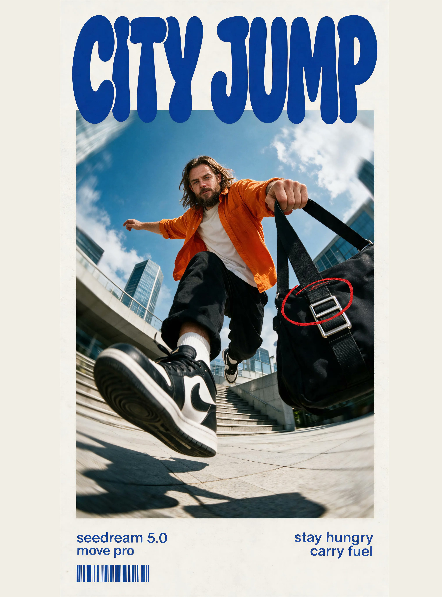

</div>

**📝 提示词:**

```
Create a vertical streetwear editorial poster with a bold youth-culture aesthetic. Use an off-white paper background and a clean magazine-style layout.

At the top, place oversized rounded bubble typography reading “CITY JUMP” in deep cobalt blue. The letters are thick, soft, playful, tightly spaced, and partially hidden behind the central photo.

In the center, place a large vertical action photograph of a young European man performing an energetic skateboard-style jump toward the camera in a modern urban plaza. He wears a orange open shirt, a shirt, black baggy pants, white crew socks, and black and white Nike Air sneakers.

Use an extreme low-angle fisheye lens from ground level. His front shoe is dramatically enlarged and dominates the foreground, while his face and upper body appear smaller in the background. One arm stretches sideways for balance, while the other hand tightly holds the wide black strap of a large black messenger bag positioned close to the right side of the camera. The bag’s rectangular silver buckle should be clearly visible and sharply detailed.

Bright blue sky with soft white clouds, modern glass-and-steel architecture, outdoor stairs, tiled pavement, strong midday sunlight, realistic shadows. Add subtle radial motion blur around the edges and background to emphasize fast movement, while keeping the person, shoe, bag strap, and buckle sharp.

Add a rough hand-drawn red oval annotation around the silver buckle on the black bag, as if marked with a red grease pencil.

At the bottom of the poster, include small cobalt-blue editorial text:

Left side:
“seedream 5.0”
“move pro”

Right side:
“stay hungry”
“carry fuel”

Add a decorative cobalt-blue barcode graphic beneath the left text.

Style: contemporary streetwear campaign, skateboarding photography, Gen-Z fashion editorial, experimental sports advertising, bold typography, dynamic forced perspective, vibrant blue and green color palette
```

**👤 出处:** [@LinusEkenstam](https://x.com/LinusEkenstam) · [source](https://x.com/LinusEkenstam/status/2076273553964687462)

▶️ **用 API 跑这条提示词** → [Velokey](https://velokey.ai?sourceChannel=github-awesome-seedream)（模型 id：`seedream-5.0-pro`）

---

### No.44 云雾天狐幻境

  

<div align="center">

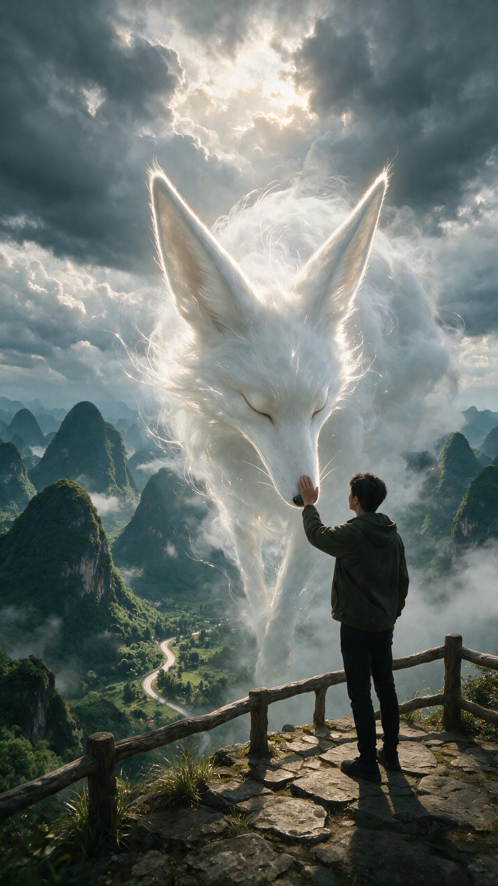 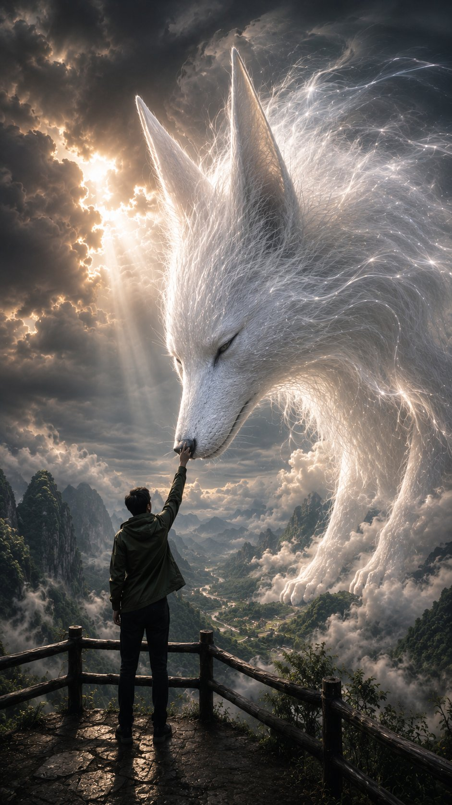

</div>

**📝 提示词:**

```
A cinematic fantasy scene from a slightly low, over-the-shoulder perspective. A lone young man stands on a weathered stone mountain viewpoint with a rustic wooden railing, seen mostly from behind, wearing a dark olive-green hooded jacket, black pants, and black shoes. He calmly raises one hand to gently touch the nose of an enormous celestial fox spirit descending from the sky. The spirit is an ethereal heavenly guardian made of white clouds, mist, and flowing strands of living light—not a solid fox. It has an elegant elongated face, peaceful closed eyes, a long slender muzzle, a tiny black nose, and two enormous, tall, perfectly upright triangular ears that define its silhouette. Only the head, neck, faint chest, and part of the front legs are visible while the rest of its colossal body dissolves seamlessly into the clouds, sky, and distant mountains. Fine glowing white strands flow naturally from its body into the atmosphere, creating a soft divine aura. Dramatic storm clouds fill the sky with a small opening where the hidden sun casts subtle warm rays and gentle rim light. Towering green karst mountains, drifting mist, and a winding road below. Ultra-realistic, photorealistic, cinematic, atmospheric, mystical, 8K.
```

> 💡 使用说明: 对比 GPT Image 2

**👤 出处:** [@frametheory058](https://x.com/frametheory058) · [source](https://x.com/frametheory058/status/2076341429350404486)

▶️ **用 API 跑这条提示词** → [Velokey](https://velokey.ai?sourceChannel=github-awesome-seedream)（模型 id：`seedream-5.0-pro`）

---

### No.46 红底暗黑 webtoon 插画

  

<div align="center">

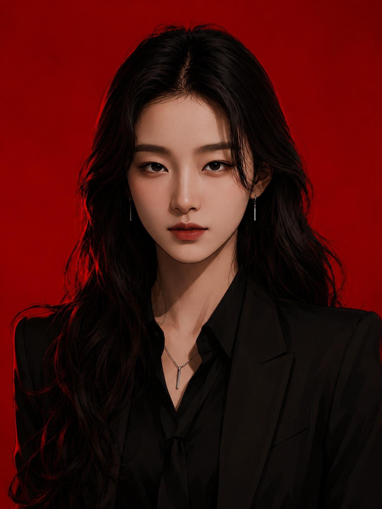 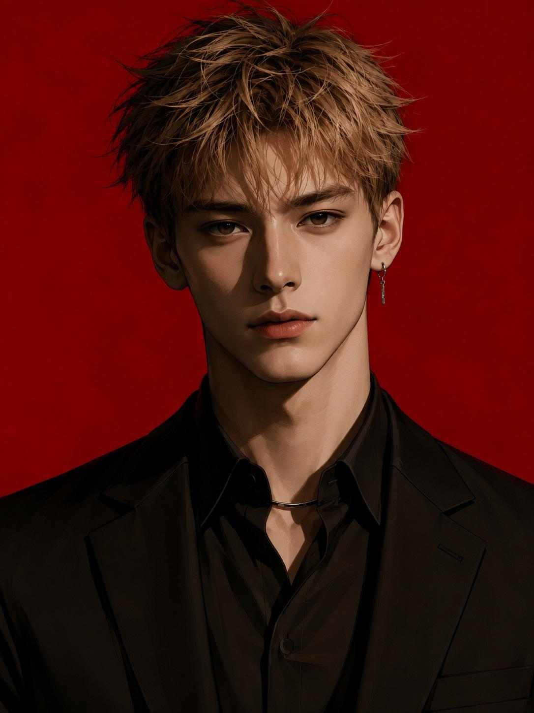

</div>

**📝 提示词:**

```
A dark, urban digital illustration featuring a bold solid red background, dramatic high-contrast lighting, a cold piercing gaze, and a sophisticated modern suit.

2. Style DNA Priority

Must Preserve

- Bold solid red background
- Mid-distance bust composition showing the face and upper body with calm yet powerful presence
- Strong chiaroscuro with deep shadows and crisp highlights
- Sharp, cold, expressionless (or slightly tense) eyes and facial expression
- Modern tailored suit with refined urban elegance
- Clean digital illustration with sharp edges, smooth gradients, and painterly rendering

Preferred Elements

- Close-up composition focusing on the head and shoulders
- Detailed hair rendering and realistic strand texture
- Accessories such as necklaces, chokers, and drop earrings
- Dark overall palette accented with subtle red and brown shading

Optional Elements

- Hairstyle variations (braided hair, naturally flowing hair, etc.)
- Slight hair movement and subtle surface texture

Avoid Misinterpretation

- Ordinary fashion illustrations
- Romantic, fantasy, or exaggerated action poses
- Photorealistic style or documentary-style natural lighting
- Bright, soft pastel aesthetics

3. Core Style Analysis

Composition / Camera Distance

Bust to waist-up composition, centered frontal framing with the face and upper torso clearly visible.

Foreground / Midground / Background

Minimal foreground, character occupies the midground, flat solid red background.

Focus / Lens

Everything remains sharp without shallow depth of field. Crisp outlines and clean digital illustration aesthetics.

Lighting / Color

Strong directional lighting creates deep facial and body shadows. The red background subtly reflects into the skin shadows.

Color Grading

Dominant red background. Natural skin tones with brown and dark green shadow hues. Moist, glossy highlights.

Rendering Medium

High-quality digital painting with clean linework, smooth gradients, realistic anatomy but unmistakably illustrated rather than photographic.

Regional Visual Language

Strong East Asian modern webtoon / illustration influence.

Body Proportions

Near-realistic proportions with a slightly elongated face and refined fashion-illustration silhouette.

Iconic Pose

Direct frontal gaze, calm posture, stern and composed expression.

Costume

Black pinstripe or solid black suit, black shirt, optional black tie, leather choker or necklace, silver drop earrings.

Genre

Dark urban media art, modern webtoon, action/drama promotional illustration.

Expression

Cold, focused eyes with firm lips and restrained tension.

Camera Perspective

Mostly frontal with only a subtle elevated viewing angle.

Accent Colors

Solid red background contrasted by dark suits, black-brown hair, red hair tie, and silver metallic accessories.

Background

Completely flat monochrome red without additional objects.

Subject Emphasis

Single centered character with no surrounding figures.

Mood

Strong presence with an isolated, solemn atmosphere.

Surrealism

Maintain realistic tension without introducing bizarre or fantasy elements.

Object Scale

Necklace, choker, and earrings should remain true to realistic size.

Avoid Beautification

Do not make the character cute, romantic, or overly softened.

Medium Conversion Rule

Remain an illustration only. Eliminate photographic textures.

Linework

Clean, crisp line art with simplified color blocking and clear facial features.

Photorealism Prevention

Avoid natural skin texture, photographic lighting, and realistic camera rendering.

Frame Ratio

Vertical 2:3 or 3:4 composition focused from above the knees to the head.

Color Balance

Solid red background, brown and dark green shadows, natural cream highlights.

Color Restriction

Never shift toward pastel, blue, or yellow-dominant palettes.

Clothing

Dark suit, black shirt, tie or choker, necklace, silver drop earrings.

Motion

Static pose with only subtle natural hair movement.

4. Fixed Composition

[Subject] is positioned in the lower-middle center of a vertical frame, shown from above the knees to the top of the head in a bust composition, facing directly forward with sharp focus against a solid red background.

5. Fixed Lighting & Color Grading

Strong one-sided directional lighting creates deep shadows across the face and body. The solid red background subtly influences the skin tones while maintaining calm red hues with brown and dark green shadows.

6. Fixed Rendering

Maintain a clean digital illustration style with crisp edges, smooth color gradients, and no photorealistic texture.

7. Fixed Body Proportions

Near-realistic proportions with a slightly elongated face, elegant fashion-illustration styling, slim physique, and masculine sophistication.

8. Fixed Iconic Elements

Sharp eyes, cold expression, minimalist black suit, silver earrings, necklace, and choker remain defining features.

9. Fixed Expression

Maintain a cold, focused gaze with tense lips and a stern, composed facial expression.

10. Fixed Accent Colors & Accessories

Keep the red hair tie, silver drop earrings, metallic choker, and necklace at their original scale and placement.

11. Fixed Background

A completely flat solid red background with no additional objects or people.

12. Fixed Subject Hierarchy

Only one central character. No surrounding figures or crowds.

13. Fixed Mood

Maintain urban sophistication and restrained tension. Avoid cute, romantic, or whimsical moods.

14. Fixed Object Scale

Accessories such as the choker, earrings, and necklace should remain realistic in size and placement.

15. Fixed Medium Rule

Do not convert into photorealism. Preserve the clean digital illustration aesthetic without realistic skin texture or natural lighting.

16. Fixed Framing

Vertical 2:3 or 3:4 aspect ratio. The character occupies over 70% of the frame from above the knees to the head.

17. Fixed Color Distribution

Solid red background, brown and dark green shadows, natural cream highlights, maintaining an overall deep red palette.

18. Color Restriction

Strictly preserve the dominant red palette with brown-green shadows. Do not shift toward pastel, yellow, or blue color grading.

19. Main Prompt

"[Subject], centered in a vertical 2:3 composition, shown from above the knees to the head in a bust-style framing, facing directly forward with a cold and tense expression. Bold solid red background with dramatic brown and dark green shadows created by strong directional lighting. Clean digital illustration style with sharp outlines, smooth gradients, and refined East Asian modern webtoon aesthetics without photorealistic textures. Wearing a black pinstripe or solid black tailored suit with a black shirt, optional black tie or leather choker, silver drop earrings, and a necklace maintained at accurate size and placement. Sharp eyes with a calm, piercing gaze. Hair flows naturally with a red hair tie accent. Flat monochrome background with no foreground objects or surrounding people. Sophisticated urban atmosphere. No photographic rendering or bright pastel colors."

20. Negative Prompt

"photorealistic photography, natural lighting, soft focus, overexposure, pastel colors, yellow tint, blue tint, smiling expression, cute aesthetics, romance, exaggerated anime proportions, excessive skin texture, DSLR beauty lighting, realistic hair rendering, busy background, glossy clothing, sportswear, cartoon facial expressions, artificial multi-light studio setup, full-body shot, environmental background, watercolor, oil painting, distorted anatomy, fantasy atmosphere"

21. Style Keywords (12)

- Solid Red Background
- Digital Illustration
- Cold Gaze
- Dramatic Chiaroscuro
- Modern Tailored Suit
- Bust Composition
- Sharp Linework
- Urban Mood
- Choker & Necklace
- Silver Accessories
- East Asian Webtoon Style
- Stern Expression
```

**👤 出处:** [@ChillaiKalan__](https://x.com/ChillaiKalan__) · [source](https://x.com/ChillaiKalan__/status/2076523680860151863)

▶️ **用 API 跑这条提示词** → [Velokey](https://velokey.ai?sourceChannel=github-awesome-seedream)（模型 id：`seedream-5.0-pro`）

---

### No.1 暗调梦幻高定全身像

 

<div align="center">

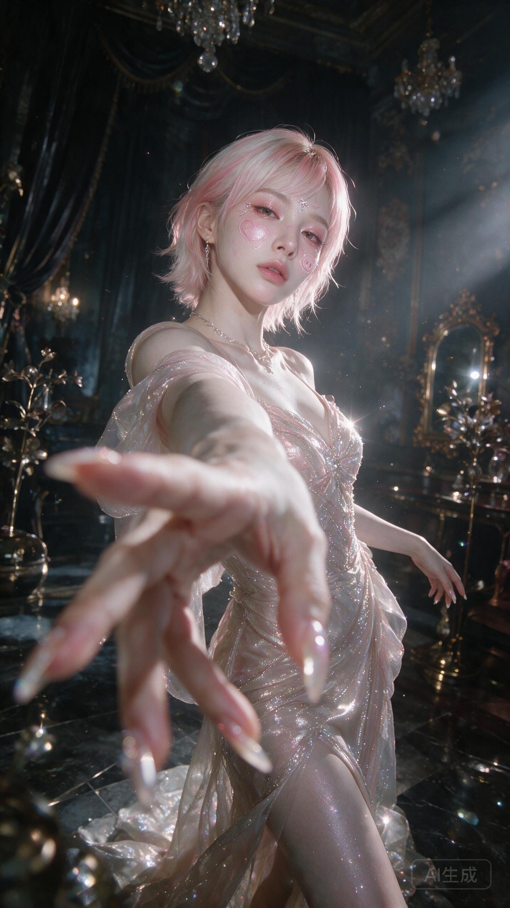

</div>

**📝 提示词:**

```
This is a highly photorealistic, high-fashion full-body portrait with an overall dark-toned, dreamy, and hazy atmosphere, filled with the flowing beauty of light and shadow. The scene uses refined artificial lighting that is soft yet richly layered, with sparkling highlights, crystal-clear reflections, and a subtle lomo film texture in certain areas, creating a surreal and luxurious fashion mood that feels both realistic and dreamlike.

The subject is a young adult Taiwanese woman with short pink-and-white blended hair and side-swept bangs. She has delicate, beautiful features, a well-defined bone structure, and facial lines that are both soft and sculptural. She has a naturally curvy, elegant, and well-proportioned figure, with an overall presence that feels mature, confident, and relaxed. Her skin has a cool fair matte quality, looking smooth and translucent while still preserving realistic skin texture. Her makeup is refined and soft, with rosy cheeks, moist dreamy eyes, and an expression that carries a hint of laziness, aloofness, and world-weary indifference, giving her an aura that feels both sophisticated and mysterious.

Her face features intricate decorative makeup details, including a huadian ornament on the forehead, floral ornaments at the outer corners of the eyes, heart-shaped facial decorations, and small artistic pig-pattern facial elements. These embellishments are naturally integrated into the overall high-end makeup look, with delicate shimmer and pearlescent textures. They should feel refined, luxurious, and elegant, never cheap or cartoonish.

The composition is shot from a low angle, with the subject’s full body visible and facing the camera directly. She extends one hand toward the lens, with long slender fingers and delicately manicured long nails, creating a strong foreground blur and a clear sense of perspective, making the image more visually dynamic. Her pose is elegant and confident, with the visual language of a high-end fashion editorial.

The overall color palette is dominated by rich, dark tones, accented with nude pink, skin-tone hues, pearlescent highlights, silvery-white reflections, and sparkling details. The image has a low-contrast tonal range, with soft focus, haze, luminosity, and a luxurious finish, resembling a meticulously retouched fashion editorial. The photo should feel highly realistic, rich in detail, with natural skin texture, in 8K ultra-high definition, with a trendy high-end internet aesthetic, vertical 9:16.
```

**👤 出处:** [@BubbleBrain](https://x.com/BubbleBrain) · [source](https://x.com/BubbleBrain/status/2074856963591290979)

▶️ **用 API 跑这条提示词** → [Velokey](https://velokey.ai?sourceChannel=github-awesome-seedream)（模型 id：`seedream-5.0-pro`）

---

### No.2 真实车内自拍首帧

 

<div align="center">

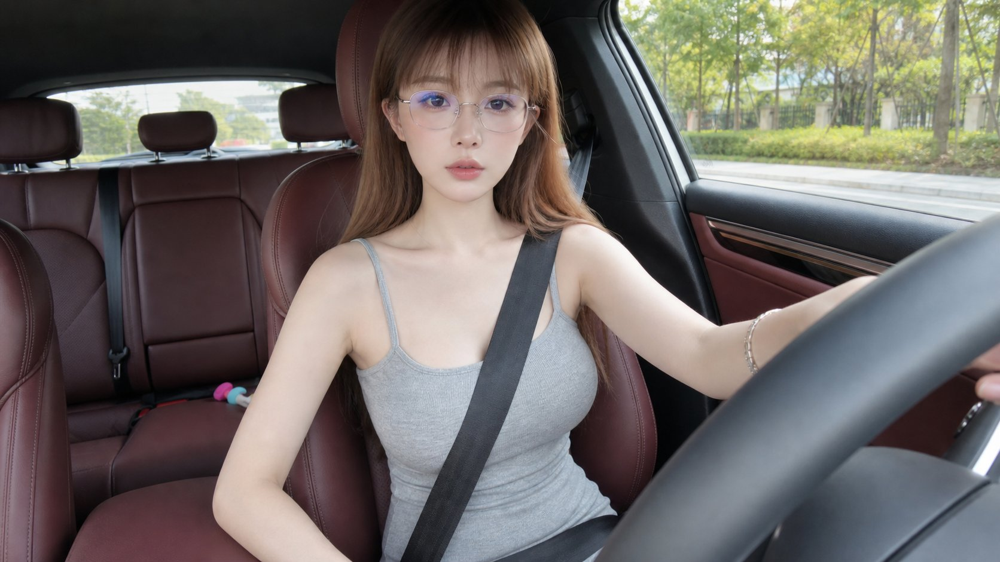 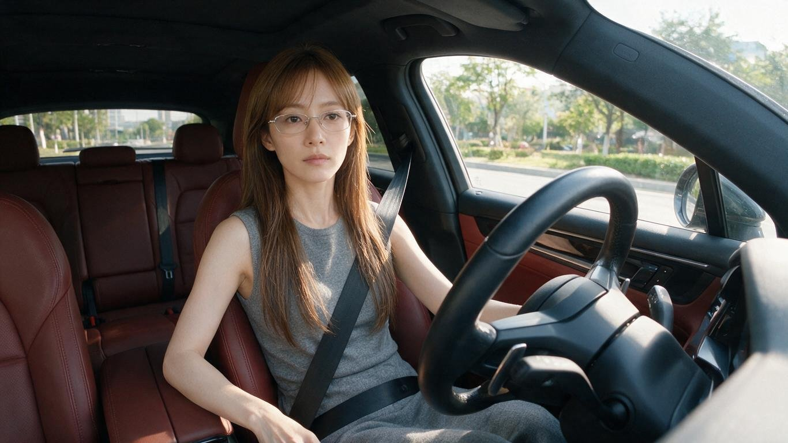

</div>

**📝 提示词:**

```
生成一张真实感车内自拍视频首帧照片，横屏 16:9。画面像固定在副驾驶前方或中控台附近的小型广角相机拍摄，轻微广角，近距离车内第一视角，像社交媒体短视频截图。
主角是一位成年女性，气质清冷、安静、精致，整体像日常车内自拍视频里的主角。她脸型小巧偏鹅蛋脸，五官自然精致，鼻梁挺，嘴唇自然，表情平静、淡淡的，有一点冷感但不夸张。她正面面向镜头或略微看向前方，能清楚看到完整正脸，不低头，不侧脸。她戴细框透明或浅银色眼镜，长直发偏浅棕色，带轻微空气刘海，头发自然垂落在肩侧。穿简洁灰色无袖针织连衣裙或灰色无袖上衣搭配同色下装，造型干净日常、端庄自然。
她坐在驾驶位，安全带已经插好并固定完成：黑色安全带清楚地从肩膀斜跨过上身到腰侧，状态自然贴合身体，不是在拉安全带，也不是正在插卡扣。她一只手自然放在方向盘附近或轻扶方向盘，另一只手放低在座椅边或腿侧，姿态像准备开车前刚坐正的一瞬间。表情专注平静，眼神可以看向镜头，也可以略微看向前方道路。
车内是红棕色真皮座椅和红棕色门板，方向盘在画面右前方形成明显前景，仪表台、车窗边缘和后排座椅可见。车窗外是白天城市道路旁的绿化、树木和轻微模糊的街景，但车子此刻看起来还没有启动，背景相对静止。自然日光从车窗照进来，皮肤质感真实，头发有自然光泽。
整体风格：真实摄影，高质量手机或运动相机车内自拍视频首帧，清晰自然，轻微广角畸变，真实车内空间，社交媒体短视频质感，不像棚拍写真。
避免：低头、侧脸、正在插安全带、正在拉安全带、字幕、文字、水印、多余人物、夸张姿势、夸张摆拍、安全带消失、方向盘变形、手指畸形、眼镜变形、车内结构错乱、背景高速运动、夜景、动漫风、CG 感、塑料皮肤、过度美颜。
```

> 💡 使用说明: 对比 GPT Image 2

**👤 出处:** [@johnAGI168](https://x.com/johnAGI168) · [source](https://x.com/johnAGI168/status/2074870910469677387)

▶️ **用 API 跑这条提示词** → [Velokey](https://velokey.ai?sourceChannel=github-awesome-seedream)（模型 id：`seedream-5.0-pro`）

---

### No.3 逆光雀斑特写自拍

 

<div align="center">

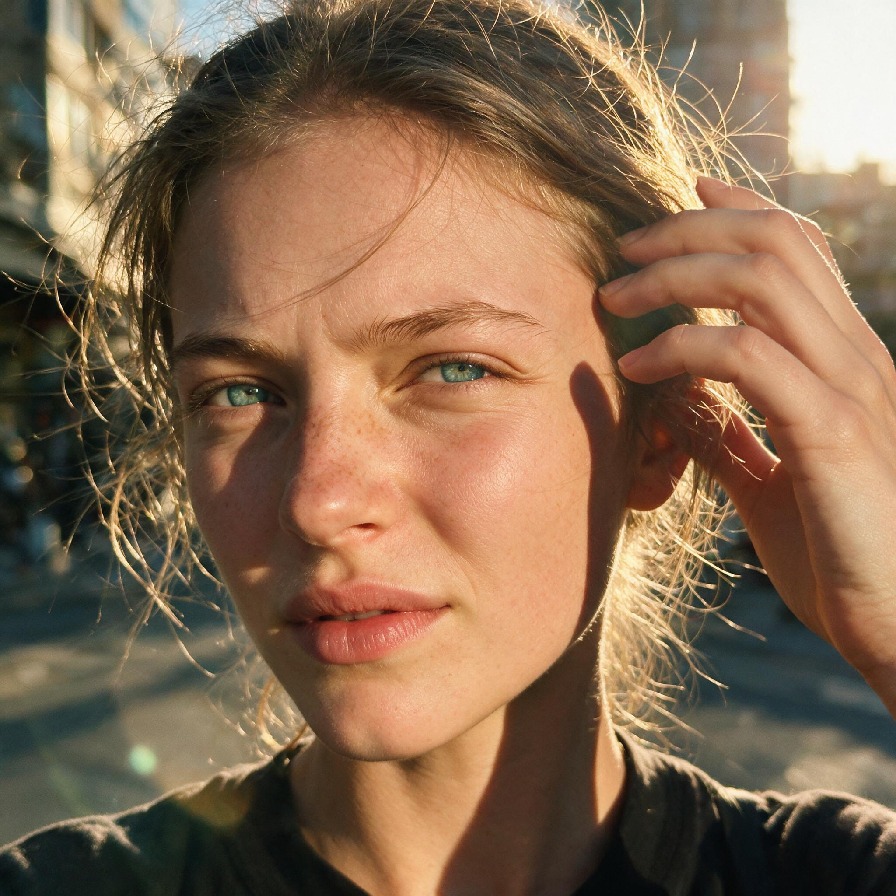 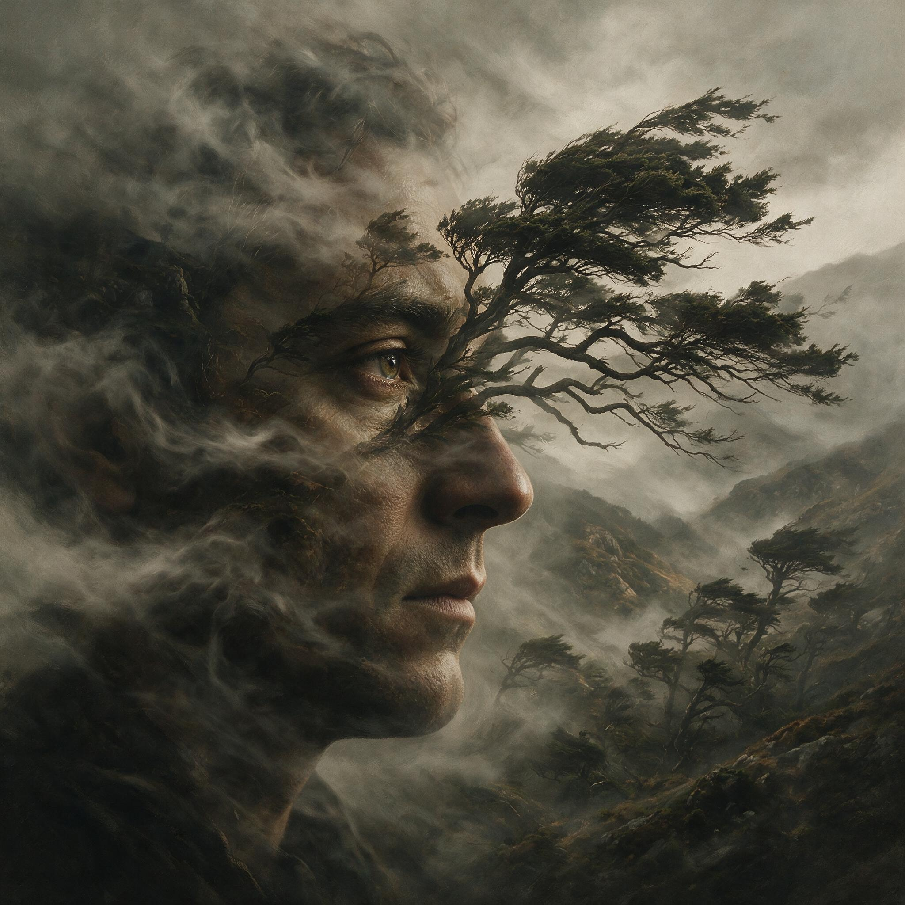

</div>

**📝 提示词:**

```
Extreme close-up selfie of a 22-year-old woman with piercing blue-green eyes, light dusting of freckles across the nose and cheeks, messy hair with visible flyaways caught in the wind, squinting slightly against the sun, casual outdoor setting, harsh golden hour side-lighting creating deep natural shadows, candid moment, unfiltered, authentic Instagram aesthetic, f/1.8, shallow depth of field, slight digital grain.


Physical details: visible skin texture and pores, fine peach fuzz, natural under-eye creases, subtle facial asymmetry, realistic hands adjusting hair (5 fingers, natural pose), blurred urban bokeh background with lens flare.
```

**👤 出处:** [@kaanakz](https://x.com/kaanakz) · [source](https://x.com/kaanakz/status/2074988990373974246)

▶️ **用 API 跑这条提示词** → [Velokey](https://velokey.ai?sourceChannel=github-awesome-seedream)（模型 id：`seedream-5.0-pro`）

---

### No.4 赛博朋克安卓海报

 

<div align="center">

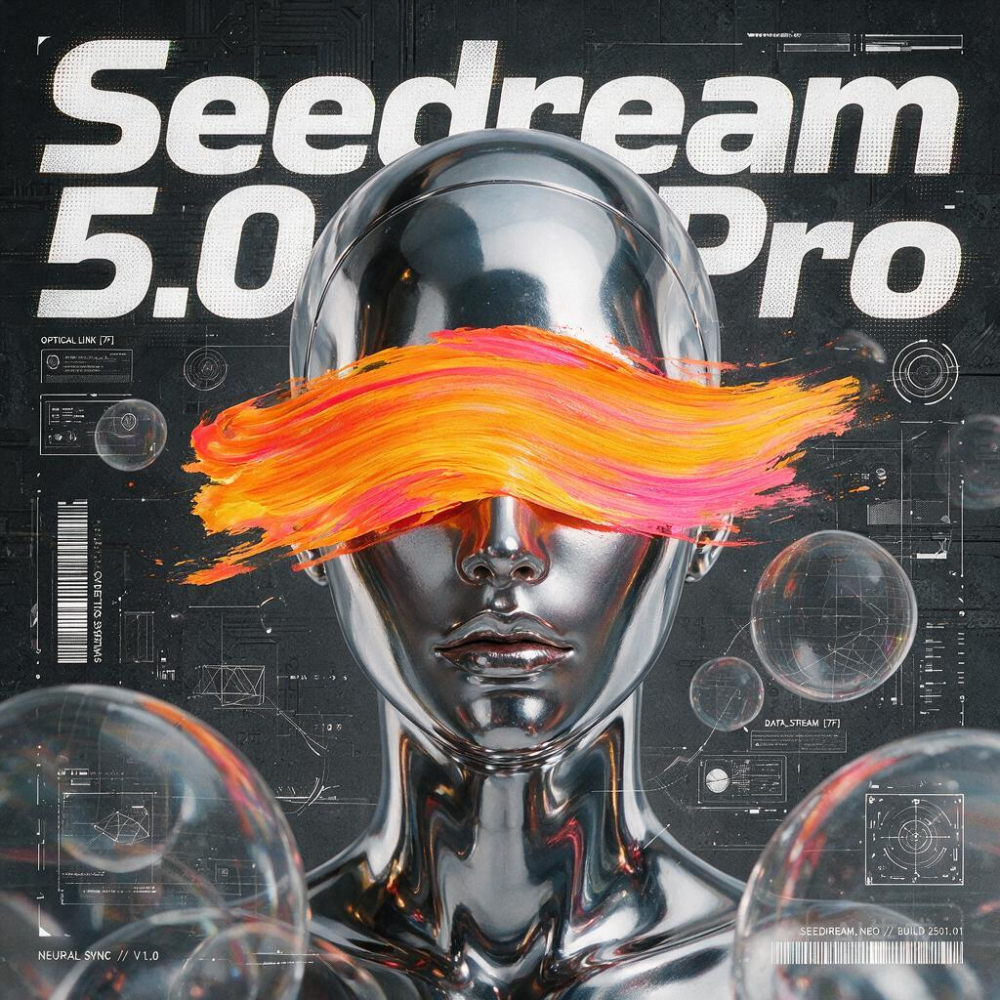

</div>

**📝 提示词:**

```
A sci-fi cyberpunk graphic design poster. In the center, a striking portrait of a female android with glossy, liquid chrome skin. A vivid swirling streak of neon orange, yellow, and pink liquid paint brush stroke horizontally covers her eyes, soft smudged color overlay with smooth flowing pigment texture, no cracks or broken facial surfaces.

The background is a dark, textured charcoal gray. Behind the central figure, large bold white futuristic typography reads "Seedream 5.0 Pro" with a subtle digital glitch and halftone texture. The composition is decorated with technical HUD elements, thin white lines, geometric wireframe diagrams, barcodes, and small sci-fi text boxes.

Semi-transparent glassy spheres with grid textures overlap the foreground, creating depth. The overall mood is high-tech, dystopian, and avant-garde.
```

**👤 出处:** [@ComfyUI](https://x.com/ComfyUI) · [source](https://x.com/ComfyUI/status/2075027793491226677)

▶️ **用 API 跑这条提示词** → [Velokey](https://velokey.ai?sourceChannel=github-awesome-seedream)（模型 id：`seedream-5.0-pro`）

---

### No.5 玻璃花 editorial 海报

 

<div align="center">

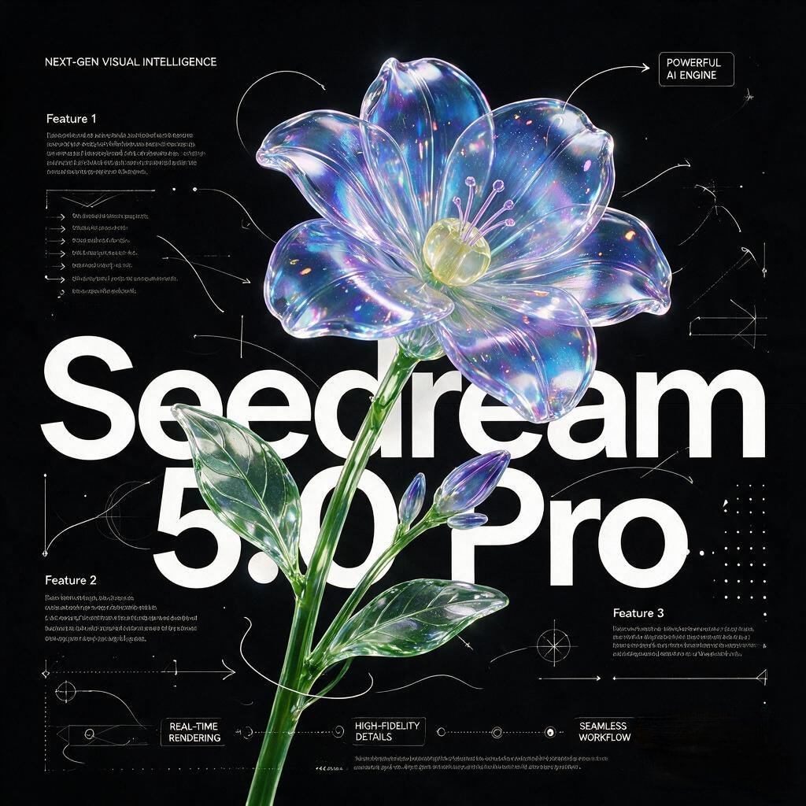

</div>

**📝 提示词:**

```
An editorial graphic design poster on a solid black background. The central elements are exquisite, translucent 3D glass flowers with iridescent, holographic petals in shades of electric blue, violet, and soft purple.

In the background, large, bold white sans-serif typography reads "Seedream 5.0 Pro", elegantly layered behind and interwoven with the glass petals.

The layout is filled with clean blocks of small white placeholder body text and delicate thin white vector lines, creating a futuristic, tech-organic informational poster. High-contrast, sharp details, refractive glass textures, glossy finish, professional UI/UX design aesthetic.
```

**👤 出处:** [@ComfyUI](https://x.com/ComfyUI) · [source](https://x.com/ComfyUI/status/2075027810666914062)

▶️ **用 API 跑这条提示词** → [Velokey](https://velokey.ai?sourceChannel=github-awesome-seedream)（模型 id：`seedream-5.0-pro`）

---

### No.6 湖边 Vespa 复古人像

 

<div align="center">

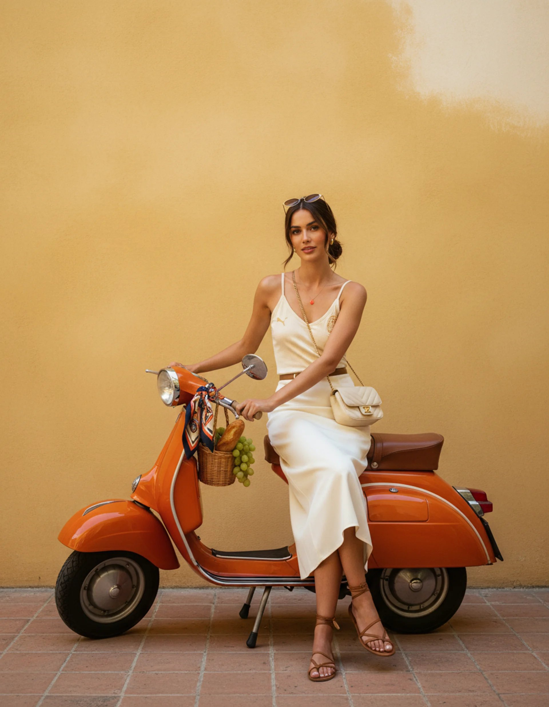 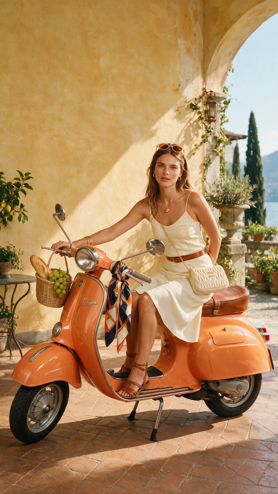

</div>

**📝 提示词:**

```
A straight-on medium-wide cinematic shot at eye-level, static locked frame, 4:5 vertical, captures a sun-bright late-morning inside a Lake Como villa courtyard room, camera perpendicular to the wall plane with no tilt, the atmosphere crisp and alive like the minute before heading out for gelato, the wall behind the scene a warm hand-troweled sable butter-yellow lime plaster slightly uneven with soft sun-bleach along the upper right edge, the floor matte burnt-terracotta chili tile grounding the frame, grout lines aged and dusty.

Centered lower in the frame, a fully restored 1965 Vespa Primavera in glossy melon-orange lacquer parked on its side stand parallel to the camera, full profile visible, polished chrome Vespa badge on the legshield catching light, round chrome headlamp glinting, chrome handlebars and mirrors, aged cognac brown leather saddle, a silk twill scarf in marine navy, chili orange, cream and cognac pattern loosely tied around the right handlebar with tails cascading down, a small wicker basket bag on the left handlebar spilling a baguette and green grapes.

The subject is a stunning World Cup beauty in her mid-twenties, with radiant sun-kissed skin and natural healthy glow, long silky dark chestnut brown hair loosely pulled into a soft low bun with gentle face-framing waves, striking hazel eyes with bright lively spark looking directly into the camera, high cheekbones, full lips in a soft warm cognac-rose shade with corners gently lifted in quiet joy. She is seated sideways on the Vespa saddle, body in a bright open three-quarter twist toward the camera, both legs crossed at the ankles on the same side, knees angled toward the lens, one hand resting lightly on the chrome handlebar, the other arm relaxed behind her on the rear of the saddle. Shoulders open and relaxed, natural breathing pose.

She wears a fitted cream football jersey with subtle gold embroidery and thin spaghetti straps, tucked into a flowing cream bias-cut midi skirt that falls mid-calf, a slim cognac leather belt at the waist, flat cognac leather Roman sandals with ankle ties, stack of thin gold bangles on one wrist, delicate gold chain with small gold-and-coral pendant, small gold hoop earrings. Miu Miu oval sunglasses with thin gold frames and warm cognac lenses pushed up on her head. A cream quilted Miu Miu matelassé crossbody bag with gold chain slung across her torso.

Natural skin texture with soft luminosity, gentle sheen on nose and lips, crisp morning sunlight, cinematic color grading, highly detailed, photorealistic, Slim Aarons style with modern World Cup energy.
```

> 💡 使用说明: 对比 Nano Banana Pro

**👤 出处:** [@cso6709](https://x.com/cso6709) · [source](https://x.com/cso6709/status/2075046425277399261)

▶️ **用 API 跑这条提示词** → [Velokey](https://velokey.ai?sourceChannel=github-awesome-seedream)（模型 id：`seedream-5.0-pro`）

---

### No.7 儿童黏土玩具广告

 

<div align="center">

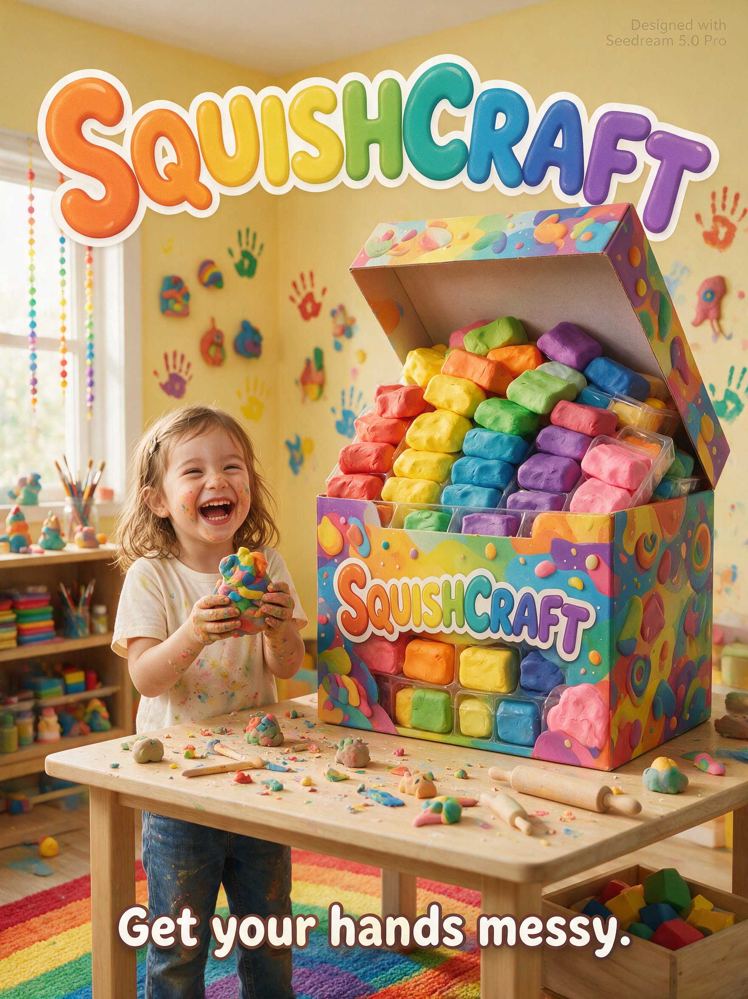

</div>

**📝 提示词:**

```
A messy fun kids advertisement poster. A laughing young girl age 6 with clay all over her hands proudly shows a lumpy clay sculpture beside a giant colorful clay set box 3x her height overflowing with clay blocks in every color, "SQUISHCRAFT" written in big squishy letters on the box. Bright cheerful craft room background with clay sculptures tools and colorful handprints on the walls. Big squishy rounded typography "SQUISHCRAFT" in rainbow colors filling the background. Tagline bottom: "Get your hands messy." Small text top-right corner reads "Designed with Seedream 5.0 Pro " in grey. Photorealistic, fun kids craft product commercial, bright warm playroom lighting.
```

**👤 出处:** [@Strength04_X](https://x.com/Strength04_X) · [source](https://x.com/Strength04_X/status/2075063250656621054)

▶️ **用 API 跑这条提示词** → [Velokey](https://velokey.ai?sourceChannel=github-awesome-seedream)（模型 id：`seedream-5.0-pro`）

---

### No.9 静奢风街拍时尚

 

<div align="center">

 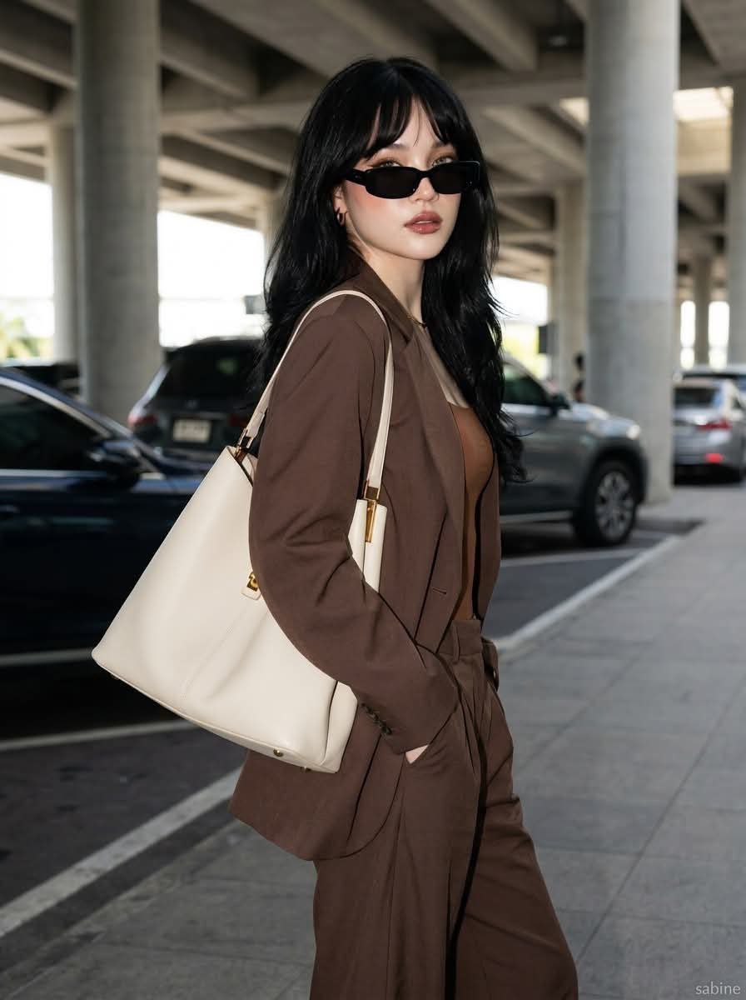

</div>

**📝 提示词:**

```
A stylish young woman with long layered black hair and soft curtain bangs, wearing sleek black rectangular sunglasses, an oversized chocolate-brown tailored blazer with matching wide-leg trousers, and a fitted mocha-brown camisole. She carries a large structured ivory leather tote bag with gold hardware over one shoulder. Standing confidently with one hand in her pocket, looking back over her shoulder. Shot in a modern open-air parking structure beneath a concrete overpass, with parked cars softly blurred in the background. Natural midday sunlight creates soft shadows and clean highlights. Minimalist luxury aesthetic, quiet luxury fashion, effortless street style, neutral earth-tone color palette, premium editorial photography, shallow depth of field, ultra-realistic skin texture, subtle makeup with glossy nude lips, high-end fashion campaign, cinematic composition, 85mm lens, f/2.0, soft bokeh, crisp focus, HDR, RAW, 8K, Vogue-style luxury editorial.
```

**👤 出处:** [@ChillaiKalan__](https://x.com/ChillaiKalan__) · [source](https://x.com/ChillaiKalan__/status/2075071088137208063)

▶️ **用 API 跑这条提示词** → [Velokey](https://velokey.ai?sourceChannel=github-awesome-seedream)（模型 id：`seedream-5.0-pro`）

---

### No.10 球衣质感产品静物

 

<div align="center">

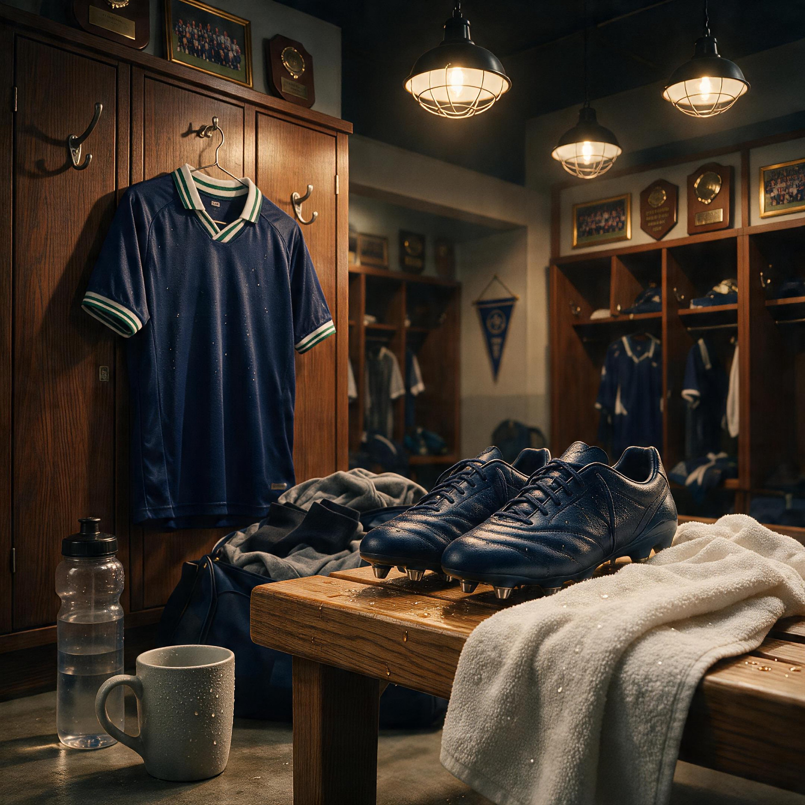 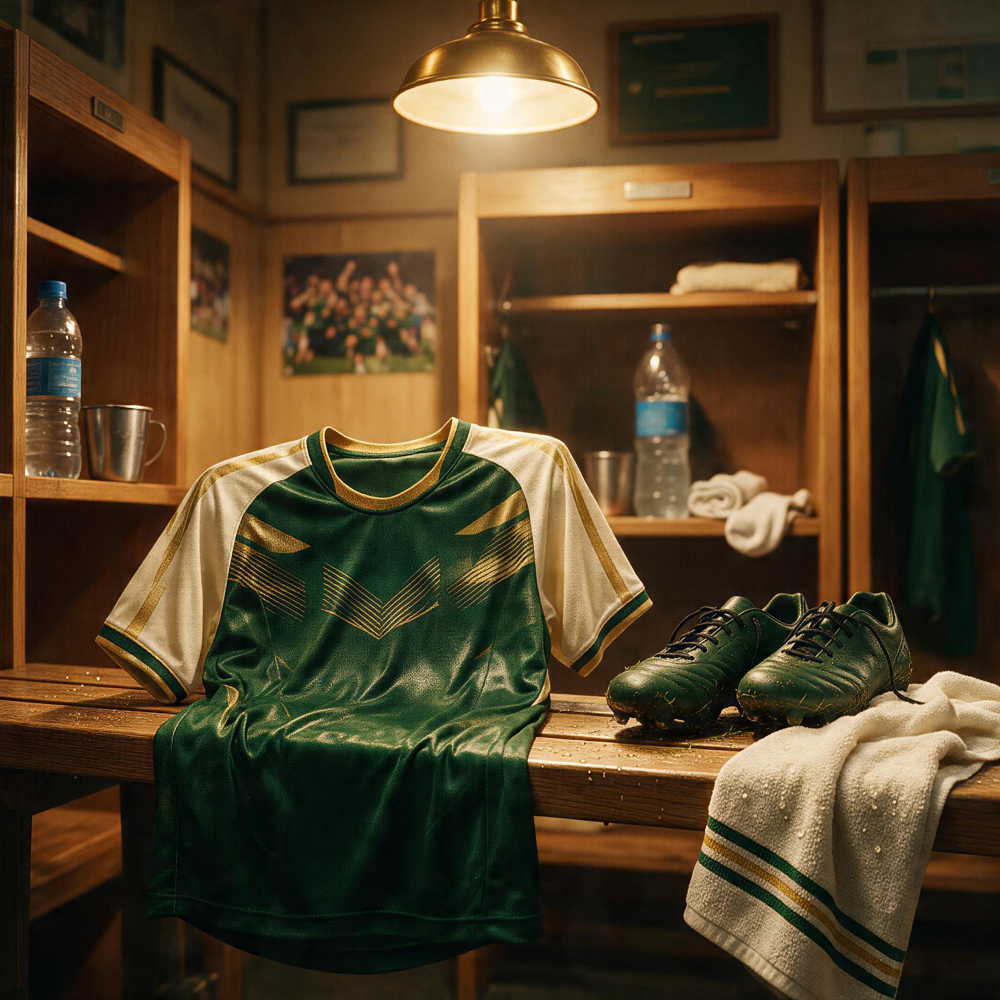

</div>

**📝 提示词:**

```
room, jersey fabric, football boots, towel, and water droplets nearby, dramatic overhead light, post match victory mood, realistic textures, premium sports refreshment campaign, sharp product focus, warm cinematic color grading, 4K, no text, no watermark.
```

**👤 出处:** [@bmx_ai13](https://x.com/bmx_ai13) · [source](https://x.com/bmx_ai13/status/2075082266695582012)

▶️ **用 API 跑这条提示词** → [Velokey](https://velokey.ai?sourceChannel=github-awesome-seedream)（模型 id：`seedream-5.0-pro`）

---

### No.13 旧金山黄昏韩系人像

 

<div align="center">

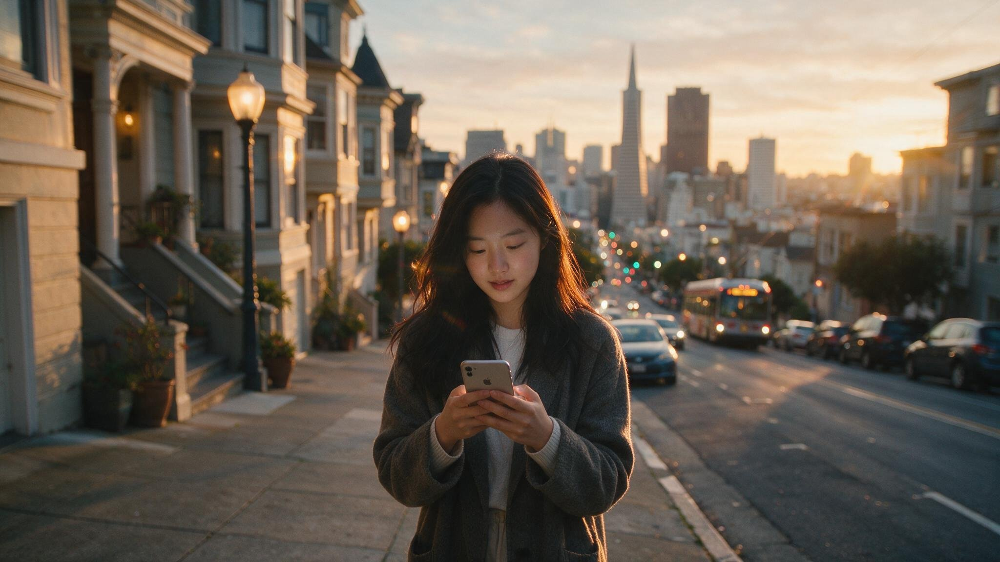

</div>

**📝 提示词:**

```
a Korean girl in her twenties on her iPhone in San Francisco at sunset
```

**👤 出处:** [@mattworkman](https://x.com/mattworkman) · [source](https://x.com/mattworkman/status/2074850550349222210)

▶️ **用 API 跑这条提示词** → [Velokey](https://velokey.ai?sourceChannel=github-awesome-seedream)（模型 id：`seedream-5.0-pro`）

---

### No.14 蓝图技术分解图

 

<div align="center">

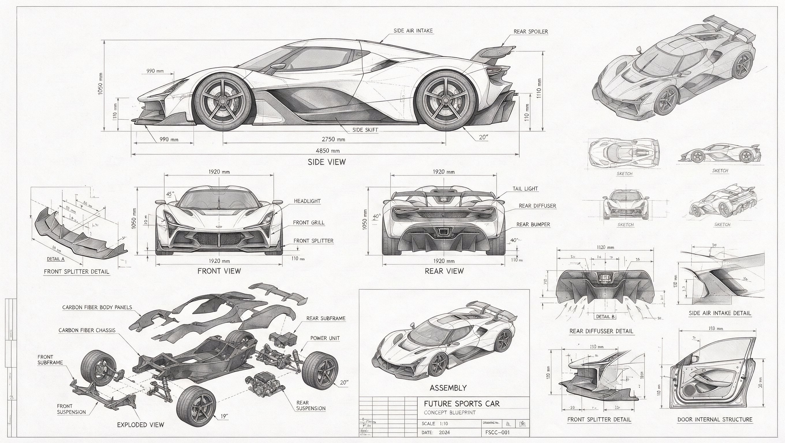 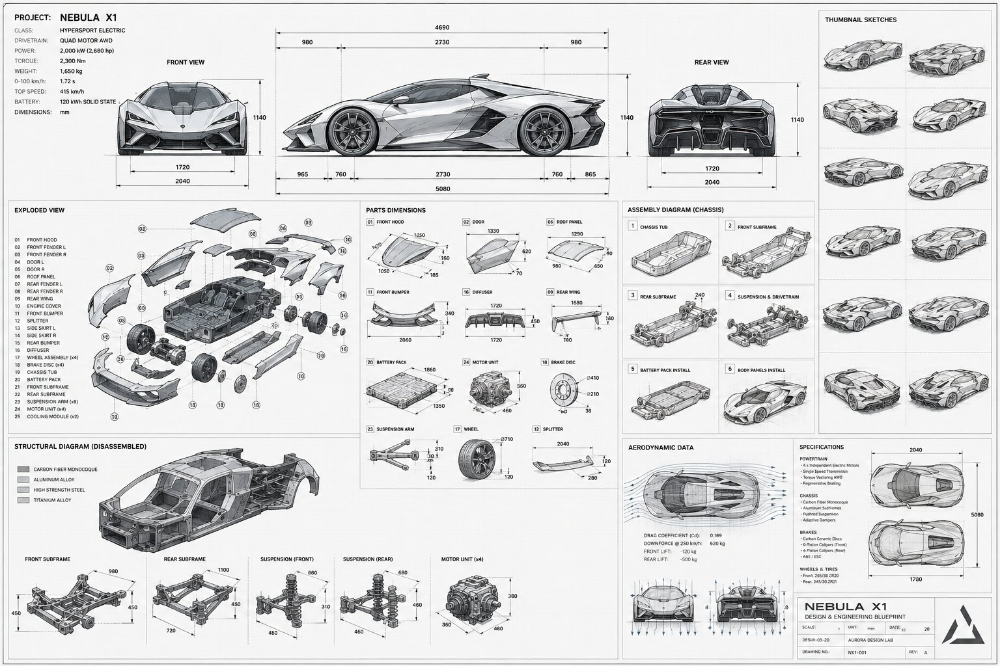

</div>

**📝 提示词:**

```
A technical drawing of a futuristic sports car in blueprint style. Include line drawings of the sports car from the front, side, and rear views, exploded parts sketches, parts assembly diagrams, and structural diagrams of disassembled components. Use abundant lines and measurement values to indicate the dimensions of each part, with grayscale tones expressing the overall sketch relationship. In addition to the main design, also show scattered thumbnails from different angles.
```

> 💡 使用说明: 对比 GPT Image 2

**👤 出处:** [@marmaduke091](https://x.com/marmaduke091) · [source](https://x.com/marmaduke091/status/2074866077499105416)

▶️ **用 API 跑这条提示词** → [Velokey](https://velokey.ai?sourceChannel=github-awesome-seedream)（模型 id：`seedream-5.0-pro`）

---

### No.15 日式田园电影感空镜

 

<div align="center">

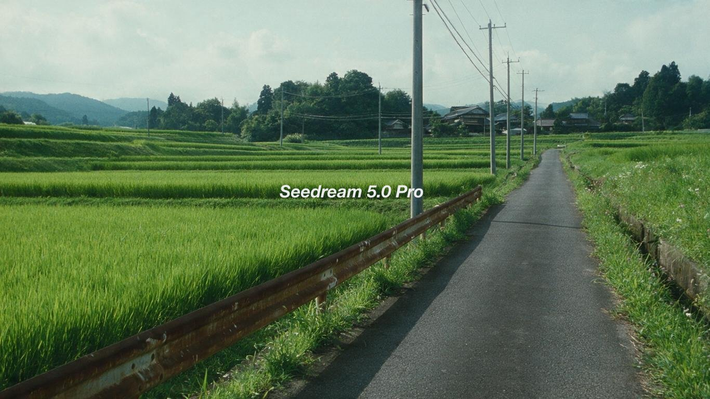 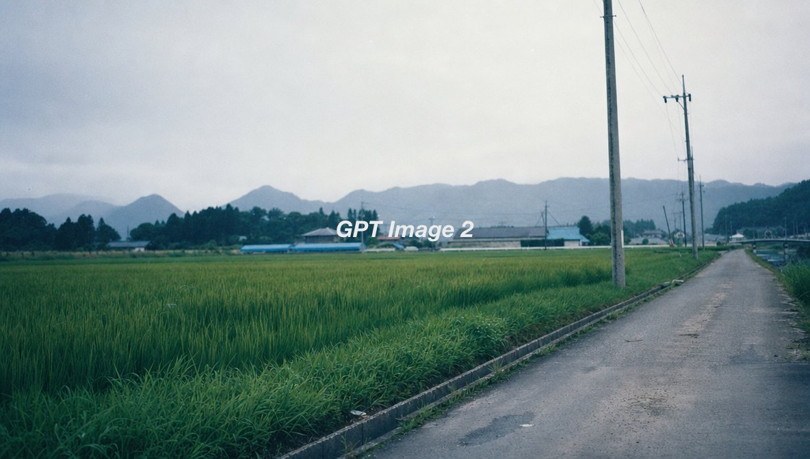 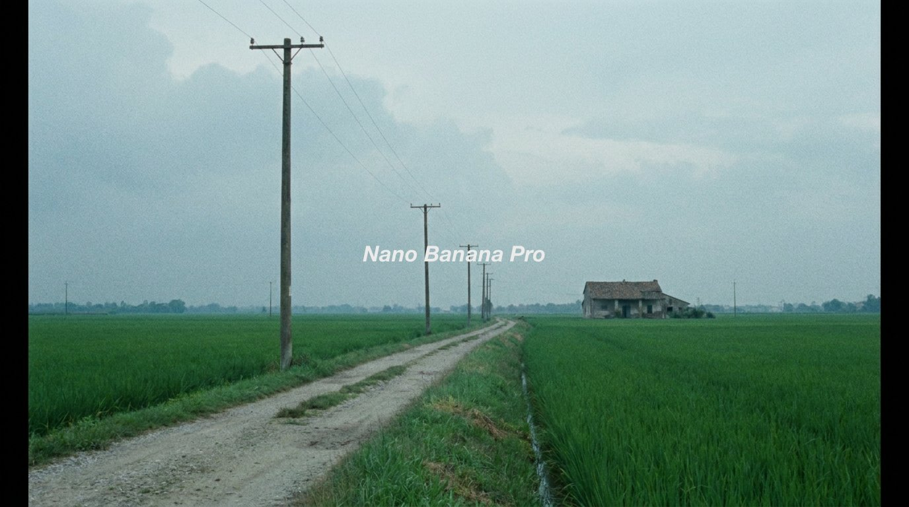

</div>

**📝 提示词:**

```
Cinematic film still,
rural Japanese rice paddy landscape in summer,
three-quarter angle view down a narrow farm road,
vivid green rice fields under an overcast pale sky,
utility poles receding into the distance,

desaturated slightly cool color grading,
subdued contrast,
off-center rule-of-thirds composition,
35mm film texture with fine grain,
soft diffused natural light,

melancholic quiet atmosphere,
no people,
Shunji Iwai inspired aesthetic
```

> 💡 使用说明: 对比 GPT Image 2 / Nano Banana Pro

**👤 出处:** [@AI__TSUBAKI](https://x.com/AI__TSUBAKI) · [source](https://x.com/AI__TSUBAKI/status/2076624942553330149)

▶️ **用 API 跑这条提示词** → [Velokey](https://velokey.ai?sourceChannel=github-awesome-seedream)（模型 id：`seedream-5.0-pro`）

---

### No.17 咖啡馆街拍甜酷少女

 

<div align="center">

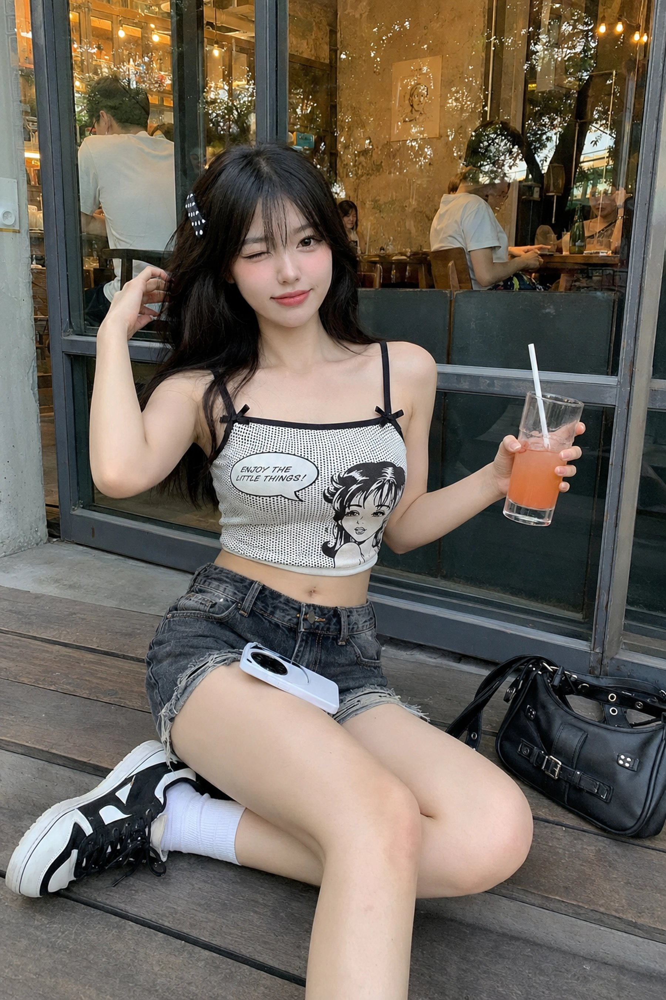 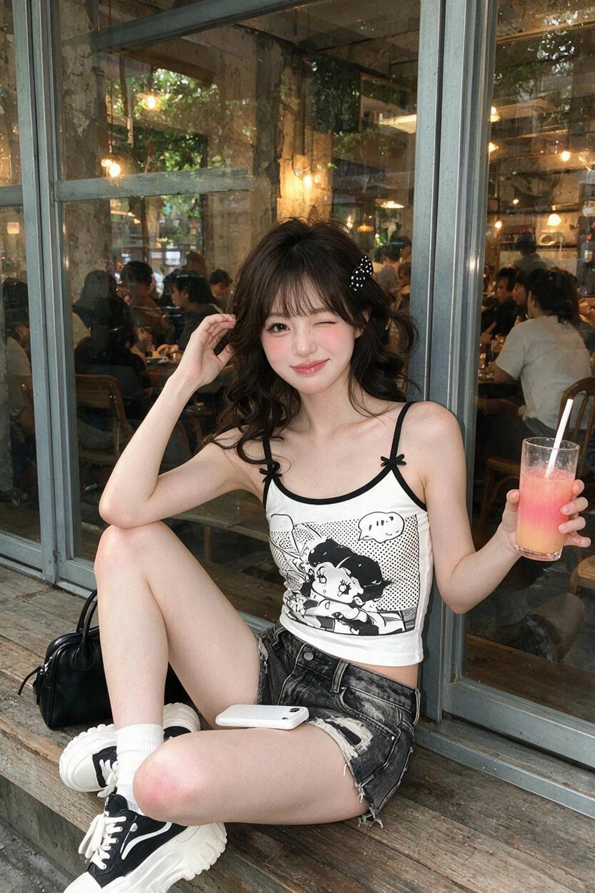

</div>

**📝 提示词:**

```
A realistic vertical 3:4 smartphone social-media street photo of a young adult woman sitting on a wooden step outside an urban cafe. Behind her are gray metal window frames and large glass panes showing the cafe interior: warm yellow lights, dining guests, wooden chairs and tables, distressed concrete walls, and tree reflections on the glass. The image should feel like a real casual snapshot, not a clean studio shoot, with natural background clutter, reflections, slight glare, and mild social-media compression.  She faces the camera while seated in a relaxed, slightly asymmetrical pose. Her body leans a little toward the left side of the frame. One leg bends sideways and the other bends naturally forward, with white socks and chunky black-and-white sneakers visible. One hand is raised near her hair, while the other holds a clear tall glass containing a pink-orange drink with a white straw. A phone with a white case rests on her lap, and a black handbag sits beside her.  She wears a black-and-white thin-strap cropped camisole with a white base, black trim, black straps, a black-and-white comic graphic, halftone dot texture, a speech bubble, and small bow details near the straps. The hem sits above the waist, revealing a small strip of midriff. Her bottoms are low-rise washed black-gray denim shorts with distressed patches, faded areas, and frayed edges, giving a Y2K streetwear feeling.  Her visible skin includes the shoulders, collarbones, upper chest edge, arms, hands, a small section of midriff, the side hip area partly covered by shorts, thighs, knees, and lower legs; the back and buttocks are not visible. The skin tone is fair with a warm pink undertone, with subtle natural redness on the cheeks and knees. The skin should look fine, soft, semi-matte, and real, with slight texture rather than plastic smoothing. Soft outdoor diffused light illuminates the front, while warm cafe lights behind the glass create faint golden reflections on the hair, shoulders, and arms.  Her styling follows a K-beauty / J-fashion sweet-cool idol-inspired direction: dark brown-black fluffy hair with airy bangs, softly curled ends, loose face-framing strands, and a black-and-white polka-dot hair clip on the left side of the image. Makeup includes a clean fair base, visible aegyo-sal, fine black eyeliner, long lashes, pink blush, and glossy rose lips. She looks into the camera with one eye open and the other playfully winking, lips softly closed with a slight smile and subtle pout.  Camera feel: taken by a friend standing in front of her with a smartphone, using a 26-35mm equivalent lens, front-facing slightly high angle, close environmental portrait framing, seated full-body view with shoes mostly included. Keep a fairly deep depth of field, clear subject, detailed cafe background, natural imperfections, reflections, mild noise, and authentic casual-photo texture.
```

> 💡 使用说明: 对比 GPT Image 2

**👤 出处:** [@underwoodxie96](https://x.com/underwoodxie96) · [source](https://x.com/underwoodxie96/status/2075140186992939103)

▶️ **用 API 跑这条提示词** → [Velokey](https://velokey.ai?sourceChannel=github-awesome-seedream)（模型 id：`seedream-5.0-pro`）

---

### No.18 午后街拍侧逆光人像

 

<div align="center">

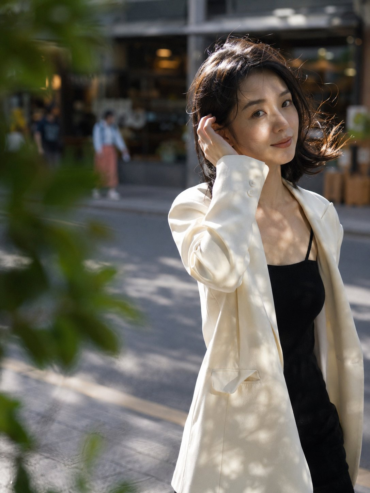 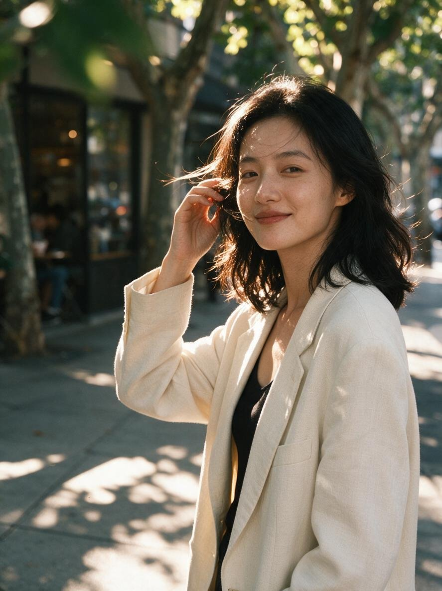

</div>

**📝 提示词:**

```
主体：一位25岁左右的中国女性，鹅蛋脸，黑色及肩微卷长发被风吹起几缕，穿米白色oversized西装外套内搭黑色吊带，锁骨清晰

动作与姿态：走在人行道上被镜头抓拍的瞬间，一只手轻拨耳边碎发，身体微微侧转，步伐自然

表情与视线：不经意间瞥向镜头的瞬间，嘴角似笑非笑，眼神松弛真实

场景环境：下午四点的城市街头，梧桐树影落在人行道上，背景是虚化的咖啡店橱窗和路人

镜头：中景（medium shot），85mm镜头，浅景深（shallow DOF），主体位于画面右三分之一，前景有虚化的树叶

光线：午后侧逆光（backlight）勾勒发丝金边，树影在脸上形成斑驳光斑（dappled light），自然柔和

风格：写实街拍摄影，富士胶片色调，轻微颗粒感

材质细节：可见皮肤毛孔和自然肤质，西装面料的编织纹理，发丝根根分明

约束：无文字水印，无畸形手指，避免过度磨皮的塑料感皮肤
```

> 💡 使用说明: 对比 GPT Image 2

**👤 出处:** [@johnAGI168](https://x.com/johnAGI168) · [source](https://x.com/johnAGI168/status/2075228822887157932)

▶️ **用 API 跑这条提示词** → [Velokey](https://velokey.ai?sourceChannel=github-awesome-seedream)（模型 id：`seedream-5.0-pro`）

---

### No.22 黑白漫画分格页

 

<div align="center">

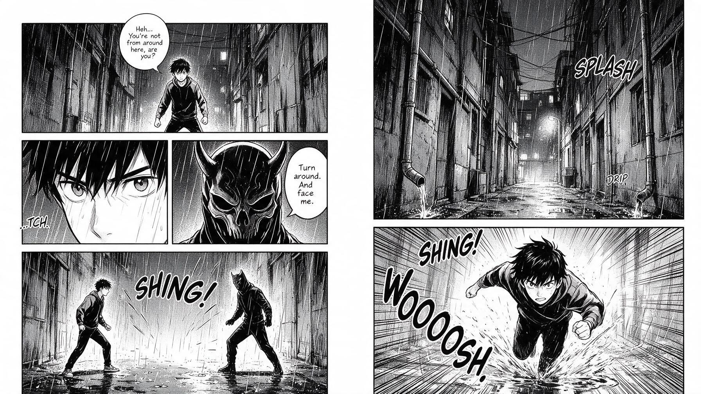

</div>

**📝 提示词:**

```
Create a single full-page manga comic layout, not a poster and not a single illustration. The output must be a real manga page with multiple panels, black and white only, authentic Japanese manga style, clean ink linework, screentones, dramatic shadows, speed lines, expressive close-ups, and clear sequential storytelling. Right-to-left reading flow.

Story scene: in a rainy urban alley at night, a young male protagonist confronts a mysterious masked enemy. Show the sequence across 5 to 6 panels: establishing shot of the alley, medium shot of the protagonist, close-up of his eyes, close-up of the enemy’s mask, tension building, then a final large action panel where the protagonist charges forward through puddles. Wet pavement, dripping pipes, narrow buildings, cables, dim lights, and urban textures should all be rendered in detailed manga style.

Use varied panel sizes and cinematic framing. Include screentones, cross-hatching, rain effects, impact lines, and manga-style speech bubbles. Keep the page visually balanced and readable, with strong storytelling and a polished published manga feel
```

**👤 出处:** [@MayorKingAI](https://x.com/MayorKingAI) · [source](https://x.com/MayorKingAI/status/2075285308497957179)

▶️ **用 API 跑这条提示词** → [Velokey](https://velokey.ai?sourceChannel=github-awesome-seedream)（模型 id：`seedream-5.0-pro`）

---

### No.23 极简高定时尚特写

 

<div align="center">

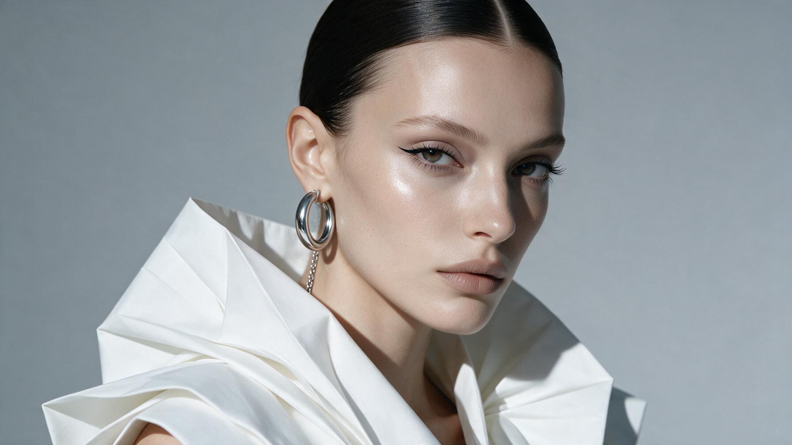

</div>

**📝 提示词:**

```
A highly photorealistic close-up editorial fashion portrait of a young woman with a strong modern look, clean bone structure, slick center-parted hair, and striking minimal makeup focused on the eyes. She wears a structured white fashion piece with sculptural lines and silver accessories. Camera: close-up crop, slightly off-center composition, 85mm lens, shallow depth of field. Lighting: crisp directional studio light from the side with controlled shadow shaping the face, subtle reflector fill, soft highlight on the cheekbone. Background: cool light gray studio backdrop. Color palette: white, silver, cool gray, pale taupe, natural skin tones. Premium avant-garde magazine photography, sharp, modern, elegant, realistic skin texture, no illustration, no cartoon look
```

**👤 出处:** [@MayorKingAI](https://x.com/MayorKingAI) · [source](https://x.com/MayorKingAI/status/2075285291875942571)

▶️ **用 API 跑这条提示词** → [Velokey](https://velokey.ai?sourceChannel=github-awesome-seedream)（模型 id：`seedream-5.0-pro`）

---

### No.24 黏土定格烘焙师

 

<div align="center">

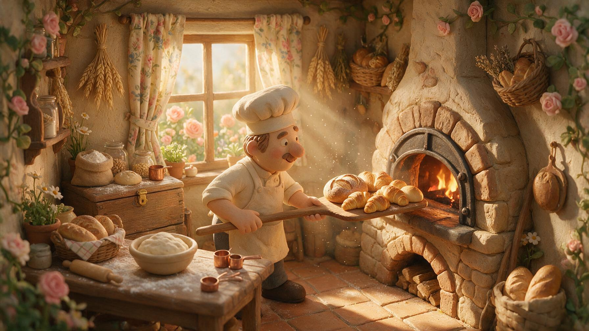

</div>

**📝 提示词:**

```
A charming claymation-style baker inside a cozy miniature bakery early in the morning, placing fresh bread into a small stone oven while flour dust floats through warm sunlight. Everything has a handcrafted stop-motion texture, including the walls, bread, tools, and character design. Gentle camera pan, whimsical movement, warm golden light, soft pastel tones, tactile clay textures, nostalgic and playful stop-motion film look
```

**👤 出处:** [@MayorKingAI](https://x.com/MayorKingAI) · [source](https://x.com/MayorKingAI/status/2075285276700872933)

▶️ **用 API 跑这条提示词** → [Velokey](https://velokey.ai?sourceChannel=github-awesome-seedream)（模型 id：`seedream-5.0-pro`）

---

### No.25 保时捷911汽车广告

 

<div align="center">

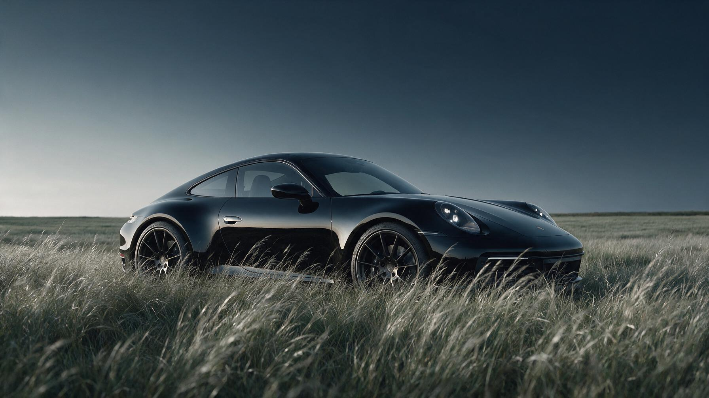

</div>

**📝 提示词:**

```
A premium photorealistic automotive advertising photograph of a black Porsche 911 coupe parked in tall windswept grass under a vast moody sky. The car is shown from a low three-quarter side angle, front facing slightly to the right, emphasizing the iconic 911 silhouette, rounded headlights, sculpted hood, smooth roofline, wide rear haunches, glossy black paint, dark multi-spoke wheels, low-profile performance tires, tinted windows, and subtle illuminated headlights. The foreground grass partially covers the lower body, creating depth and texture. The background is minimal and elegant, with no buildings, no people, and no distractions, only an open field and a smooth gradient sky fading from pale gray near the horizon to deep charcoal blue above. Lighting is soft, cold, and atmospheric, with refined reflections across the hood, roofline, doors, wheels, and headlights. Color palette: black, charcoal, blue-gray, silver, muted steel tones. The image should feel quiet, expensive, cinematic, and refined, like a high-end Porsche magazine campaign. Sharp focus on the car, realistic reflections, premium commercial photography, clean composition, no text, no artificial CGI look, no illustration
```

**👤 出处:** [@MayorKingAI](https://x.com/MayorKingAI) · [source](https://x.com/MayorKingAI/status/2075285260917723492)

▶️ **用 API 跑这条提示词** → [Velokey](https://velokey.ai?sourceChannel=github-awesome-seedream)（模型 id：`seedream-5.0-pro`）

---

### No.26 雨中武士电影镜头

 

<div align="center">

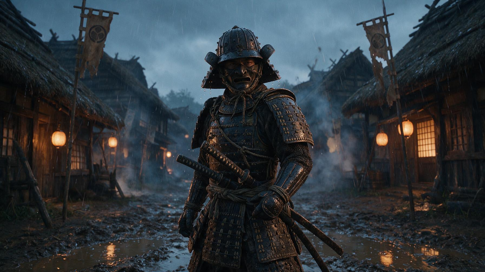

</div>

**📝 提示词:**

```
A highly photorealistic cinematic image of a battle-worn samurai standing alone in a muddy village street moments before a duel, during heavy rain at dusk. His armor is scratched and wet, his face is calm but hardened, and one hand rests close to the sword hilt as he faces an unseen opponent just outside the frame. The village around him is realistic and sparse: wooden houses, puddles, torn banners, muddy ground, rainwater dripping from roof edges, and smoke lingering in the damp air. Camera: slightly low angle, medium shot, 50mm lens, strong subject focus with subtle background softness, composition centered on the samurai’s posture and readiness. Lighting: soft overcast dusk light with a dim cool sky tone, mixed with warm lantern glow from a nearby doorway reflecting faintly on wet armor and puddles. Color palette: muted earth tones, wet wood browns, iron gray, deep blue-gray sky, warm amber highlights. The scene should feel tense, restrained, and realistic, with natural rain interaction, authentic materials, and grounded historical atmosphere. No fantasy armor, no anime look, no exaggerated action posing
```

**👤 出处:** [@MayorKingAI](https://x.com/MayorKingAI) · [source](https://x.com/MayorKingAI/status/2075285245402972404)

▶️ **用 API 跑这条提示词** → [Velokey](https://velokey.ai?sourceChannel=github-awesome-seedream)（模型 id：`seedream-5.0-pro`）

---

### No.27 1970s 纪实人像

 

<div align="center">

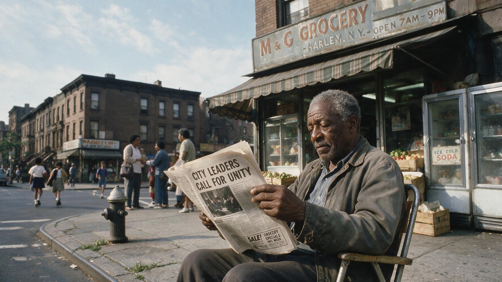

</div>

**📝 提示词:**

```
A highly photorealistic social documentary portrait captured as a 1970s 35mm color film photograph. An older Harlem resident sits on a folding chair outside a small corner store in the morning, reading a newspaper. The frame is close enough to show his weathered hands, textured skin, worn jacket, calm eyes, and the creases of the newspaper. In the background, softly blurred neighbors talk near brownstone buildings, children walk to school, and faded storefront signs suggest the rhythm of everyday neighborhood life. The image should feel candid, quiet, intimate, and observational, with no posing or dramatization. 1970s documentary photojournalism look, analog grain, faded color palette, soft natural light, gentle contrast, realistic imperfections, archival feel, no glamour, no illustration
```

**👤 出处:** [@MayorKingAI](https://x.com/MayorKingAI) · [source](https://x.com/MayorKingAI/status/2075285229670199488)

▶️ **用 API 跑这条提示词** → [Velokey](https://velokey.ai?sourceChannel=github-awesome-seedream)（模型 id：`seedream-5.0-pro`）

---

### No.28 3D 动画毛怪衣柜

 

<div align="center">

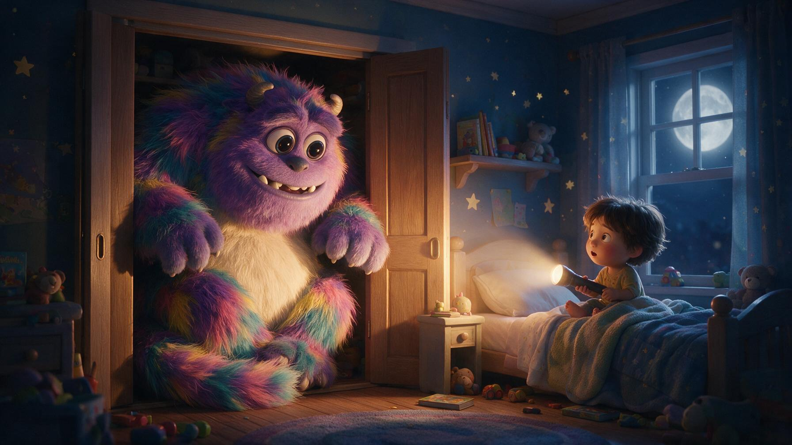

</div>

**📝 提示词:**

```
A high-quality 3D animated feature film scene of a large gentle monster hiding awkwardly inside a child’s bedroom closet. The monster is fluffy, oversized, colorful, and harmless, with huge expressive eyes, small horns, rounded teeth, and a nervous smile. A little child sits on the bed holding a flashlight, surprised but not scared. The room has toys, storybooks, star stickers, soft blankets, warm night lamp light, and moonlight coming through the window. Emotional and comedic tone, rounded character design, soft fur simulation, warm cinematic lighting, stylized realism, polished animated family film look
```

**👤 出处:** [@MayorKingAI](https://x.com/MayorKingAI) · [source](https://x.com/MayorKingAI/status/2075285213484359723)

▶️ **用 API 跑这条提示词** → [Velokey](https://velokey.ai?sourceChannel=github-awesome-seedream)（模型 id：`seedream-5.0-pro`）

---

### No.30 80-90 年代 OVA 动漫

 

<div align="center">

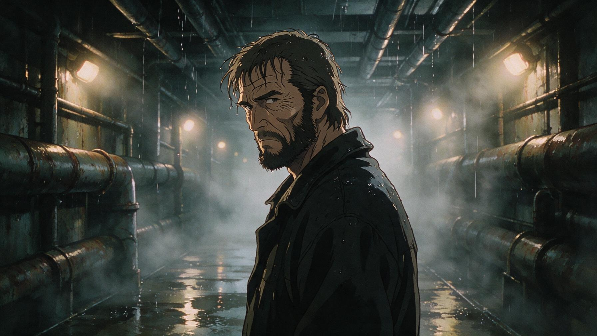

</div>

**📝 提示词:**

```
A rugged man in his 50s inside a wet industrial corridor, facing three-quarter left, silent and tense, eyes focused forward, beard stubble, damp hair, soaked jacket collar, wrinkles drawn with subtle anime linework. Everything in the image is 100% anime: character, corridor, lights, rain, fog, reflections, shadows, textures, and background. Adult 1980s-1990s anime OVA style, gritty hand-drawn cel animation, traditional painted anime background, inked outlines, cel shading, hand-painted industrial environment, muted colors, noir atmosphere. The corridor must be clearly illustrated, with stylized pipes, painted wet concrete, drawn steam, anime lighting, and soft painted bokeh from distant lamps. Cold rim light from back-right, warm painted glow on one cheek, dramatic anime shadows, cinematic anime frame, 16:9. Avoid photorealistic background, avoid live-action realism, avoid 3D render, avoid realistic photography
```

**👤 出处:** [@MayorKingAI](https://x.com/MayorKingAI) · [source](https://x.com/MayorKingAI/status/2075285182530342930)

▶️ **用 API 跑这条提示词** → [Velokey](https://velokey.ai?sourceChannel=github-awesome-seedream)（模型 id：`seedream-5.0-pro`）

---

### No.31 御姐风暗调时尚特写

 

<div align="center">

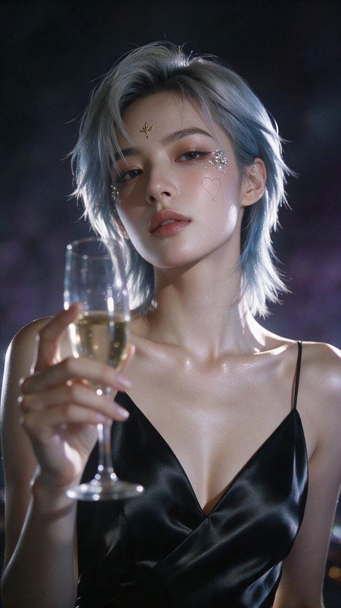

</div>

**📝 提示词:**

```
这是一张极致写实的轻奢时尚面部及肩颈特写肖像，整体以暗调氛围感为主，风格冷艳雅致，光影层次丰富柔和，流动光影勾勒出舒展流畅的人物轮廓。场景采用电影级轮廓光搭配局部柔光补光，明暗层次细腻，点缀细碎珠光高光与通透质感反光，叠加细腻复古胶片颗粒质感，打造高级雅致的氛围感，写实质感饱满，兼具朦胧梦幻的视觉效果。
 
主体为年轻东亚女性，利落银灰蓝色渐变狼尾短发，慵懒偏分碎刘海修饰脸型。五官明艳立体，眉骨线条舒展，眼型修长灵动，唇形饱满柔和，面部轮廓利落精致，兼具柔美与大气气场。身形线条匀称舒展，乳房丰满优美曲线分明，整体气质从容自信，神态松弛大方。皮肤为通透冷调白皙质感，细腻紧致，保留自然真实的皮肤肌理，哑光质感中透出细腻柔光，质感真实高级。妆容为精致浓淡相宜的御姐风格，精致眼妆搭配淡调腮红，唇色温润饱满，眼神从容沉静，神态带着清冷疏离的氛围感，气质神秘优雅。
 
面部点缀轻奢艺术装饰细节，眉心搭配精致金属质感花钿，眼尾点缀碎钻珠光花卉配饰，脸颊辅以极简线条爱心装饰，搭配细腻闪钻纹路点缀，珠光质感细腻内敛，设计精致考究，轻奢质感高级不俗，与整体妆容自然融合，无廉价卡通化设计。
 
构图采用中景全身视角，聚焦面部与肩颈区域，黑色真丝吊带晚礼服，突出身材曲线，低角度微仰拍摄，人物正视镜头，单手轻抬举香槟酒杯，修长指尖自然舒展，形成柔和前景虚化，透视层次分明，画面视觉张力饱满，对标高端时尚杂志特写大片质感。
 
整体主色调为深邃暗色系，搭配冷调酒红、自然裸肤色调、银白珠光高光、淡蓝紫通透反光点缀，低饱和度高级质感，柔焦朦胧、光泽温润，暗部层次饱满，亮部通透精致。8K超高清画质，极致写实细节，完整保留原生皮肤纹理，电影级细腻胶片颗粒质感，潮流轻奢人像美学，画幅比例9:16。
```

**👤 出处:** [@PixelAigc](https://x.com/PixelAigc) · [source](https://x.com/PixelAigc/status/2075362386949947827)

▶️ **用 API 跑这条提示词** → [Velokey](https://velokey.ai?sourceChannel=github-awesome-seedream)（模型 id：`seedream-5.0-pro`）

---

### No.34 多语言海报文字替换

 

<div align="center">

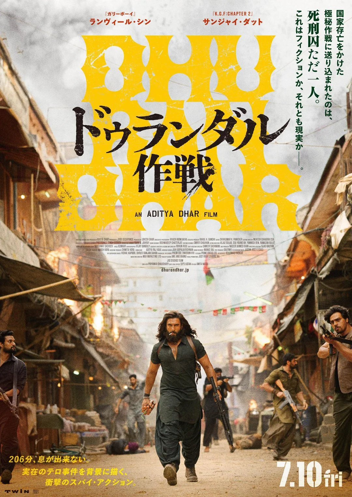 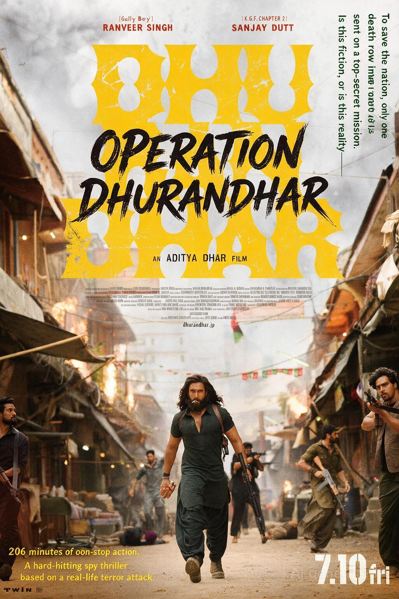

</div>

**📝 提示词:**

```
Using the uploaded Japanese movie poster as the reference image, automatically detect all Japanese text and replace it with natural, readable English while preserving the original meaning. Do not redesign the poster.
```

> 💡 使用说明: 图像编辑技巧，需参考图

**👤 出处:** [@EyeingAI](https://x.com/EyeingAI) · [source](https://x.com/EyeingAI/status/2075550621181317267)

▶️ **用 API 跑这条提示词** → [Velokey](https://velokey.ai?sourceChannel=github-awesome-seedream)（模型 id：`seedream-5.0-pro`）

---

### No.35 柔光 pastel 室内人像

 

<div align="center">

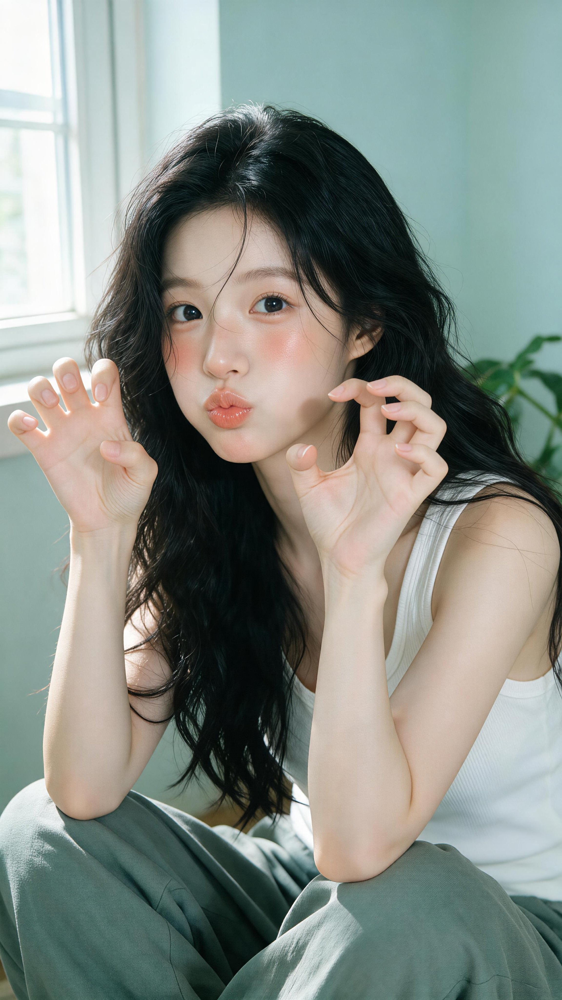

</div>

**📝 提示词:**

```
9:16, photorealistic close-up indoor portrait, soft natural window light, pale aqua wall background, low-contrast pastel color grading, gentle shadows, clean fresh lifestyle photography.

Young adult East Asian woman, long fluffy black wavy hair, loose messy strands across her face and lips, delicate doll-like face, large clear dark eyes, fair luminous skin, peach blush on cheeks and nose, glossy peach pouty lips, subtle natural makeup.

She sits casually on the floor with knees raised in the foreground, wearing a white ribbed sleeveless tank top and loose gray-green pants. Both hands lifted near her face, playful cute pout expression, looking directly at the camera, intimate candid mood, soft focus, realistic skin texture, shallow depth of field.
```

**👤 出处:** [@BubbleBrain](https://x.com/BubbleBrain) · [source](https://x.com/BubbleBrain/status/2075565735275794897)

▶️ **用 API 跑这条提示词** → [Velokey](https://velokey.ai?sourceChannel=github-awesome-seedream)（模型 id：`seedream-5.0-pro`）

---

### No.36 红金古风 cosplay

 

<div align="center">

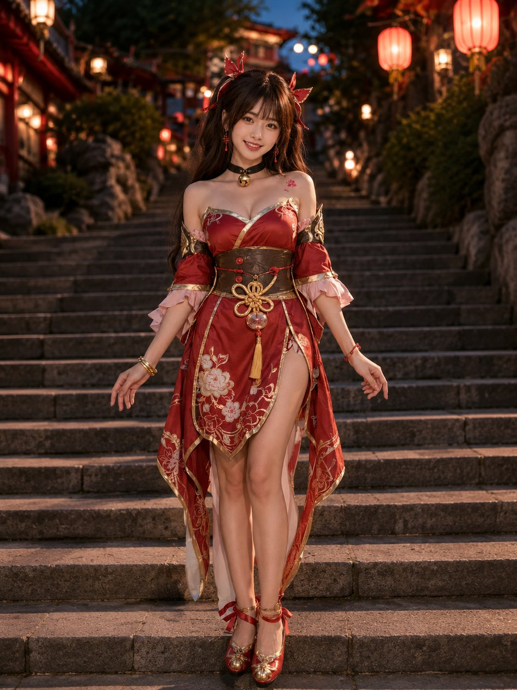 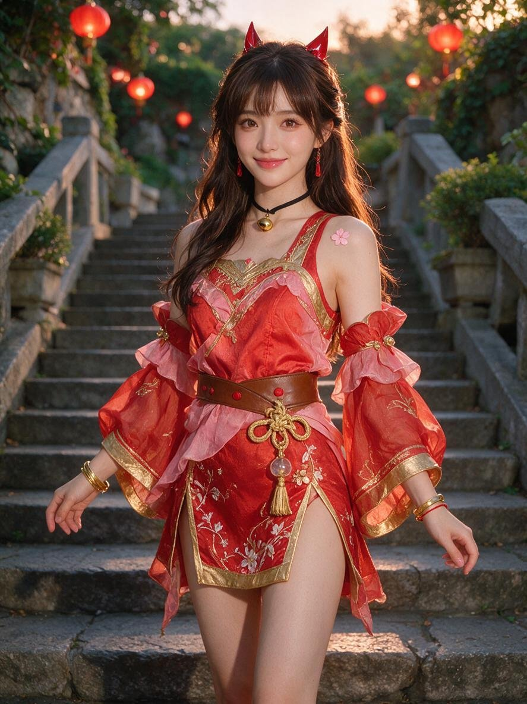

</div>

**📝 提示词:**

```
A photograph of a beautiful young East Asian woman in her early 20s cosplaying an anime-style character, standing on an outdoor stone staircase at dusk. She has long, wavy dark brown hair with side bangs, styled with a pair of red pointed hair ornaments near the crown. Delicate features with soft makeup — large warm brown eyes, glossy pink lips in a gentle smile, a small pink cherry-blossom decal on her left shoulder. She wears a black cord choker with a round golden bell pendant, red dangling earrings, gold bangle bracelets, and a thin red string bracelet. She has an attractive figure shown in an elaborate red-and-gold traditional-fantasy costume — an off-shoulder sleeveless red top with gold trim and ruffled pink accents at the upper arms, detached puffed sleeves, a wide brown leather belt with red buttons at the waist cinched over the outfit, an ornate knotted gold cord and tasseled ornament with a small glass orb hanging at the front, and a short red skirt with white and gold floral embroidery and a high side slit revealing her thigh. She stands facing the camera, both arms relaxed and slightly open at her sides, weight even. Behind her, a wide grey stone staircase leads up into a blurred background of warm red lantern light, greenery, and rocky garden walls, softly out of focus. Warm golden-hour lighting with a reddish ambient glow. Shot at eye level, full-body vertical framing, 50mm lens, shallow depth of field, natural skin texture, vivid saturated colors, glossy cosplay photography aesthetic.
```

> 💡 使用说明: 对比 GPT Image 2

**👤 出处:** [@johnAGI168](https://x.com/johnAGI168) · [source](https://x.com/johnAGI168/status/2075591097493918202)

▶️ **用 API 跑这条提示词** → [Velokey](https://velokey.ai?sourceChannel=github-awesome-seedream)（模型 id：`seedream-5.0-pro`）

---

### No.37 雪中回眸人像

 

<div align="center">

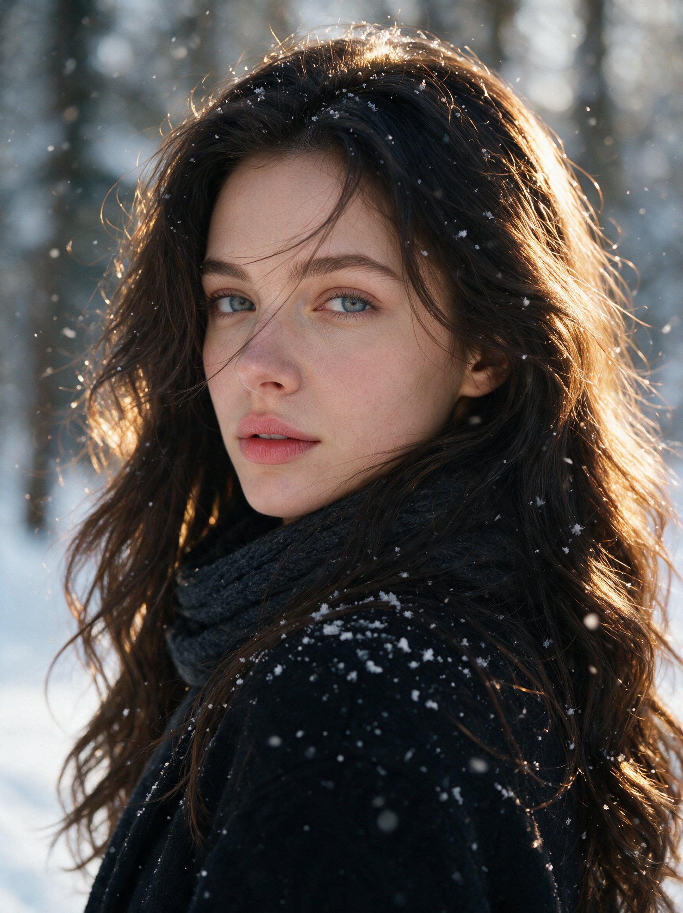

</div>

**📝 提示词:**

```
Ultra-realistic close-up portrait of a young woman outdoors during gentle snowfall, looking back over her shoulder at the camera. Long dark brown wavy hair with loose strands blowing across her face, snowflakes resting naturally on her hair and shoulders. Thick charcoal gray knitted scarf wrapped around her neck, black textured winter coat. Soft pink lips, defined natural eyebrows, subtle makeup, light blue-gray eyes with a calm expression. Warm golden winter sunlight creates soft rim lighting against a blurred snowy forest background. Shallow depth of field, cinematic composition, 85mm lens, f/1.8, high dynamic range, photorealistic, DSLR quality. Natural skin texture with visible pores, fine peach fuzz, subtle skin imperfections, realistic subsurface scattering, gentle tonal variation, no plastic skin, no excessive smoothing, no beauty filter, true-to-life complexion, crisp eye detail, lifelike facial features. Cold winter atmosphere, soft bokeh, ultra-detailed, 8K.
```

**👤 出处:** [@rovvmut_](https://x.com/rovvmut_) · [source](https://x.com/rovvmut_/status/2075619983837831390)

▶️ **用 API 跑这条提示词** → [Velokey](https://velokey.ai?sourceChannel=github-awesome-seedream)（模型 id：`seedream-5.0-pro`）

---

### No.38 月夜檐廊人像

 

<div align="center">

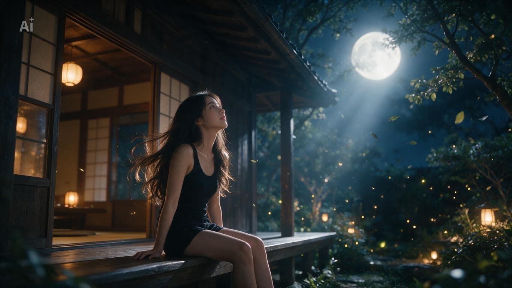 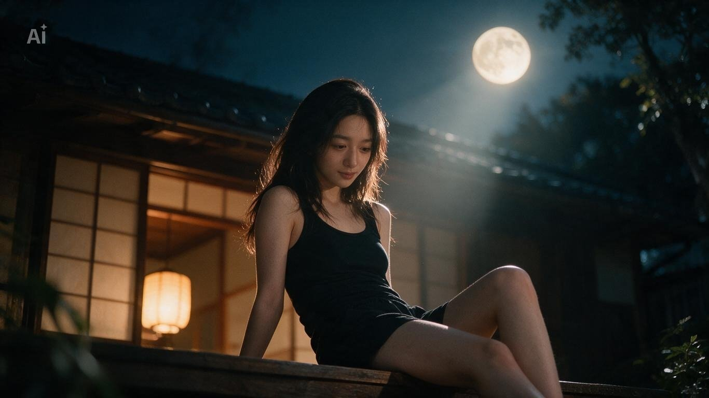

</div>

**📝 提示词:**

```
Long flowing dark hair with soft waves, natural and effortless beauty, soft glowing skin, same facial features exactly as reference.

A beautiful young Japanese woman with long flowing dark hair, wearing a fitted black tank top and casual black shorts, relaxed and unposed, sitting casually on the engawa (wooden veranda) of a traditional Japanese house at night, leaning back slightly with one leg bent, looking down softly at her phone or simply resting with a calm, natural gaze not looking at the moon.

The full moon glows softly in the background sky above the rooftop, purely as ambient scenery.

Cinematic movie-grade shot, shallow depth of field with creamy bokeh, slow dolly-in camera movement, soft moonlight rim lighting mixed with warm ambient glow from paper shoji lanterns inside the house, subtle film grain, volumetric moonlight rays filtering through surrounding trees, color graded like a Denis Villeneuve film deep indigo and warm amber tones, 35mm anamorphic lens.
```

**👤 出处:** [@Cia0_exe](https://x.com/Cia0_exe) · [source](https://x.com/Cia0_exe/status/2075632375858659717)

▶️ **用 API 跑这条提示词** → [Velokey](https://velokey.ai?sourceChannel=github-awesome-seedream)（模型 id：`seedream-5.0-pro`）

---

### No.40 摩天楼仰角街拍

 

<div align="center">

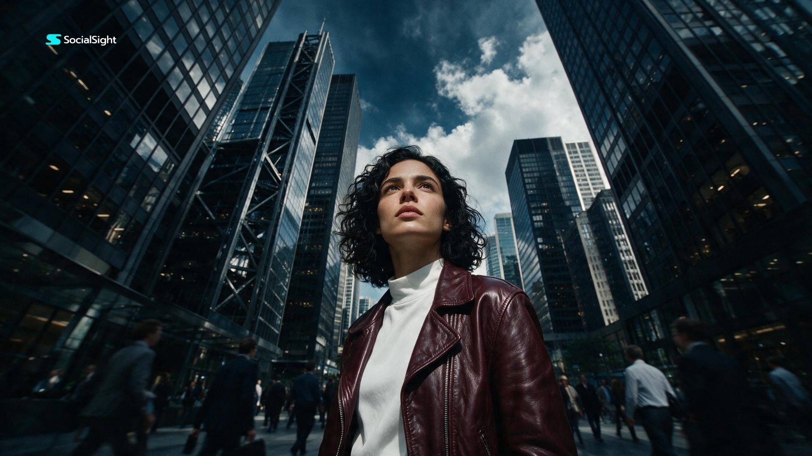

</div>

**📝 提示词:**

```
Ultra realistic cinematic street photograph of a confident young woman standing between towering modern skyscrapers in a dense financial district. Captured from an extreme low angle perspective, making the dark glass and steel buildings rise dramatically around her and converge toward the cloudy blue sky. She has shoulder length curly black hair and wears a deep burgundy leather jacket over a clean white high neck top. Her expression is serious, calm, and determined as she looks upward toward something beyond the frame.

The woman occupies the lower center of the composition while the massive architecture dominates the surrounding space, creating a strong sense of ambition, pressure, and scale. Blurred silhouettes of commuters move through the background, adding natural city energy without distracting from the subject. Cool overcast daylight, deep blue and charcoal tones, subtle warm reflections inside the buildings, soft directional light across her face, realistic skin texture, natural curls, detailed leather grain, authentic fabric folds, atmospheric depth, cinematic shadows, shallow depth of field, 20mm wide angle lens, f/2.8, slight edge distortion, handheld editorial photography, high dynamic range, subtle film grain, photorealistic full frame camera quality, no artificial beauty filter, no plastic skin, no CGI appearance, ultra detailed, 8K.
```

**👤 出处:** [@bmx_ai13](https://x.com/bmx_ai13) · [source](https://x.com/bmx_ai13/status/2075922805573751264)

▶️ **用 API 跑这条提示词** → [Velokey](https://velokey.ai?sourceChannel=github-awesome-seedream)（模型 id：`seedream-5.0-pro`）

---

### No.41 红纱丽宫廷人像

 

<div align="center">

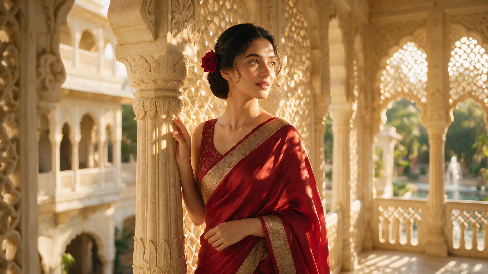 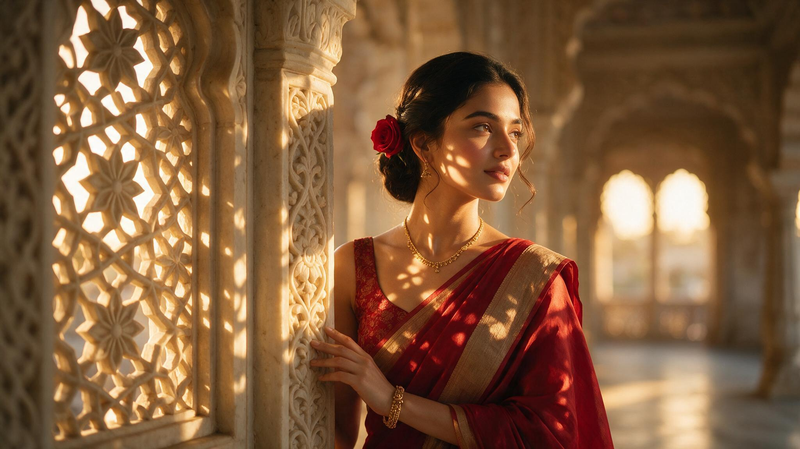

</div>

**📝 提示词:**

```
Ultra-realistic cinematic portrait of a beautiful young woman wearing a rich deep crimson red silk saree with a matching sleeveless blouse featuring subtle floral jacquard embroidery and a muted gold border. She is standing beside an intricately carved ivory stone pillar in a heritage palace corridor during golden hour, gazing softly into the distance with a calm, dreamy expression. Her hair is styled in a neat low bun adorned with a single fresh red rose, with a few loose curled strands framing her face. Smooth glowing natural skin, expressive brown eyes, soft pink lips, minimal makeup. Warm sunlight passes through ornate carved jali patterns, casting intricate floral shadows across her face, neck, shoulders, blouse, and saree. Soft cinematic backlight, creamy bokeh, shallow depth of field, luxurious heritage architecture blurred in the background, elegant composition, warm golden color grading, highly detailed silk texture, photorealistic skin, natural facial proportions, HDR, 8K, DSLR quality, 85mm portrait lens, f/1.8, ultra sharp focus on the face, premium editorial fashion photography
```

**👤 出处:** [@aaliya_va](https://x.com/aaliya_va) · [source](https://x.com/aaliya_va/status/2075924410423271453)

▶️ **用 API 跑这条提示词** → [Velokey](https://velokey.ai?sourceChannel=github-awesome-seedream)（模型 id：`seedream-5.0-pro`）

---

### No.43 古风书阁纪实人像

 

<div align="center">

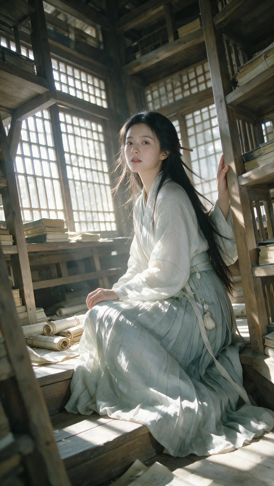 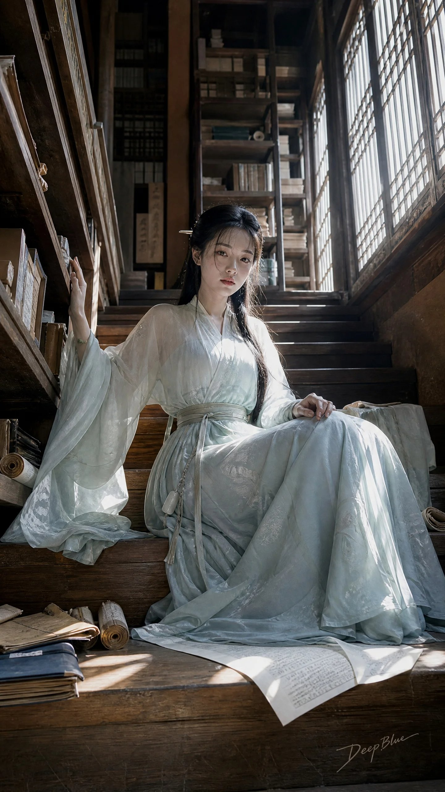

</div>

**📝 提示词:**

```
古风纪实摄影 · 书阁梯影午后  竖版 9:16，超写实真人摄影，国际高级时尚杂志 Editorial Photography 与中国古风书阁生活纪实摄影融合风格，复古 CCD 数码相机直闪结合自然窗光拍摄，仿佛在旧书阁中随手记录的一张真实生活影像，具有安静、克制的电影质感与轻微胶片颗粒。  成年中国古风女子，约二十三岁，气质清雅沉静，五官精致自然，鹅蛋脸，杏眼柔和，鼻梁挺秀，唇形自然，肤色冷白至象牙白，真实皮肤纹理保留，整体不过度修饰。乌黑长发自然垂落，仅以一支木簪轻轻固定部分发丝，发丝随室内微风轻轻摆动。  人物身形线条柔和圆润饱满，整体比例协调，肩颈修长，锁骨线条柔和，身体姿态自然放松，四肢线条修长真实，整体具有国际高级时尚杂志 Editorial Photography 的人体雕塑感与东方古典气质。  身穿浅月白与淡墨青宋制汉服，上襦为交领轻纱材质，质地轻薄柔和，下身百迭裙层层展开，自然垂落在木质地板与台阶之间，衣料绣有极淡的云纹与书卷暗纹，整体色调克制安静。腰间系浅色丝绦，佩戴白玉小坠饰与简约香囊。  人物坐在古代书阁木质台阶上，身体微微侧向窗边光源，一只手轻轻扶着身旁木质书架，另一只手自然放在膝上，手边散落几卷古籍与宣纸卷轴。人物微微抬头看向镜头，神情平静内敛，带有轻微思绪感。  摄影采用低机位略仰拍，35mm 广角镜头，利用书架纵深结构与阶梯线条形成强透视构图。前景为木质台阶与散落书页，中景为人物主体，背景为高耸书阁结构与格栅窗光。  窗外午后阳光穿过木格窗，形成条状光影落在人物衣料与地面上，光影层次清晰。室内空气带有轻微尘埃感，使光束可见，增强真实感与空间深度。  整体色彩以浅木色、月白、墨青、纸白与灰棕为主，低饱和高调曝光，CCD彩噪、轻微胶片颗粒、柔和锐化与年代数码压缩质感并存。  画面重点包括：书阁纵深结构、阶梯透视、窗格光影、汉服垂坠感、书卷元素、CCD直闪纪实摄影、高级 Editorial 构图。  右下角加入低调手写艺术签名「DeepBlue」。 
 Negative Prompt： anime, cartoon, illustration, CGI, 3D render, game graphics, plastic skin, AI face, over smoothing, beauty filter, HDR artifacts, oversharpen, low resolution, JPEG artifacts, watermark, logo, QR code, text, date stamp, border, duplicate person, extra limbs, extra fingers, missing fingers, bad anatomy, distorted proportions, unnatural pose, floating objects, cloth clipping, hair clipping, modern architecture, modern objects, neon colors, electronics, vehicles, blur, motion blur, fisheye distortion, messy background.
```

> 💡 使用说明: 对比 GPT Image 2

**👤 出处:** [@DeepBlueAIX](https://x.com/DeepBlueAIX) · [source](https://x.com/DeepBlueAIX/status/2076309938255593666)

▶️ **用 API 跑这条提示词** → [Velokey](https://velokey.ai?sourceChannel=github-awesome-seedream)（模型 id：`seedream-5.0-pro`）

---

### No.45 滑板运动风人像

 

<div align="center">

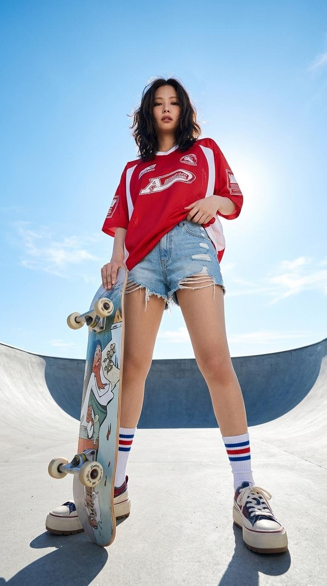 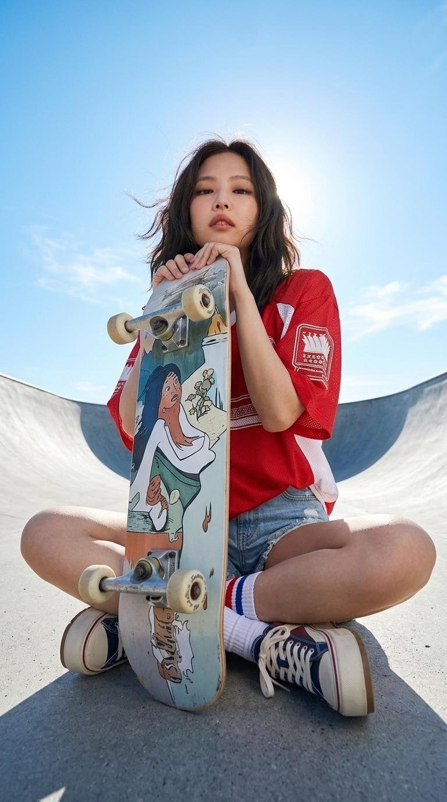

</div>

**📝 提示词:**

```
{
    "subject_and_outfit_formula": "A stylish young East Asian woman with a confident and cool expression, her dark, shoulder-length hair gently tousled by a light breeze. She is dressed in an oversized, retro-style red athletic jersey with white side panels and bold graphic lettering on the chest. Below, she wears high-waisted light-wash denim shorts featuring aggressive distressing, large ripped panels across the thighs, and raw, frayed hems. Her footwear includes thick white crew socks with classic red and blue stripes at the top, paired with chunky, multi-layered cream and beige platform sneakers that add to her urban, sporty aesthetic.",
    "background_and_environment": "The scene is set in a minimalist, sun-drenched outdoor skatepark featuring smooth, sweeping gray concrete ramps and bowls. The backdrop is an expansive, vibrant azure sky dotted with soft, feathered white clouds, suggesting a clear and bright summer afternoon. Intense, direct sunlight originates from a high angle, creating a luminous rim-lighting effect around the subject's silhouette and casting sharp, defined shadows on the concrete surface, evoking a sense of high-energy urban life.",
    "camera_angle_and_composition": "An extreme low-angle 'worm's eye view' shot captured from a ground-level perspective looking steeply upward, which emphasizes the subject's height and commanding, heroic presence. A colorful, illustrative skateboard with intricate pop-art graphics and bold 'SKATE' typography is held vertically in the immediate foreground, acting as a powerful visual anchor and creating a strong sense of depth. The composition utilizes a wide-angle perspective to frame the subject against the vastness of the sky, making her the central focal point of the frame.",
    "face_reference": "Use the uploaded photo as the primary reference for facial structure and features.",
    "camera_and_vintage_style_settings": "Standard high-quality digital photography, crisp and clear."
}
```

> 💡 使用说明: JSON 结构提示词

**👤 出处:** [@Kashberg_0](https://x.com/Kashberg_0) · [source](https://x.com/Kashberg_0/status/2076518233956622760)

▶️ **用 API 跑这条提示词** → [Velokey](https://velokey.ai?sourceChannel=github-awesome-seedream)（模型 id：`seedream-5.0-pro`）

---

### No.47 摩天轮波西米亚夏日

 

<div align="center">

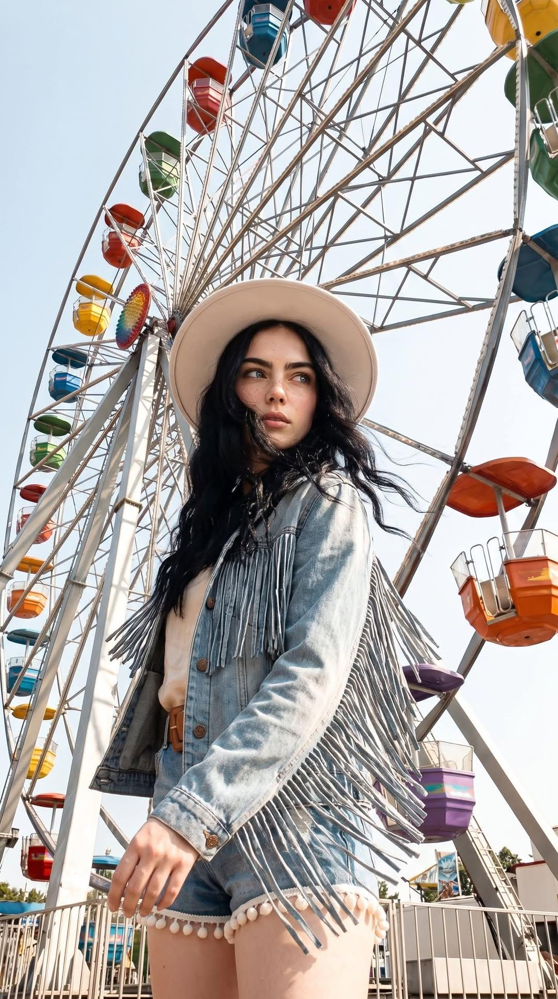 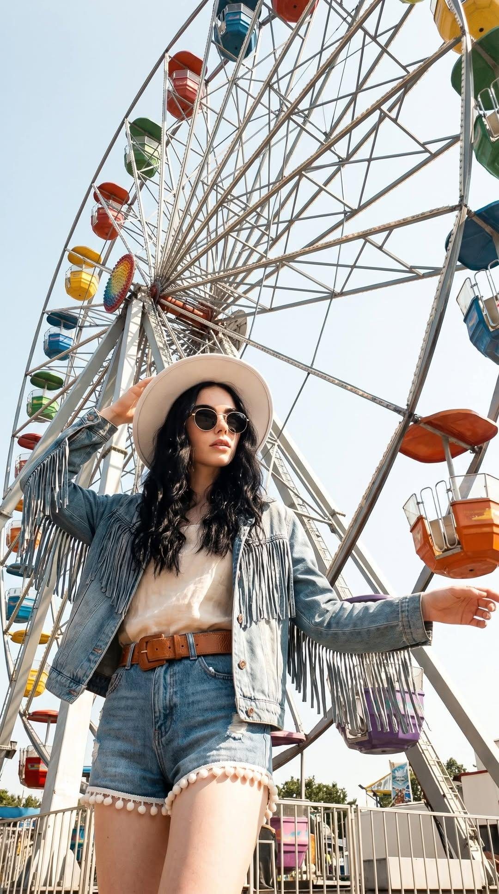

</div>

**📝 提示词:**

```
Shot from a low-angle perspective. The woman is wearing a boho-chic outfit and standing in front of a giant Ferris wheel with colorful gondolas against a clear blue sky.
She is dressed in a light-colored crop top and shorts with pom-pom trim, layered with a fringed denim jacket, a wide leather belt, a white wide-brim hat, and round dark sunglasses. Her long wavy hair is loose.
She strikes a dynamic pose: one hand is holding the brim of her hat while the other is extended out to the side.
The background is filled with the metal spokes and framework of the Ferris wheel, with the colorful gondolas occupying much of the scene.
Realistic smartphone photo, taken on a hot summer day in bright direct sunlight, with warm color grading, slightly overexposed highlights, natural shadows, a strong sense of summer heat, natural-looking skin, subtle film grain, slightly sun-faded colors, and the feel of a candid, spontaneous snapshot.
The face, identity, appearance, age, and all unique characteristics of the person from the original photo must be preserved exactly. The person is not looking at the camera.
```

**👤 出处:** [@ChillaiKalan__](https://x.com/ChillaiKalan__) · [source](https://x.com/ChillaiKalan__/status/2076205946674766094)

▶️ **用 API 跑这条提示词** → [Velokey](https://velokey.ai?sourceChannel=github-awesome-seedream)（模型 id：`seedream-5.0-pro`）

---

## 🤝 投稿

在 X / Reddit / 小红书看到好提示词？[**点这里用表单投稿**](https://github.com/velokey-ai/awesome-seedream-5.0-pro-prompts/issues/new?template=submit-prompt.yml)，审核通过后自动收录进 README。

## 📄 协议

本仓库采用 [CC BY 4.0](https://creativecommons.org/licenses/by/4.0/) 协议，提示词版权归原作者所有。

[](https://star-history.com/#velokey-ai/awesome-seedream-5.0-pro-prompts&Date)

<div align="center">

<sub>🤖 Auto-generated from <code>data/prompts.yaml</code> · 2026-07-18 09:09 UTC</sub>

<br><sub>一个 API 接入主流文本 / 图片 / 视频模型 · [velokey.ai](https://velokey.ai?sourceChannel=github-awesome-seedream)</sub>

</div>