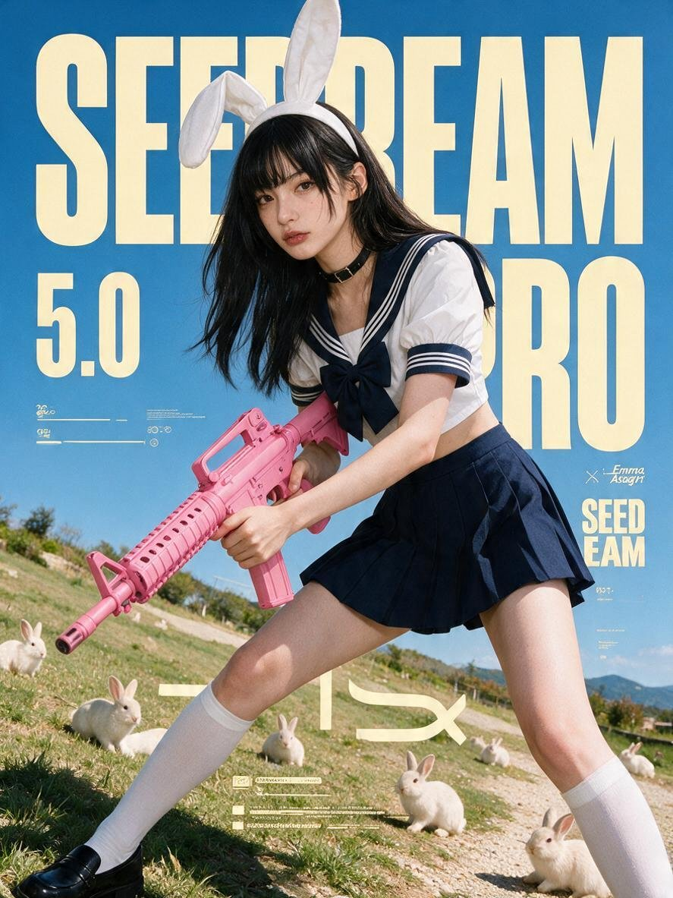

[← 返回全部 / Back]( ../README_zh.md )　|　[English](../README.md)

# No.11 · 编辑风动感海报模板 / Editorial Action Poster Template

`卡片与海报 / Cards & Posters`　`model: seedream-5.0-pro`

<div align="center">



</div>

> 💡 参数化模板 {占位符}

## 📝 Prompt

```
Create a {ASPECT_RATIO} full-bleed editorial action poster for [Brand Name]. The brand’s visual identity follows these must-visible traits: a bright outdoor photograph with a clear open sky dominating a large portion of the frame; enormous warm-cream extra-condensed block letters cropped by the canvas and sitting behind the main subject; one oversized action figure cutting diagonally across the layout and breaking through the text layer; a low or close wide-angle camera angle that makes the foreground feel physically imposing; secondary text, large numerals, or stacked words in cream placed along bottom and side edges; compact white editorial microcopy in short tight clusters anchored to strong grid positions; one vivid accent color concentrated on the hero product or outfit while the environment stays sky-blue and neutral; hard midday sunlight with crisp shadows and high-contrast edges; a layered structure alternating between flat graphic type and real photography; minimal ornament — only small marks, rules, or separators; a dense, kinetic layout with the action dominant, type second, and microcopy third.

Scene: {SUBJECT} is {SUBJECT_ACTION} with {PRODUCT_OR_PROP} in {LOCATION}, surrounded by {BACKGROUND_ELEMENTS}.

Camera & Composition: Low or close wide-angle outdoors, oversized foreground scale, decisive frozen motion, one strong diagonal, subject cropped by at least one canvas edge.

Typography: Place massive warm-cream ultra-condensed block sans lettering reading {MAIN_TEXT} behind the subject, filling over half the canvas, cropped by the frame and partially hidden by the action. Add compact white microcopy reading {SECONDARY_TEXT} in tight editorial blocks. Include a small generic {ACCENT_SYMBOL} mark and bottom information clusters in cream.

Wardrobe: {WARDROBE_STYLE}. Brand colors: saturated sky-blue or cyan dominant, warm cream type, crisp white microcopy, deep shadows, one vivid accent on the hero prop or wardrobe.

Lighting & Finish: Hard midday sun, crisp shadows, high-contrast commercial photo realism, slight print-grain texture. No illustration, 3D rendering, real logos, or watermarks.

Avoid: {SOURCE_CONTENT_TO_AVOID}. Also exclude: real brand logos, watermarks, QR codes, comic or halftone effects, 3D renders, dark studio scenes, muted palettes, or a tiny distant subject.

Generate as a 4K Ultra-high-resolution raster image.
```

**👤 出处 / Credit:** [@AI__TSUBAKI](https://x.com/AI__TSUBAKI) · [source](https://x.com/AI__TSUBAKI/status/2075128188964159539)

▶️ **用 API 跑这条 / Run via API** → [Velokey](https://velokey.ai?sourceChannel=github-awesome-seedream) (`seedream-5.0-pro`)
