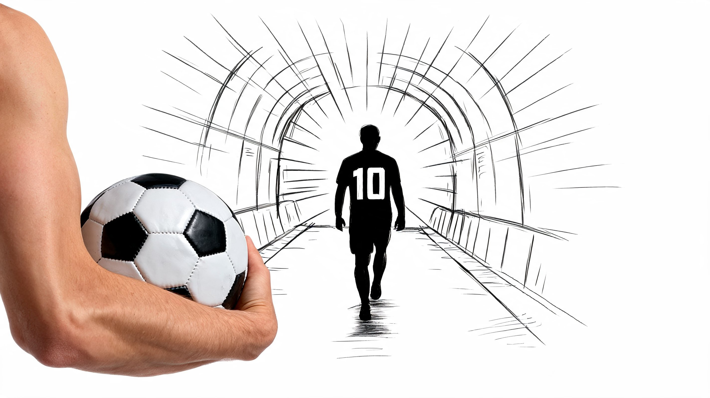

[← 返回全部 / Back]( ../README_zh.md )　|　[English](../README.md)

# No.12 · 真实产品×涂鸦创意广告 / Real-Product × Doodle Ad Template

`卡片与海报 / Cards & Posters`　`model: seedream-5.0-pro`

<div align="center">

 

</div>

> 💡 参数化模板 [占位符]

## 📝 Prompt

```
Creative composite brand advertisement, 16:9 horizontal aspect ratio, clean white background, studio lighting, sharp focus. A real-life photograph of a [BRAND PRODUCT] is physically placed and seamlessly integrated with a hand-drawn black ink cartoon illustration. The drawing is simple, expressive line art with minimal shading — like a quick sketch on paper. A cartoon character is [SCENE], interacting naturally with the real product as if it exists in their world. At the top, the [BRAND] slogan in clean bold sans-serif typography. At the bottom, the real brand logo rendered in full original colors and proportions. Photorealistic product + bold black doodle art, perfect seamless blend between drawn and real elements, witty scroll-stopping brand ad aesthetic, high contrast, minimalist composition, trending creative ad design.
```

**👤 出处 / Credit:** [@ZephyraLeigh](https://x.com/ZephyraLeigh) · [source](https://x.com/ZephyraLeigh/status/2075551476345442582)

▶️ **用 API 跑这条 / Run via API** → [Velokey](https://velokey.ai?sourceChannel=github-awesome-seedream) (`seedream-5.0-pro`)
