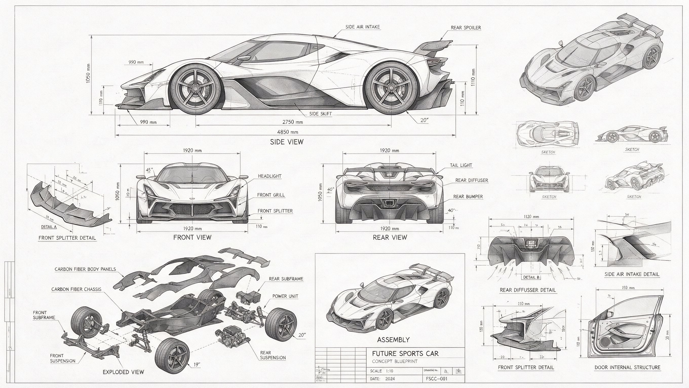
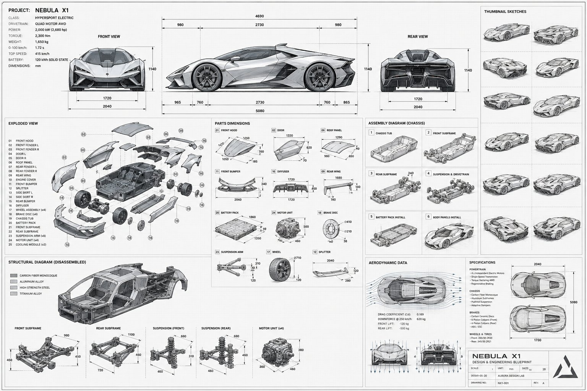

[← 返回全部 / Back]( ../README_zh.md )　|　[English](../README.md)

# No.14 · 蓝图技术分解图 / Blueprint Technical Drawing

`信息图与教育 / Infographics & Edu`　`model: seedream-5.0-pro`

<div align="center">

 

</div>

> 💡 对比 GPT Image 2

## 📝 Prompt

```
A technical drawing of a futuristic sports car in blueprint style. Include line drawings of the sports car from the front, side, and rear views, exploded parts sketches, parts assembly diagrams, and structural diagrams of disassembled components. Use abundant lines and measurement values to indicate the dimensions of each part, with grayscale tones expressing the overall sketch relationship. In addition to the main design, also show scattered thumbnails from different angles.
```

**👤 出处 / Credit:** [@marmaduke091](https://x.com/marmaduke091) · [source](https://x.com/marmaduke091/status/2074866077499105416)

▶️ **用 API 跑这条 / Run via API** → [Velokey](https://velokey.ai?sourceChannel=github-awesome-seedream) (`seedream-5.0-pro`)
