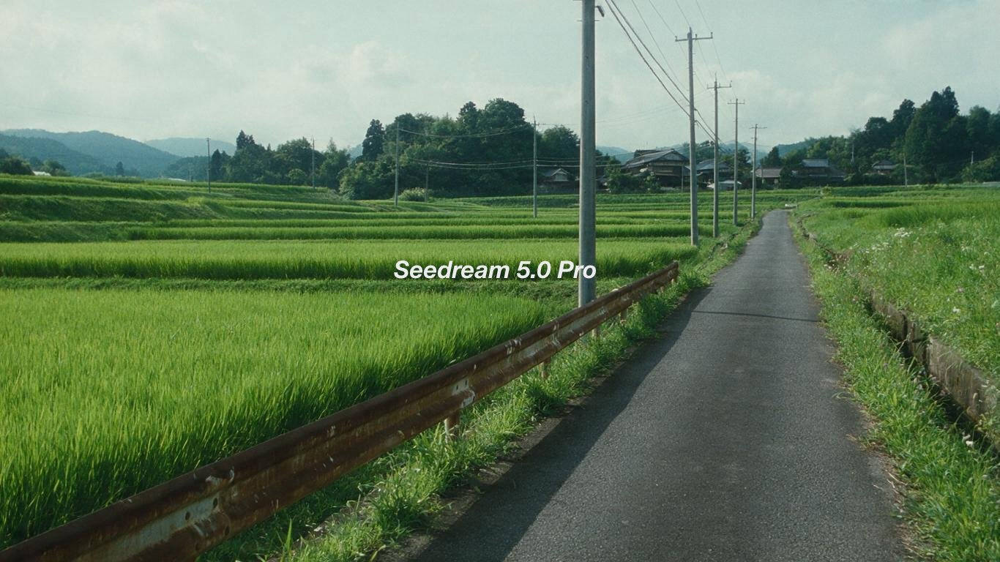
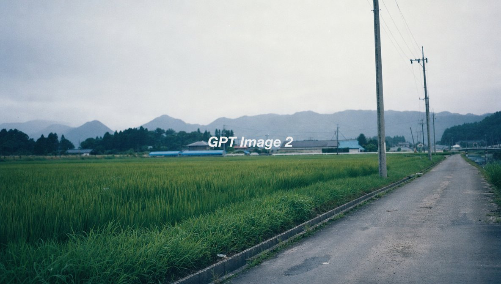
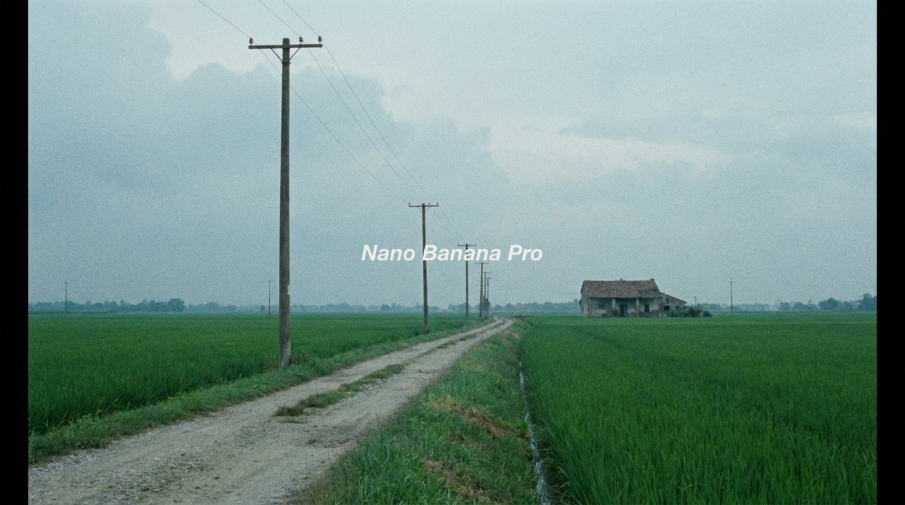

[← 返回全部 / Back]( ../README_zh.md )　|　[English](../README.md)

# No.15 · 日式田园电影感空镜 / Cinematic Rural Japan

`风格转绘 / Style Transfer`　`model: seedream-5.0-pro`

<div align="center">

  

</div>

> 💡 对比 GPT Image 2 / Nano Banana Pro

## 📝 Prompt

```
Cinematic film still,
rural Japanese rice paddy landscape in summer,
three-quarter angle view down a narrow farm road,
vivid green rice fields under an overcast pale sky,
utility poles receding into the distance,

desaturated slightly cool color grading,
subdued contrast,
off-center rule-of-thirds composition,
35mm film texture with fine grain,
soft diffused natural light,

melancholic quiet atmosphere,
no people,
Shunji Iwai inspired aesthetic
```

**👤 出处 / Credit:** [@AI__TSUBAKI](https://x.com/AI__TSUBAKI) · [source](https://x.com/AI__TSUBAKI/status/2076624942553330149)

▶️ **用 API 跑这条 / Run via API** → [Velokey](https://velokey.ai?sourceChannel=github-awesome-seedream) (`seedream-5.0-pro`)
