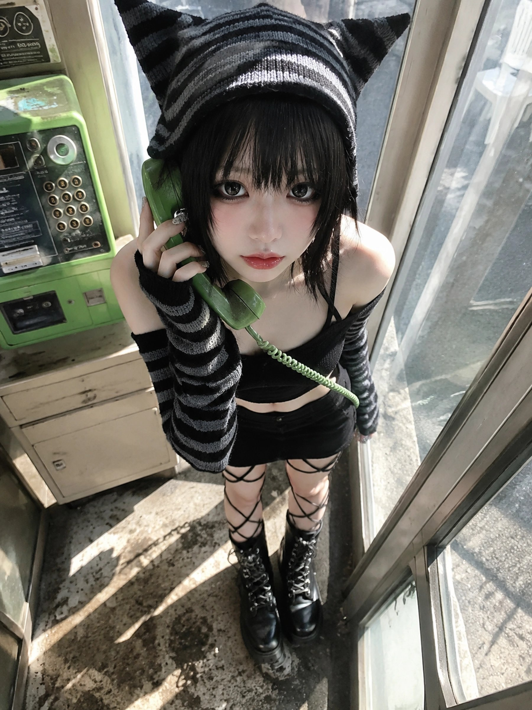
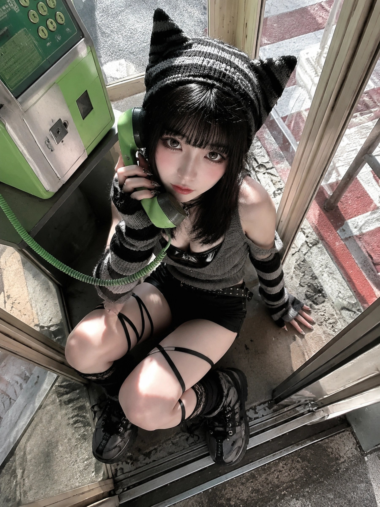

[← 返回全部 / Back]( ../README_zh.md )　|　[English](../README.md)

# No.16 · 电话亭 Y2K 暗系人像 / Phonebooth Y2K Goth Portrait

`人像与头像 / Portrait & Avatar`　`model: seedream-5.0-pro`

<div align="center">

 

</div>

## 📝 Prompt

```
{   "subject": {     "description": "A young adult woman crouching inside a retro public phone booth, wearing a black-and-gray striped cat-ear knit hood and dark Y2K styling. She holds a green public phone receiver and looks up toward a camera shooting from above. The overall style mixes goth-lolita, Y2K emo, Japanese alternative doll fashion, and harsh-sunlight mobile snapshot realism.",     "mirror_rules": "Not a mirror selfie; do not show a mirror or a phone covering the face. Keep the direct upward gaze toward a high-angle camera.",     "age": "young adult, early 20s appearance; avoid underage or overly childlike styling",     "expression": {       "eyes": {         "look": "large glossy eyes with strong black eyeliner, quiet and slightly melancholic, with a doll-like hollow softness",         "energy": "low-intensity, focused, faintly distant, as if caught right after picking up the phone",         "direction": "looking upward into the camera from below"       },       "mouth": {         "position": "lips naturally closed or lightly relaxed",         "energy": "controlled, quiet, not smiling broadly"       },       "overall": "cool, sweet-dark, slightly emo and still"     },     "face": {       "preserve_original": "Preserve the small face, soft chin, large eye proportion, thick bangs across the forehead, heavy eyeliner, lower-eye shadow, pale pink blush, and softly glossy lip makeup.",       "makeup": "Makeup inspired by East Asian goth-lolita and Y2K emo styling: lifted black eyeliner, clear lower eyeliner, under-eye shadow, separated lashes, slight smoky eye contour, pale pink blush, and glossy cool-rose to nude-pink gradient lips."     }   },   "hair": {     "color": "black or very dark brown-black",     "style": "short to medium-length hair ending around the shoulders and neck, with thick broken bangs over the forehead and side strands close to the cheeks",     "effect": "slightly messy with real flyaways and mild frizz; strong sunlight creates fine highlights on the bangs and crown, while the shadowed areas stay deep black"   },   "body": {     "frame": "slender and small-framed, with a light shoulder and neck line; the high-angle wide lens makes the head and eyes more prominent while compressing the body downward",     "waist": "the waist and midriff are mostly covered by the top and bottom, with only a small edge of skin possibly visible between garments; do not make it the main exposed area",     "chest": "the chest is mostly covered by the gray knit cropped top and black glossy inner layer, with collarbones, shoulders, and the upper chest edge visible; do not exaggerate volume",     "legs": "both legs are clearly visible in a crouched pose, with large areas of front thigh and knee-adjacent skin exposed; black crisscross straps and lace or net-like hosiery details wrap the legs, with chunky high-top shoes or boots",     "skin": {       "visible_areas": "Visible skin includes the face, neck, collarbones and upper chest edge, both shoulders, parts of the upper arms, both hands and fingers, both thighs, knee-adjacent areas, and leg skin seen between the straps. The back, buttocks, and full waist-hip line are not visible.",       "tone": "fair cool ivory skin, extremely bright under direct sunlight, with slight overexposure on the thighs and hands; shadow areas carry subtle blue-gray and green glass reflections",       "texture": "the skin should feel soft, fine, and sun-warmed, with a faint powdery surface, real pores, and natural tonal transitions; the thigh skin should read as soft and warm under harsh light, not plastic or overly smoothed",       "lighting_effect": "hard direct sunlight enters diagonally through the phone booth glass and frame, hitting the face, shoulders, hands, thighs, and knees with crisp bright patches, sharp shadows, local overexposure, and strong light-dark separation"     }   },   "pose": {     "position": "crouching or half-kneeling on the narrow phone booth floor, body leaning slightly forward, head lifted toward the camera above",     "base": "one hand holds the green public phone receiver near the side of the face, while the other hand supports the body on the floor with naturally spread fingers; both legs bend into the lower part of the frame",     "overall": "the pose is constrained by the booth, quiet and slightly tense, as if she was suddenly photographed from above; keep the body tilt and cramped framing instead of a polished studio pose"   },   "clothing": {     "top": {       "type": "black-and-gray striped cat-ear knit hood, gray knit cropped top, black glossy inner or corset-like top, and black-gray striped long arm warmers",       "color": "black, charcoal gray, pale gray-white stripes, and gray knit",       "details": "the hood has clear pointed cat ears, the shoulders are exposed, the arm warmers have wide horizontal knit stripes, and the chest area layers gray ribbed knit over black glossy fabric, creating a dark academy and emo streetwear feeling",       "effect": "the knit fabric has visible ribbing, thickness, and yarn texture; the black glossy inner layer catches sunlight and contrasts with the matte knit"     },     "bottom": {       "type": "black shorts or mini bottom, crisscross leg straps, lace/net hosiery details, and chunky high-top shoes or boots",       "color": "mostly black with worn gray-black footwear",       "details": "black waist belt with metal buckle, thin black straps crossing around the legs, shoes with multiple laces, metal eyelets, buckles, and worn surfaces",       "effect": "the bottom and leg straps create strong graphic lines across the legs; the heavy footwear adds a rough worn streetwear texture"     }   },   "accessories": {     "headwear": "black-and-gray striped cat-ear knit hood fitted around the head, with clearly visible cat ears",     "device": "green public telephone receiver and green coiled phone cord, the receiver held in one hand",     "prop": "retro public phone booth or phone installation with a cream-colored body, green phone casing, glass panels, metal rail, and door frame"   },   "photography": {     "camera_style": "real wide-angle mobile-phone photo, as if a friend shot from above or just outside the booth at close range; keep the social-media snapshot feeling, slight compression, sharpening, noise, overexposure, and glass glare",     "angle": "strong high-angle overhead view, camera above and in front of the subject, focus near the face and phone receiver; wide-angle perspective makes the face, eyes, hand, and legs slightly distorted by proximity",     "shot_type": "close high-angle full-body-to-three-quarter composition, including the cat-ear hood, torso, legs, and shoes, with the subject boxed in by the phone booth structure",     "aspect_ratio": "vertical 3:4 mobile photo ratio",     "texture": "harsh sunlight phone snapshot texture, blown highlights, hard shadows, visible glass reflections, floor stains, wear marks, and edge compression",     "lighting": "the main light is hard direct sunlight entering diagonally from outside the phone booth, not studio soft light; the sun passes through glass and metal frames, creating blocky highlights and deep shadows on the face, shoulders, sleeves, hands, legs, and floor",     "depth_of_field": "moderate depth of field; the subject is clear, while the phone machine, glass, door frame, floor stains, and outdoor red-white ground pattern remain recognizable, not heavily blurred"   },   "background": {     "setting": "inside a retro public phone booth or street-side phone installation, a narrow space enclosed by glass, metal frames, and a green telephone",     "wall_color": "green phone casing, cream-colored structure, gray concrete floor, blue-gray glass reflections, and red-white ground patterns outside",     "elements": [       "green public telephone",       "green coiled phone cord",       "cream-colored booth structure",       "glass panels",       "metal rail and door frame",       "rectangular patches of strong sunlight",       "floor stains and worn marks",       "red-white outdoor ground pattern",       "blurred white chair or outdoor object"     ],     "atmosphere": "bright, cramped, retro public-facility atmosphere with an alternative fashion snapshot quality",     "lighting": "ambient light comes from strong outdoor sun and glass reflections; the booth interior has high contrast, and the green phone slightly tints the darker areas"   },   "the_vibe": {     "energy": "sweet-cold, quiet, dark-cute, cramped but tense",     "mood": "as if she had just crouched down to answer a phone call; the previous voice still sits inside the receiver, she looks up now, and she may hang up in the next second",     "aesthetic": "goth-lolita, Y2K emo, Japanese cat-ear street style, alternative doll-like fashion, harsh-sunlight mobile snapshot",     "authenticity": "keep imperfections: crowded framing, overhead pressure, blown highlights, floor stains, glass glare, and slight wide-angle distortion in the hands and legs",     "intimacy": "the photographer feels very close, looking down from above the booth, creating a private and suddenly discovered feeling",     "story": "She picked up the green receiver inside a retro phone booth, sunlight cut into the narrow space, and the shutter clicked the moment she looked up.",     "caption_energy": "“The call was not over yet, but the sunlight had already reached my knees.”"   },   "constraints": {     "must_keep": [       "black-and-gray striped cat-ear hood",       "black medium-short hair with broken bangs",       "large-eyed heavy eyeliner doll makeup",       "green public phone receiver",       "green coiled phone cord",       "high-angle overhead shot",       "narrow phone booth space",       "harsh direct sunlight and hard shadows",       "black-and-gray striped long arm warmers",       "gray knit cropped top",       "black glossy inner layer",       "black shorts or mini bottom",       "crisscross leg straps",       "chunky high-top shoes or boots",       "real mobile-phone photo texture"     ],     "avoid": [       "underage styling",       "oversexualized pose",       "commercial softbox lighting",       "over-smoothed skin",       "plastic skin",       "perfectly clean background",       "excessive blur",       "anime illustration style",       "missing green telephone",       "missing cat-ear hood",       "extra watermark or garbled text",       "wrong number of fingers"     ]   },   "negative_prompt": [     "underage look",     "oversexualized pose",     "plastic skin",     "over-retouched",     "studio softbox",     "perfect symmetry",     "clean empty background",     "missing green phone",     "missing cat-ear hood",     "wrong phone color",     "anime style",     "cartoon",     "excessive blur",     "extra fingers",     "distorted hands",     "fake watermark"   ] }
```

**👤 出处 / Credit:** [@underwoodxie96](https://x.com/underwoodxie96) · [source](https://x.com/underwoodxie96/status/2075110445443338615)

▶️ **用 API 跑这条 / Run via API** → [Velokey](https://velokey.ai?sourceChannel=github-awesome-seedream) (`seedream-5.0-pro`)
