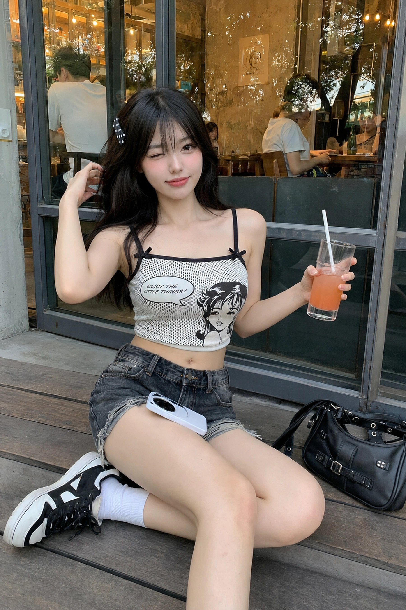
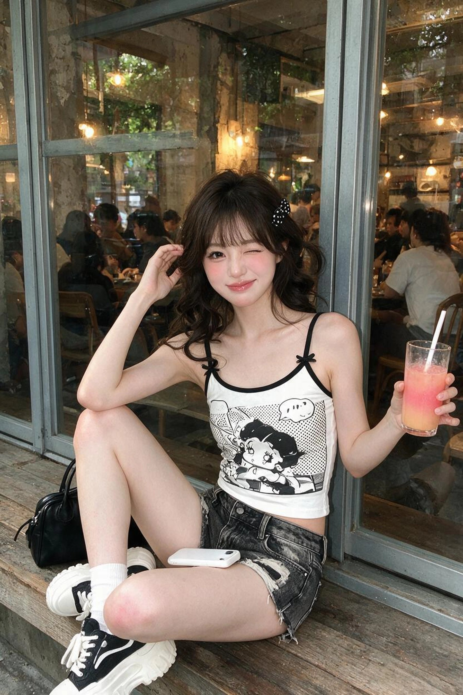

[← 返回全部 / Back]( ../README_zh.md )　|　[English](../README.md)

# No.17 · 咖啡馆街拍甜酷少女 / Cafe-Step Street Portrait

`人像与头像 / Portrait & Avatar`　`model: seedream-5.0-pro`

<div align="center">

 

</div>

> 💡 对比 GPT Image 2

## 📝 Prompt

```
A realistic vertical 3:4 smartphone social-media street photo of a young adult woman sitting on a wooden step outside an urban cafe. Behind her are gray metal window frames and large glass panes showing the cafe interior: warm yellow lights, dining guests, wooden chairs and tables, distressed concrete walls, and tree reflections on the glass. The image should feel like a real casual snapshot, not a clean studio shoot, with natural background clutter, reflections, slight glare, and mild social-media compression.  She faces the camera while seated in a relaxed, slightly asymmetrical pose. Her body leans a little toward the left side of the frame. One leg bends sideways and the other bends naturally forward, with white socks and chunky black-and-white sneakers visible. One hand is raised near her hair, while the other holds a clear tall glass containing a pink-orange drink with a white straw. A phone with a white case rests on her lap, and a black handbag sits beside her.  She wears a black-and-white thin-strap cropped camisole with a white base, black trim, black straps, a black-and-white comic graphic, halftone dot texture, a speech bubble, and small bow details near the straps. The hem sits above the waist, revealing a small strip of midriff. Her bottoms are low-rise washed black-gray denim shorts with distressed patches, faded areas, and frayed edges, giving a Y2K streetwear feeling.  Her visible skin includes the shoulders, collarbones, upper chest edge, arms, hands, a small section of midriff, the side hip area partly covered by shorts, thighs, knees, and lower legs; the back and buttocks are not visible. The skin tone is fair with a warm pink undertone, with subtle natural redness on the cheeks and knees. The skin should look fine, soft, semi-matte, and real, with slight texture rather than plastic smoothing. Soft outdoor diffused light illuminates the front, while warm cafe lights behind the glass create faint golden reflections on the hair, shoulders, and arms.  Her styling follows a K-beauty / J-fashion sweet-cool idol-inspired direction: dark brown-black fluffy hair with airy bangs, softly curled ends, loose face-framing strands, and a black-and-white polka-dot hair clip on the left side of the image. Makeup includes a clean fair base, visible aegyo-sal, fine black eyeliner, long lashes, pink blush, and glossy rose lips. She looks into the camera with one eye open and the other playfully winking, lips softly closed with a slight smile and subtle pout.  Camera feel: taken by a friend standing in front of her with a smartphone, using a 26-35mm equivalent lens, front-facing slightly high angle, close environmental portrait framing, seated full-body view with shoes mostly included. Keep a fairly deep depth of field, clear subject, detailed cafe background, natural imperfections, reflections, mild noise, and authentic casual-photo texture.
```

**👤 出处 / Credit:** [@underwoodxie96](https://x.com/underwoodxie96) · [source](https://x.com/underwoodxie96/status/2075140186992939103)

▶️ **用 API 跑这条 / Run via API** → [Velokey](https://velokey.ai?sourceChannel=github-awesome-seedream) (`seedream-5.0-pro`)
