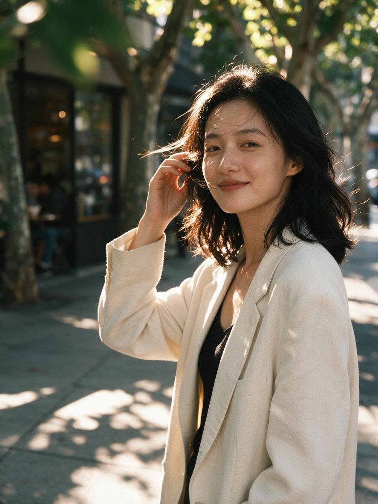

[← 返回全部 / Back]( ../README_zh.md )　|　[English](../README.md)

# No.18 · 午后街拍侧逆光人像 / Afternoon Backlit Street Portrait

`人像与头像 / Portrait & Avatar`　`model: seedream-5.0-pro`

<div align="center">

 

</div>

> 💡 对比 GPT Image 2

## 📝 Prompt

```
主体：一位25岁左右的中国女性，鹅蛋脸，黑色及肩微卷长发被风吹起几缕，穿米白色oversized西装外套内搭黑色吊带，锁骨清晰

动作与姿态：走在人行道上被镜头抓拍的瞬间，一只手轻拨耳边碎发，身体微微侧转，步伐自然

表情与视线：不经意间瞥向镜头的瞬间，嘴角似笑非笑，眼神松弛真实

场景环境：下午四点的城市街头，梧桐树影落在人行道上，背景是虚化的咖啡店橱窗和路人

镜头：中景（medium shot），85mm镜头，浅景深（shallow DOF），主体位于画面右三分之一，前景有虚化的树叶

光线：午后侧逆光（backlight）勾勒发丝金边，树影在脸上形成斑驳光斑（dappled light），自然柔和

风格：写实街拍摄影，富士胶片色调，轻微颗粒感

材质细节：可见皮肤毛孔和自然肤质，西装面料的编织纹理，发丝根根分明

约束：无文字水印，无畸形手指，避免过度磨皮的塑料感皮肤
```

**👤 出处 / Credit:** [@johnAGI168](https://x.com/johnAGI168) · [source](https://x.com/johnAGI168/status/2075228822887157932)

▶️ **用 API 跑这条 / Run via API** → [Velokey](https://velokey.ai?sourceChannel=github-awesome-seedream) (`seedream-5.0-pro`)
