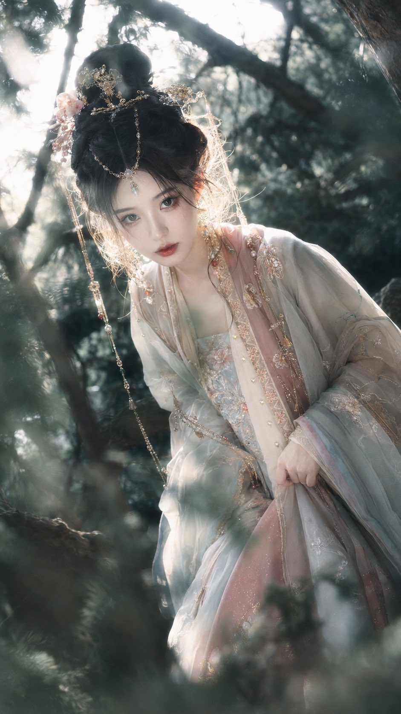

[← 返回全部 / Back]( ../README_zh.md )　|　[English](../README.md)

# No.19 · 林间国风神女 / Ethereal Guofeng Forest Goddess

`人像与头像 / Portrait & Avatar`　`model: seedream-5.0-pro`

<div align="center">

 

</div>

## 📝 Prompt

```
创作一张竖幅 9:16 的古风幻想人像，主题是林间神女。成年东方女性，精致清冷的古典美感，高挽发髻或半挽发，点缀金色发簪、玉石、珠链、少量红粉饰物。服装是多层汉服与幻想古装结合，不固定单一颜色和制式，可以是齐胸襦裙、交领襦裙、对襟衫裙、宽袖大袖衫、披帛、半透明纱罗外层、刺绣织锦内层等组合；衣服颜色可以多样变化，如月白、玉青、藕粉、朱砂红、黛蓝、浅紫灰、米杏、湖绿、古金等，但都被林间逆光和冷青灰空气统一起来，不要变成现代彩色舞台服。

采用近距离竖幅三分之四轻微俯拍，人物从幽深枝干和叶丛之间靠近镜头，脸部位于画面上半部视觉中心，身体和宽大袖摆向下延展。背景主要是盘曲老树枝、深绿色叶影、潮湿森林空气和斑驳光点，前景有少量虚化叶片形成遮挡；花只作为零星点缀，可以有一两簇小白花、淡粉花或细小野花，不要大量花海，不要让花抢走人物和枝干结构。

主要光线来自人物背后和上方的林间强逆光，穿过树叶形成碎裂的白色高光，高光带轻微过曝和柔和晕染，发丝、珠链、刺绣、纱袖边缘出现银白轮廓光；脸部保留柔和清亮的补光，肤色白皙偏粉但有真实皮肤层次，眼睛清澈，嘴唇淡红润泽，表情安静、微微凝视镜头。

综合色彩的重点不是固定服装颜色，而是统一的林间光色：深墨绿树影、冷青灰空气、乳白逆光、古金细节和低饱和衣料颜色互相融合。暗部要深而有层次，高光可以梦幻泛白，但眼睛、嘴唇、发丝、织物纹理和刺绣边缘保持清晰。真实摄影与东方 fantasy costume editorial 结合，浅景深、轻微柔焦、自然镜头眩光、细腻颗粒、湿润空气感，华丽但自然，不要现代物件，不要花海背景，不要统一模板化配色，不要平面插画感。
```

**👤 出处 / Credit:** [@coco007ZUHA](https://x.com/coco007ZUHA) · [source](https://x.com/coco007ZUHA/status/2075252520784375873)

▶️ **用 API 跑这条 / Run via API** → [Velokey](https://velokey.ai?sourceChannel=github-awesome-seedream) (`seedream-5.0-pro`)
