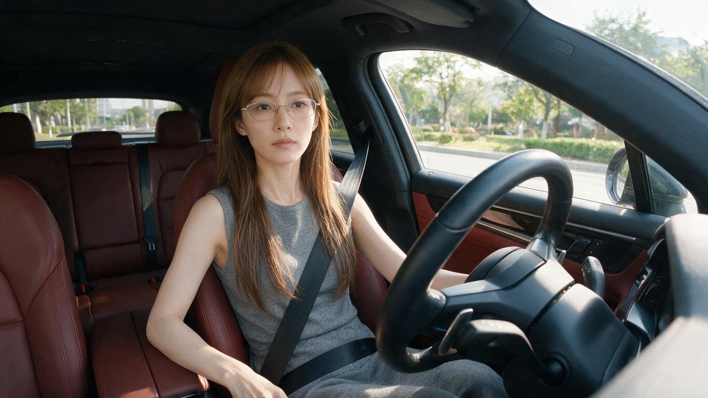

[← 返回全部 / Back]( ../README_zh.md )　|　[English](../README.md)

# No.2 · 真实车内自拍首帧 / Realistic In-Car Selfie

`人像与头像 / Portrait & Avatar`　`model: seedream-5.0-pro`

<div align="center">

 

</div>

> 💡 对比 GPT Image 2

## 📝 Prompt

```
生成一张真实感车内自拍视频首帧照片，横屏 16:9。画面像固定在副驾驶前方或中控台附近的小型广角相机拍摄，轻微广角，近距离车内第一视角，像社交媒体短视频截图。
主角是一位成年女性，气质清冷、安静、精致，整体像日常车内自拍视频里的主角。她脸型小巧偏鹅蛋脸，五官自然精致，鼻梁挺，嘴唇自然，表情平静、淡淡的，有一点冷感但不夸张。她正面面向镜头或略微看向前方，能清楚看到完整正脸，不低头，不侧脸。她戴细框透明或浅银色眼镜，长直发偏浅棕色，带轻微空气刘海，头发自然垂落在肩侧。穿简洁灰色无袖针织连衣裙或灰色无袖上衣搭配同色下装，造型干净日常、端庄自然。
她坐在驾驶位，安全带已经插好并固定完成：黑色安全带清楚地从肩膀斜跨过上身到腰侧，状态自然贴合身体，不是在拉安全带，也不是正在插卡扣。她一只手自然放在方向盘附近或轻扶方向盘，另一只手放低在座椅边或腿侧，姿态像准备开车前刚坐正的一瞬间。表情专注平静，眼神可以看向镜头，也可以略微看向前方道路。
车内是红棕色真皮座椅和红棕色门板，方向盘在画面右前方形成明显前景，仪表台、车窗边缘和后排座椅可见。车窗外是白天城市道路旁的绿化、树木和轻微模糊的街景，但车子此刻看起来还没有启动，背景相对静止。自然日光从车窗照进来，皮肤质感真实，头发有自然光泽。
整体风格：真实摄影，高质量手机或运动相机车内自拍视频首帧，清晰自然，轻微广角畸变，真实车内空间，社交媒体短视频质感，不像棚拍写真。
避免：低头、侧脸、正在插安全带、正在拉安全带、字幕、文字、水印、多余人物、夸张姿势、夸张摆拍、安全带消失、方向盘变形、手指畸形、眼镜变形、车内结构错乱、背景高速运动、夜景、动漫风、CG 感、塑料皮肤、过度美颜。
```

**👤 出处 / Credit:** [@johnAGI168](https://x.com/johnAGI168) · [source](https://x.com/johnAGI168/status/2074870910469677387)

▶️ **用 API 跑这条 / Run via API** → [Velokey](https://velokey.ai?sourceChannel=github-awesome-seedream) (`seedream-5.0-pro`)
