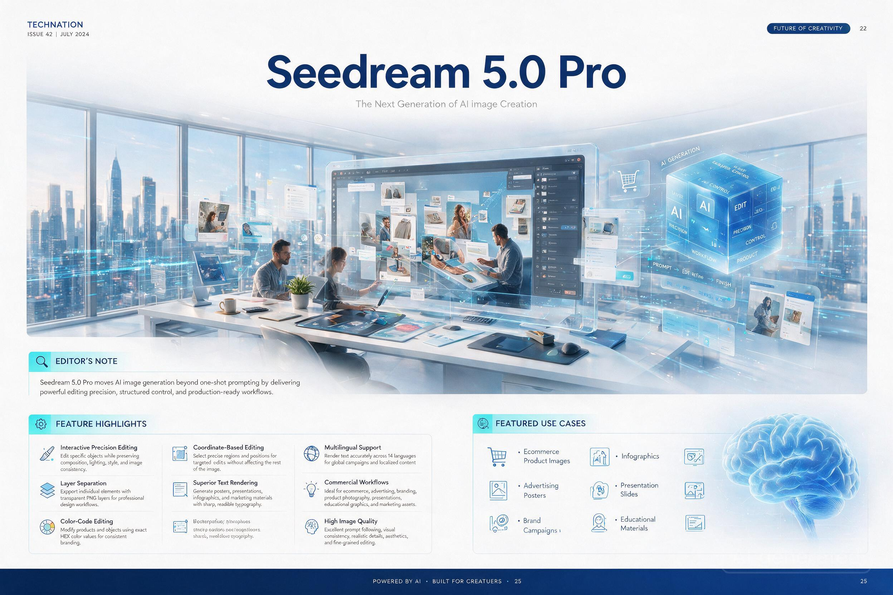

[← 返回全部 / Back]( ../README_zh.md )　|　[English](../README.md)

# No.20 · Seedream 杂志跨页信息图 / Magazine-Spread Infographic

`信息图与教育 / Infographics & Edu`　`model: seedream-5.0-pro`

<div align="center">



</div>

## 📝 Prompt

```
Create a premium double-page technology magazine spread introducing "Seedream 5.0 Pro": ultra-clean editorial layout, modern typography, white background with blue and cyan accents, luxury print magazine aesthetic, highly structured information hierarchy, flawless typography, perfectly readable text, crisp vector graphics, magazine-quality composition

Main cover headline:
"Seedream 5.0 Pro"

Subtitle:
"The Next Generation of AI Image Creation"

Hero illustration showing a futuristic creative workspace with AI-generated artwork, designers, transparent editing layers, interface elements, and visual workflow graphics.

Include the following magazine sections with perfectly rendered text:

EDITOR'S NOTE
Seedream 5.0 Pro moves AI image generation beyond one-shot prompting by delivering powerful editing precision, structured control, and production-ready workflows.

FEATURE HIGHLIGHTS

Interactive Precision Editing
Edit specific objects while preserving composition, lighting, style, and image consistency.

Layer Separation
Export individual elements with transparent PNG layers for professional design workflows.

Color-Code Editing
Modify products and objects using exact HEX color values for consistent branding.

Coordinate-Based Editing
Select precise regions and positions for targeted edits without affecting the rest of the image.

Superior Text Rendering
Generate posters, presentations, infographics, and marketing materials with sharp, readable typography.

Multilingual Support
Render text accurately across 14 languages for global campaigns and localized content.

Commercial Workflows
Ideal for ecommerce, advertising, branding, product photography, presentations, educational graphics, and marketing assets.

High Image Quality
Excellent prompt following, visual consistency, realistic details, aesthetics, and fine-grained editing.

FEATURED USE CASES
• Ecommerce Product Images
• Advertising Posters
• Brand Campaigns
• Social Media Creatives
• Infographics
• Presentation Slides
• Portrait Editing
• Educational Materials

Include elegant charts, workflow diagrams, iconography, comparison callout boxes, editorial pull quotes, numbered feature cards, print-ready CMYK aesthetic, ultra-sharp typography, perfect spelling, highly legible small text, sophisticated technology magazine design
```

**👤 出处 / Credit:** [@azed_ai](https://x.com/azed_ai) · [source](https://x.com/azed_ai/status/2075263036856975743)

▶️ **用 API 跑这条 / Run via API** → [Velokey](https://velokey.ai?sourceChannel=github-awesome-seedream) (`seedream-5.0-pro`)
