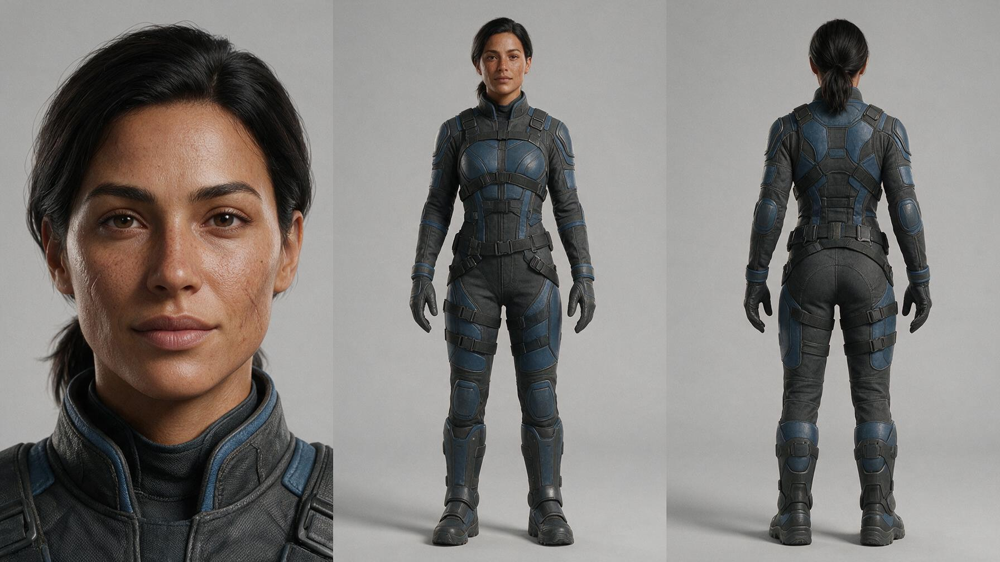

[← 返回全部 / Back]( ../README_zh.md )　|　[English](../README.md)

# No.21 · 三视图角色设定 / Three-View Character Sheet

`创意脑洞 / Creative Ideas`　`model: seedream-5.0-pro`

<div align="center">



</div>

## 📝 Prompt

```
Create a realistic character sheet  with a strict three-column layout. The image must be divided into three equal vertical sections, each taking exactly 33.3% of the width. The same character must appear in all three sections with perfect consistency in face, body proportions, hairstyle, skin tone, and outfit design.

Left section: a close-up frontal portrait, head and shoulders only, facing directly forward, neutral expression, clear facial details, subtle scars, and visible material detail around the collar.

Center section: a full-body frontal view, standing upright in a neutral pose, full costume clearly visible from head to boots.

Right section: a full-body back view, standing upright, showing the rear design of the suit, utility belt, and boots.

Character: a female sci-fi bounty hunter in her early 30s, athletic build, tan skin, short dark hair tied back, sharp features, wearing a grounded futuristic tactical suit in dark gray and muted blue, with utility straps, reinforced panels, gloves, and heavy boots.

Style: highly photorealistic, realistic sci-fi character sheet, clean studio presentation, neutral background, soft even studio lighting, believable materials, realistic skin texture, no weapon in hand, no action pose, no illustration, no extra objects, no overlapping, precise clean layout
```

**👤 出处 / Credit:** [@MayorKingAI](https://x.com/MayorKingAI) · [source](https://x.com/MayorKingAI/status/2075285324327219388)

▶️ **用 API 跑这条 / Run via API** → [Velokey](https://velokey.ai?sourceChannel=github-awesome-seedream) (`seedream-5.0-pro`)
