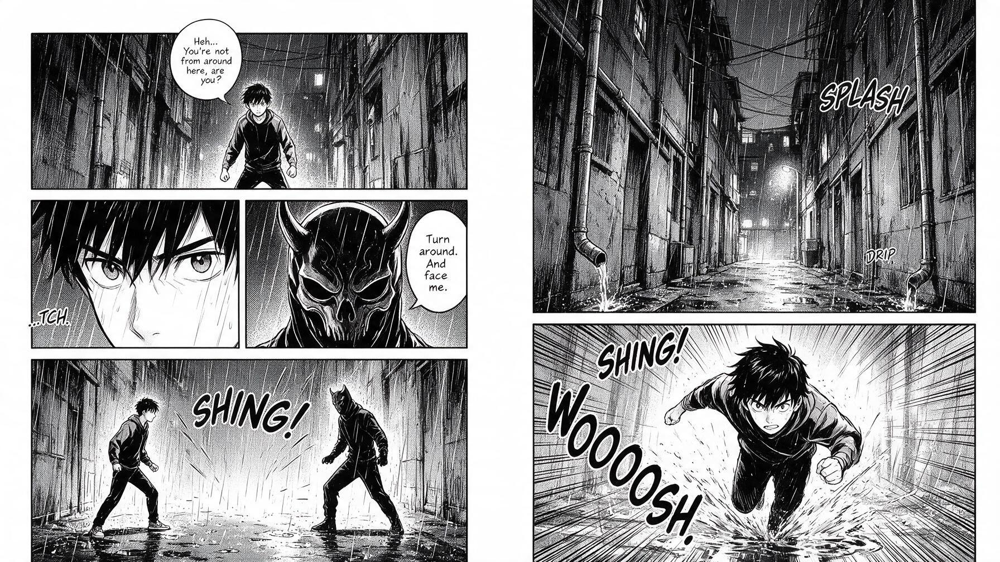

[← 返回全部 / Back]( ../README_zh.md )　|　[English](../README.md)

# No.22 · 黑白漫画分格页 / Black-and-White Manga Page

`创意脑洞 / Creative Ideas`　`model: seedream-5.0-pro`

<div align="center">



</div>

## 📝 Prompt

```
Create a single full-page manga comic layout, not a poster and not a single illustration. The output must be a real manga page with multiple panels, black and white only, authentic Japanese manga style, clean ink linework, screentones, dramatic shadows, speed lines, expressive close-ups, and clear sequential storytelling. Right-to-left reading flow.

Story scene: in a rainy urban alley at night, a young male protagonist confronts a mysterious masked enemy. Show the sequence across 5 to 6 panels: establishing shot of the alley, medium shot of the protagonist, close-up of his eyes, close-up of the enemy’s mask, tension building, then a final large action panel where the protagonist charges forward through puddles. Wet pavement, dripping pipes, narrow buildings, cables, dim lights, and urban textures should all be rendered in detailed manga style.

Use varied panel sizes and cinematic framing. Include screentones, cross-hatching, rain effects, impact lines, and manga-style speech bubbles. Keep the page visually balanced and readable, with strong storytelling and a polished published manga feel
```

**👤 出处 / Credit:** [@MayorKingAI](https://x.com/MayorKingAI) · [source](https://x.com/MayorKingAI/status/2075285308497957179)

▶️ **用 API 跑这条 / Run via API** → [Velokey](https://velokey.ai?sourceChannel=github-awesome-seedream) (`seedream-5.0-pro`)
