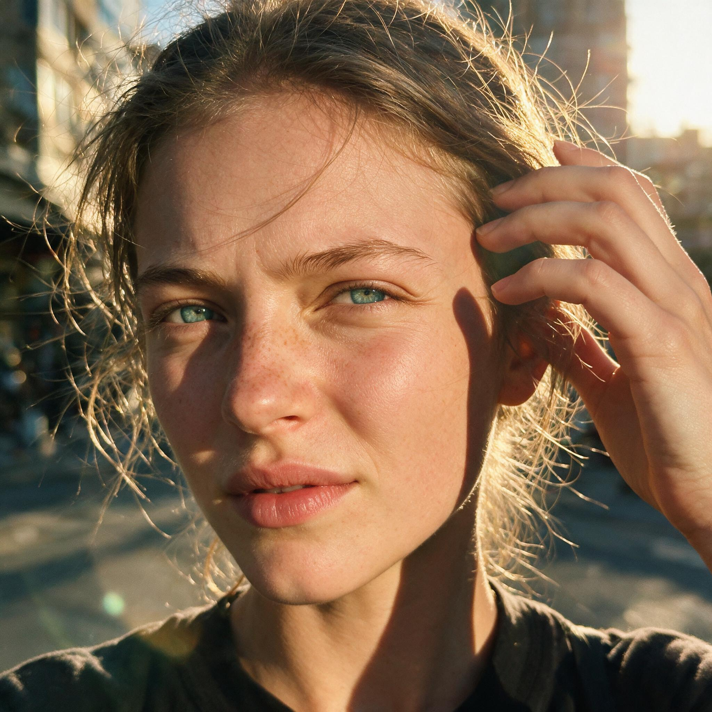
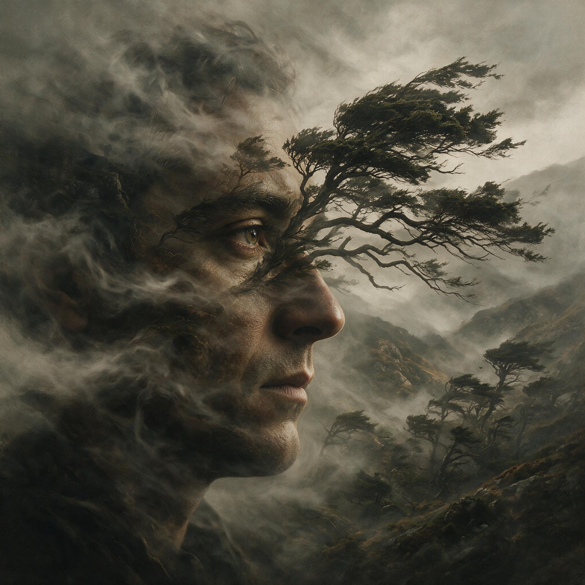

[← 返回全部 / Back]( ../README_zh.md )　|　[English](../README.md)

# No.3 · 逆光雀斑特写自拍 / Freckled Golden-Hour Selfie

`人像与头像 / Portrait & Avatar`　`model: seedream-5.0-pro`

<div align="center">

 

</div>

## 📝 Prompt

```
Extreme close-up selfie of a 22-year-old woman with piercing blue-green eyes, light dusting of freckles across the nose and cheeks, messy hair with visible flyaways caught in the wind, squinting slightly against the sun, casual outdoor setting, harsh golden hour side-lighting creating deep natural shadows, candid moment, unfiltered, authentic Instagram aesthetic, f/1.8, shallow depth of field, slight digital grain.


Physical details: visible skin texture and pores, fine peach fuzz, natural under-eye creases, subtle facial asymmetry, realistic hands adjusting hair (5 fingers, natural pose), blurred urban bokeh background with lens flare.
```

**👤 出处 / Credit:** [@kaanakz](https://x.com/kaanakz) · [source](https://x.com/kaanakz/status/2074988990373974246)

▶️ **用 API 跑这条 / Run via API** → [Velokey](https://velokey.ai?sourceChannel=github-awesome-seedream) (`seedream-5.0-pro`)
