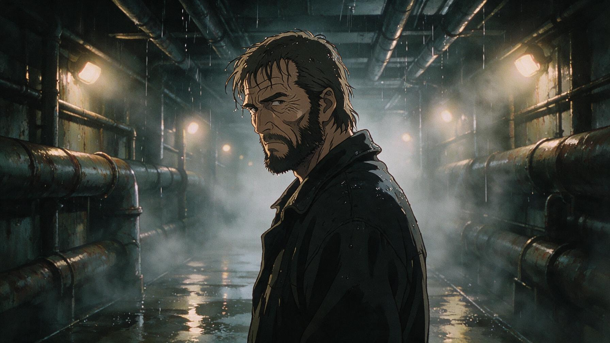

[← 返回全部 / Back]( ../README_zh.md )　|　[English](../README.md)

# No.30 · 80-90 年代 OVA 动漫 / 1980s-90s Anime OVA Style

`风格转绘 / Style Transfer`　`model: seedream-5.0-pro`

<div align="center">



</div>

## 📝 Prompt

```
A rugged man in his 50s inside a wet industrial corridor, facing three-quarter left, silent and tense, eyes focused forward, beard stubble, damp hair, soaked jacket collar, wrinkles drawn with subtle anime linework. Everything in the image is 100% anime: character, corridor, lights, rain, fog, reflections, shadows, textures, and background. Adult 1980s-1990s anime OVA style, gritty hand-drawn cel animation, traditional painted anime background, inked outlines, cel shading, hand-painted industrial environment, muted colors, noir atmosphere. The corridor must be clearly illustrated, with stylized pipes, painted wet concrete, drawn steam, anime lighting, and soft painted bokeh from distant lamps. Cold rim light from back-right, warm painted glow on one cheek, dramatic anime shadows, cinematic anime frame, 16:9. Avoid photorealistic background, avoid live-action realism, avoid 3D render, avoid realistic photography
```

**👤 出处 / Credit:** [@MayorKingAI](https://x.com/MayorKingAI) · [source](https://x.com/MayorKingAI/status/2075285182530342930)

▶️ **用 API 跑这条 / Run via API** → [Velokey](https://velokey.ai?sourceChannel=github-awesome-seedream) (`seedream-5.0-pro`)
