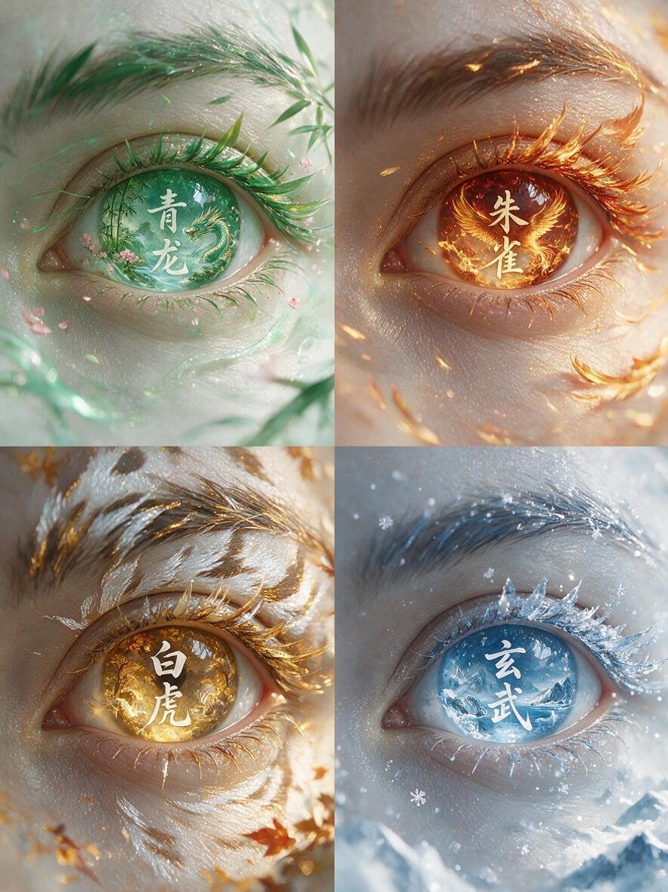

[← 返回全部 / Back]( ../README_zh.md )　|　[English](../README.md)

# No.32 · 四象眼眸四屏写真 / Four-Symbols Eye Macro (4-panel)

`创意脑洞 / Creative Ideas`　`model: seedream-5.0-pro`

<div align="center">

 

</div>

> 💡 对比 GPT Image 2

## 📝 Prompt

```
以眼部特写参考图作为唯一人物眼睛参考，生成一张 3:4 四屏构图东方幻想艺术眼眸写真。 四个画面分别代表中国传统四象：青龙、朱雀、白虎、玄武。 整体风格： 东方神话美学 × 高级美妆广告 × 超现实艺术摄影。 保持真实人类眼睛结构，高清微距摄影，真实皮肤纹理，精致睫毛，细腻眼妆，不改变眼型比例。 四屏人物眼睛保持同一身份，同一角度，同一构图。 第一屏：青龙 · 东方春生 眼眸呈现青绿色翡翠质感虹膜，仿佛一块天然东方玉石。 虹膜内部隐藏微型东方山水世界： 青龙盘旋于云雾之间，青竹、桃花、流水融入眼底。 睫毛化作细长竹叶与青色羽纹，眼角有细小桃花花瓣飘落。 脸部肌肤带有柔和春日光泽，青绿色流光环绕眼眸。 画面中央加入： “青龙” 白色东方篆刻艺术字体。 整体： 青绿色调，清雅、灵动、生命感。 第二屏：朱雀 · 炽焰盛夏 眼眸呈现赤金色琥珀质感。 虹膜内部像燃烧的小型凤凰世界： 朱雀展翅飞翔，金色火焰、凤凰羽毛、夕阳云霞融合其中。 睫毛带有细微火焰羽片质感，眼角漂浮金色羽毛。 皮肤被暖金色光线照亮，形成高级珠宝广告质感。 画面中央加入： “朱雀” 白色鎏金东方艺术字体。 整体： 红金色调，华丽、热烈、神圣。 第三屏：白虎 · 金秋肃杀 眼眸呈现金黄色琥珀瞳孔。 虹膜内部是一片东方秋日森林： 白虎身影隐藏于金色山林之间， 枫叶、古树、金色尘埃漂浮。 睫毛融合白色虎纹与秋叶纹理， 眉眼之间有银白色纹路若隐若现。 光线如夕阳穿过森林，形成电影感暖光。 画面中央加入： “白虎” 白色水墨艺术字体。 整体： 金黄、银白、深棕色调，神秘、高贵。 第四屏：玄武 · 冰雪玄境 眼眸呈现冰蓝色水晶质感。 虹膜内部是一片东方冰雪世界： 玄武神兽沉睡于冰川湖泊， 雪山、冰晶、寒雾融入眼底。 睫毛覆盖透明冰晶纹理， 眼角有细小雪花与银色光点。 冷蓝月光照射脸庞， 形成冰雪女神般的高级视觉。 画面中央加入： “玄武” 白色书法艺术字体。 整体： 冰蓝、银白色调，冷冽、纯净、空灵。 统一画面要求 四屏排列整齐，像高级艺术展览海报。 背景为极简东方留白空间， 加入淡淡水墨纹理、云雾、金属浮雕质感。 文字设计： 东方篆刻字体， 白色半透明艺术字， 不要现代商业字体。 摄影： macro eye photography, ultra realistic skin texture, cinematic lighting, luxury beauty campaign, 8K detail, high fashion editorial. 禁止： 卡通风格、动漫眼睛、夸张变形眼球、低质量CG、塑料皮肤、错误文字、额外眼睛。 比例： 3:4 生成图片
```

**👤 出处 / Credit:** [@Chengzilhy](https://x.com/Chengzilhy) · [source](https://x.com/Chengzilhy/status/2075462701887930745)

▶️ **用 API 跑这条 / Run via API** → [Velokey](https://velokey.ai?sourceChannel=github-awesome-seedream) (`seedream-5.0-pro`)
