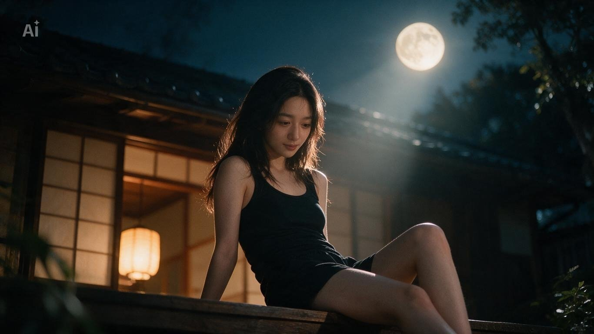

[← 返回全部 / Back]( ../README_zh.md )　|　[English](../README.md)

# No.38 · 月夜檐廊人像 / Moonlit Engawa Portrait

`人像与头像 / Portrait & Avatar`　`model: seedream-5.0-pro`

<div align="center">

 

</div>

## 📝 Prompt

```
Long flowing dark hair with soft waves, natural and effortless beauty, soft glowing skin, same facial features exactly as reference.

A beautiful young Japanese woman with long flowing dark hair, wearing a fitted black tank top and casual black shorts, relaxed and unposed, sitting casually on the engawa (wooden veranda) of a traditional Japanese house at night, leaning back slightly with one leg bent, looking down softly at her phone or simply resting with a calm, natural gaze not looking at the moon.

The full moon glows softly in the background sky above the rooftop, purely as ambient scenery.

Cinematic movie-grade shot, shallow depth of field with creamy bokeh, slow dolly-in camera movement, soft moonlight rim lighting mixed with warm ambient glow from paper shoji lanterns inside the house, subtle film grain, volumetric moonlight rays filtering through surrounding trees, color graded like a Denis Villeneuve film deep indigo and warm amber tones, 35mm anamorphic lens.
```

**👤 出处 / Credit:** [@Cia0_exe](https://x.com/Cia0_exe) · [source](https://x.com/Cia0_exe/status/2075632375858659717)

▶️ **用 API 跑这条 / Run via API** → [Velokey](https://velokey.ai?sourceChannel=github-awesome-seedream) (`seedream-5.0-pro`)
