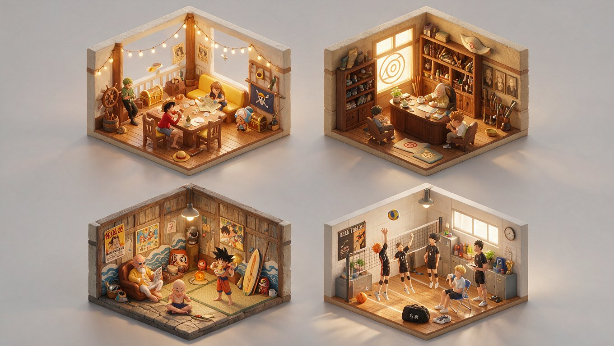

[← 返回全部 / Back]( ../README_zh.md )　|　[English](../README.md)

# No.39 · 漫画等距剖面模型 / Manga Isometric Cutaway Diorama

`创意脑洞 / Creative Ideas`　`model: seedream-5.0-pro`

<div align="center">

 

</div>

> 💡 对比 Nano Banana Pro

## 📝 Prompt

```
2x2 grid, do this for 4 famous manga: RENDER_CHAIN = "[$INPUT_TOPIC :: iconic_interior :: isometric_cutaway_diorama]"

TRANSFORM = {
    "floor_plan": "cube with two cut walls, floating on void, cross-section edges clean",
    "hero_space": "inferred iconic location rebuilt as hyper-detailed 3D room, architecture/materials true to source, warm interior light",
    "inhabitants": "2-4 miniature stylized characters, mid-activity, correctly scaled to furniture",
    "set_dressing": "8-15 recognizable props, furniture, signage, easter eggs; dense yet legible",
    "render_env": "clean 3D, soft GI, gentle AO, true isometric 45°, neutral bg, crisp focus"
}

NEGATIVE = "photorealism, off-model characters, empty room, missing props, harsh shadows"

OUTPUT = (RENDER_CHAIN :: TRANSFORM) - NEGATIVE
RENDER: single miniature isometric diorama image.
```

**👤 出处 / Credit:** [@Gdgtify](https://x.com/Gdgtify) · [source](https://x.com/Gdgtify/status/2075856368246902834)

▶️ **用 API 跑这条 / Run via API** → [Velokey](https://velokey.ai?sourceChannel=github-awesome-seedream) (`seedream-5.0-pro`)
