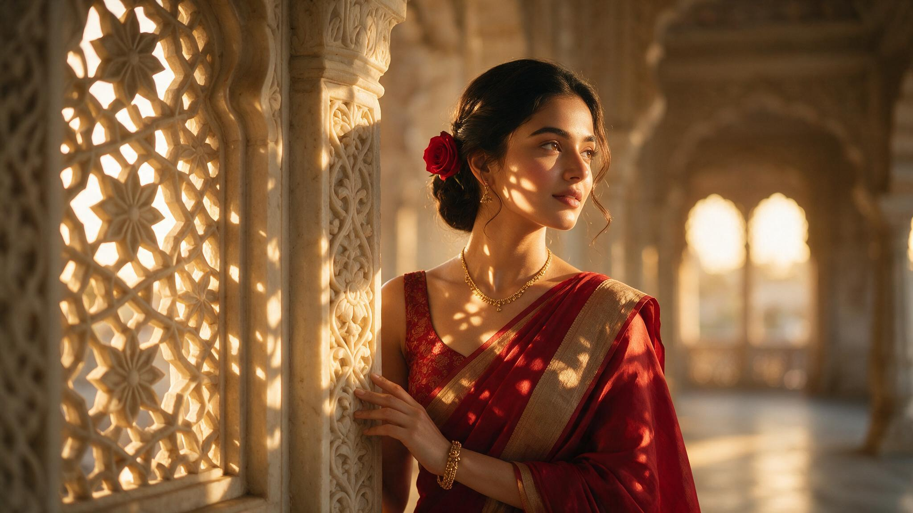

[← 返回全部 / Back]( ../README_zh.md )　|　[English](../README.md)

# No.41 · 红纱丽宫廷人像 / Crimson Saree Palace Portrait

`人像与头像 / Portrait & Avatar`　`model: seedream-5.0-pro`

<div align="center">

 

</div>

## 📝 Prompt

```
Ultra-realistic cinematic portrait of a beautiful young woman wearing a rich deep crimson red silk saree with a matching sleeveless blouse featuring subtle floral jacquard embroidery and a muted gold border. She is standing beside an intricately carved ivory stone pillar in a heritage palace corridor during golden hour, gazing softly into the distance with a calm, dreamy expression. Her hair is styled in a neat low bun adorned with a single fresh red rose, with a few loose curled strands framing her face. Smooth glowing natural skin, expressive brown eyes, soft pink lips, minimal makeup. Warm sunlight passes through ornate carved jali patterns, casting intricate floral shadows across her face, neck, shoulders, blouse, and saree. Soft cinematic backlight, creamy bokeh, shallow depth of field, luxurious heritage architecture blurred in the background, elegant composition, warm golden color grading, highly detailed silk texture, photorealistic skin, natural facial proportions, HDR, 8K, DSLR quality, 85mm portrait lens, f/1.8, ultra sharp focus on the face, premium editorial fashion photography
```

**👤 出处 / Credit:** [@aaliya_va](https://x.com/aaliya_va) · [source](https://x.com/aaliya_va/status/2075924410423271453)

▶️ **用 API 跑这条 / Run via API** → [Velokey](https://velokey.ai?sourceChannel=github-awesome-seedream) (`seedream-5.0-pro`)
