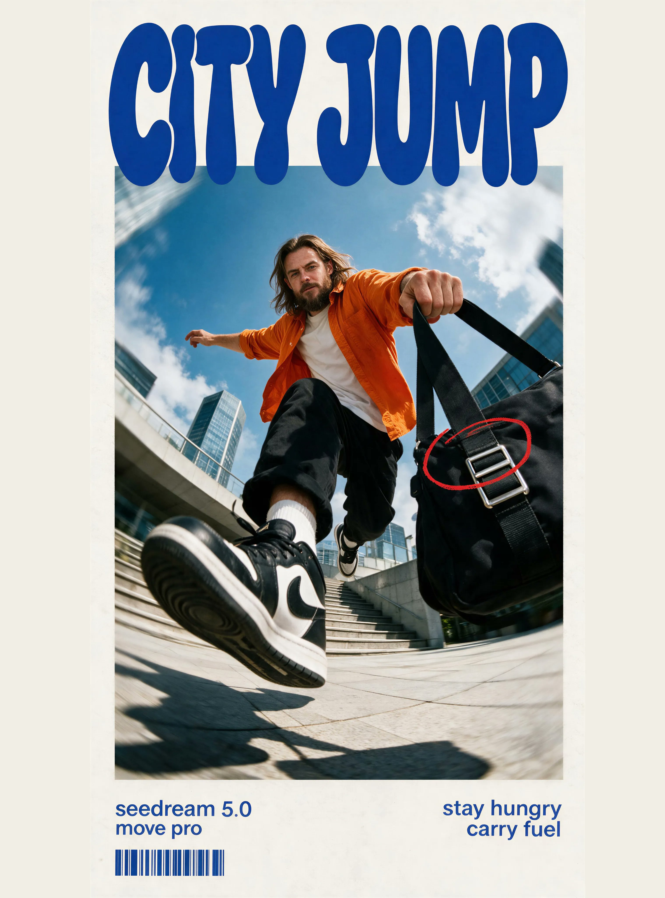

[← 返回全部 / Back]( ../README_zh.md )　|　[English](../README.md)

# No.42 · City Jump 街头海报 / "City Jump" Streetwear Poster

`卡片与海报 / Cards & Posters`　`model: seedream-5.0-pro`

<div align="center">



</div>

## 📝 Prompt

```
Create a vertical streetwear editorial poster with a bold youth-culture aesthetic. Use an off-white paper background and a clean magazine-style layout.

At the top, place oversized rounded bubble typography reading “CITY JUMP” in deep cobalt blue. The letters are thick, soft, playful, tightly spaced, and partially hidden behind the central photo.

In the center, place a large vertical action photograph of a young European man performing an energetic skateboard-style jump toward the camera in a modern urban plaza. He wears a orange open shirt, a shirt, black baggy pants, white crew socks, and black and white Nike Air sneakers.

Use an extreme low-angle fisheye lens from ground level. His front shoe is dramatically enlarged and dominates the foreground, while his face and upper body appear smaller in the background. One arm stretches sideways for balance, while the other hand tightly holds the wide black strap of a large black messenger bag positioned close to the right side of the camera. The bag’s rectangular silver buckle should be clearly visible and sharply detailed.

Bright blue sky with soft white clouds, modern glass-and-steel architecture, outdoor stairs, tiled pavement, strong midday sunlight, realistic shadows. Add subtle radial motion blur around the edges and background to emphasize fast movement, while keeping the person, shoe, bag strap, and buckle sharp.

Add a rough hand-drawn red oval annotation around the silver buckle on the black bag, as if marked with a red grease pencil.

At the bottom of the poster, include small cobalt-blue editorial text:

Left side:
“seedream 5.0”
“move pro”

Right side:
“stay hungry”
“carry fuel”

Add a decorative cobalt-blue barcode graphic beneath the left text.

Style: contemporary streetwear campaign, skateboarding photography, Gen-Z fashion editorial, experimental sports advertising, bold typography, dynamic forced perspective, vibrant blue and green color palette
```

**👤 出处 / Credit:** [@LinusEkenstam](https://x.com/LinusEkenstam) · [source](https://x.com/LinusEkenstam/status/2076273553964687462)

▶️ **用 API 跑这条 / Run via API** → [Velokey](https://velokey.ai?sourceChannel=github-awesome-seedream) (`seedream-5.0-pro`)
