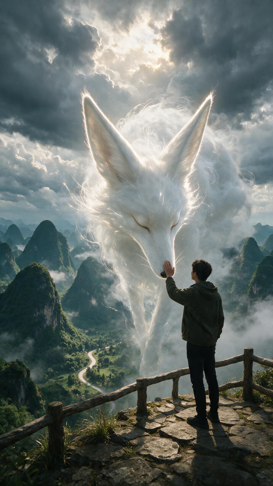
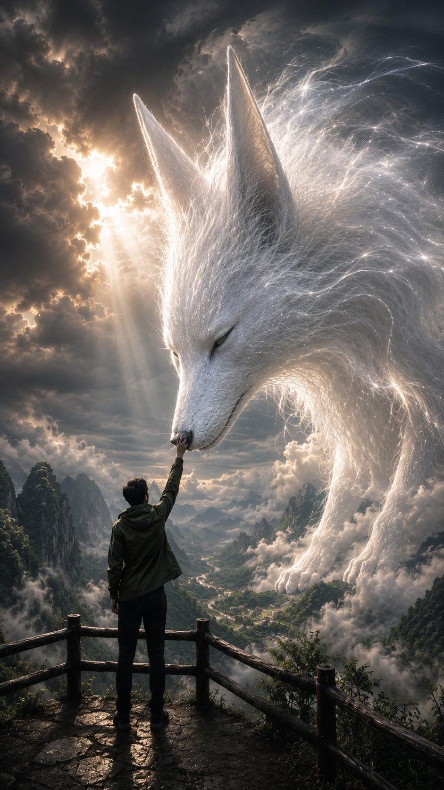

[← 返回全部 / Back]( ../README_zh.md )　|　[English](../README.md)

# No.44 · 云雾天狐幻境 / Celestial Cloud-Fox Spirit

`创意脑洞 / Creative Ideas`　`model: seedream-5.0-pro`

<div align="center">

 

</div>

> 💡 对比 GPT Image 2

## 📝 Prompt

```
A cinematic fantasy scene from a slightly low, over-the-shoulder perspective. A lone young man stands on a weathered stone mountain viewpoint with a rustic wooden railing, seen mostly from behind, wearing a dark olive-green hooded jacket, black pants, and black shoes. He calmly raises one hand to gently touch the nose of an enormous celestial fox spirit descending from the sky. The spirit is an ethereal heavenly guardian made of white clouds, mist, and flowing strands of living light—not a solid fox. It has an elegant elongated face, peaceful closed eyes, a long slender muzzle, a tiny black nose, and two enormous, tall, perfectly upright triangular ears that define its silhouette. Only the head, neck, faint chest, and part of the front legs are visible while the rest of its colossal body dissolves seamlessly into the clouds, sky, and distant mountains. Fine glowing white strands flow naturally from its body into the atmosphere, creating a soft divine aura. Dramatic storm clouds fill the sky with a small opening where the hidden sun casts subtle warm rays and gentle rim light. Towering green karst mountains, drifting mist, and a winding road below. Ultra-realistic, photorealistic, cinematic, atmospheric, mystical, 8K.
```

**👤 出处 / Credit:** [@frametheory058](https://x.com/frametheory058) · [source](https://x.com/frametheory058/status/2076341429350404486)

▶️ **用 API 跑这条 / Run via API** → [Velokey](https://velokey.ai?sourceChannel=github-awesome-seedream) (`seedream-5.0-pro`)
