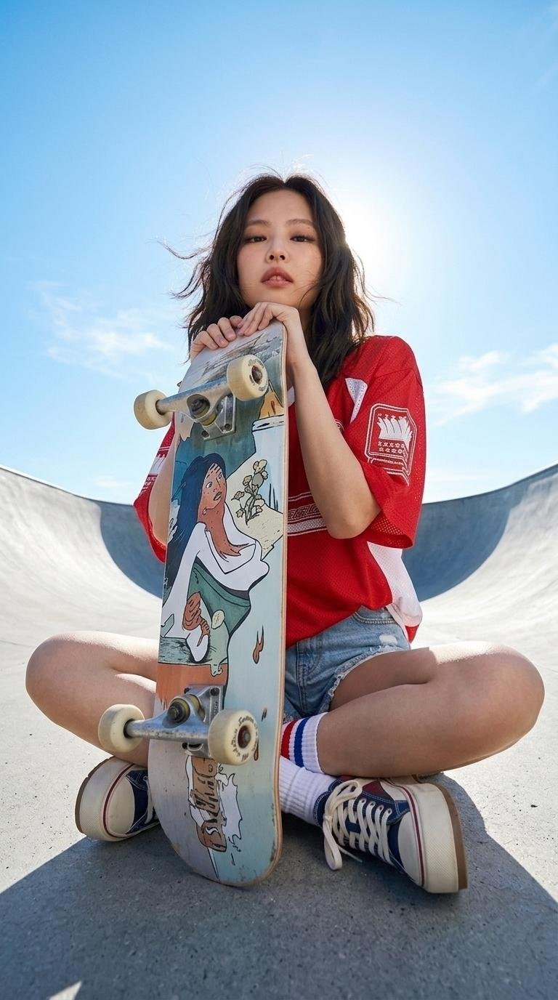

[← 返回全部 / Back]( ../README_zh.md )　|　[English](../README.md)

# No.45 · 滑板运动风人像 / Skatepark Sporty Portrait

`人像与头像 / Portrait & Avatar`　`model: seedream-5.0-pro`

<div align="center">

 

</div>

> 💡 JSON 结构提示词

## 📝 Prompt

```
{
    "subject_and_outfit_formula": "A stylish young East Asian woman with a confident and cool expression, her dark, shoulder-length hair gently tousled by a light breeze. She is dressed in an oversized, retro-style red athletic jersey with white side panels and bold graphic lettering on the chest. Below, she wears high-waisted light-wash denim shorts featuring aggressive distressing, large ripped panels across the thighs, and raw, frayed hems. Her footwear includes thick white crew socks with classic red and blue stripes at the top, paired with chunky, multi-layered cream and beige platform sneakers that add to her urban, sporty aesthetic.",
    "background_and_environment": "The scene is set in a minimalist, sun-drenched outdoor skatepark featuring smooth, sweeping gray concrete ramps and bowls. The backdrop is an expansive, vibrant azure sky dotted with soft, feathered white clouds, suggesting a clear and bright summer afternoon. Intense, direct sunlight originates from a high angle, creating a luminous rim-lighting effect around the subject's silhouette and casting sharp, defined shadows on the concrete surface, evoking a sense of high-energy urban life.",
    "camera_angle_and_composition": "An extreme low-angle 'worm's eye view' shot captured from a ground-level perspective looking steeply upward, which emphasizes the subject's height and commanding, heroic presence. A colorful, illustrative skateboard with intricate pop-art graphics and bold 'SKATE' typography is held vertically in the immediate foreground, acting as a powerful visual anchor and creating a strong sense of depth. The composition utilizes a wide-angle perspective to frame the subject against the vastness of the sky, making her the central focal point of the frame.",
    "face_reference": "Use the uploaded photo as the primary reference for facial structure and features.",
    "camera_and_vintage_style_settings": "Standard high-quality digital photography, crisp and clear."
}
```

**👤 出处 / Credit:** [@Kashberg_0](https://x.com/Kashberg_0) · [source](https://x.com/Kashberg_0/status/2076518233956622760)

▶️ **用 API 跑这条 / Run via API** → [Velokey](https://velokey.ai?sourceChannel=github-awesome-seedream) (`seedream-5.0-pro`)
