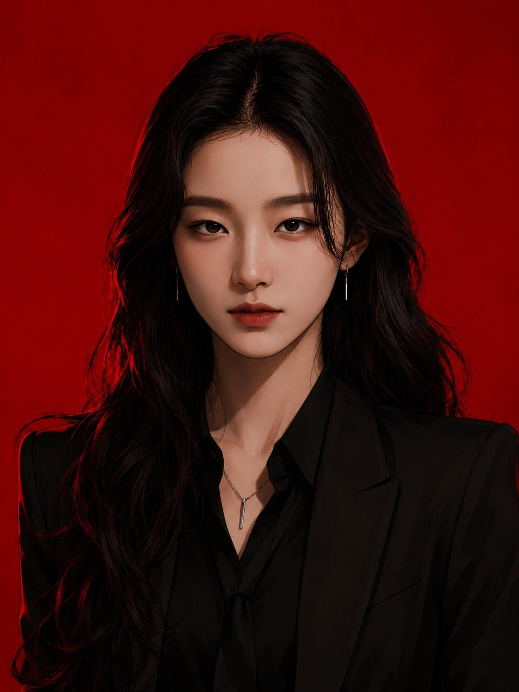
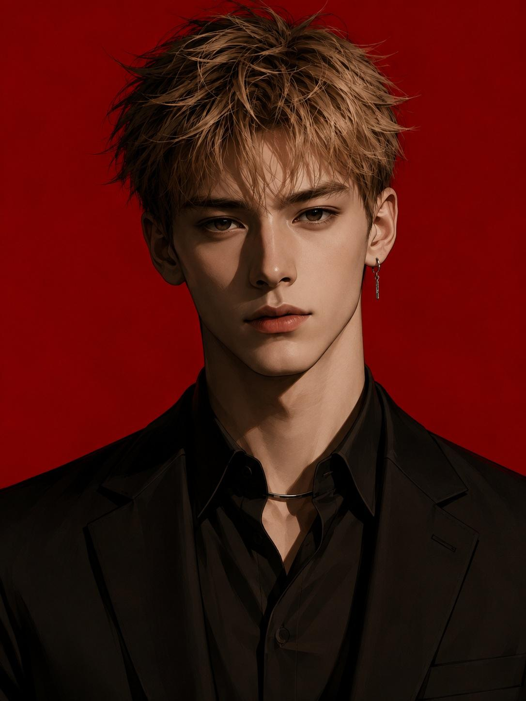

[← 返回全部 / Back]( ../README_zh.md )　|　[English](../README.md)

# No.46 · 红底暗黑 webtoon 插画 / Red-BG Dark Webtoon Illustration

`风格转绘 / Style Transfer`　`model: seedream-5.0-pro`

<div align="center">

 

</div>

## 📝 Prompt

```
A dark, urban digital illustration featuring a bold solid red background, dramatic high-contrast lighting, a cold piercing gaze, and a sophisticated modern suit.

2. Style DNA Priority

Must Preserve

- Bold solid red background
- Mid-distance bust composition showing the face and upper body with calm yet powerful presence
- Strong chiaroscuro with deep shadows and crisp highlights
- Sharp, cold, expressionless (or slightly tense) eyes and facial expression
- Modern tailored suit with refined urban elegance
- Clean digital illustration with sharp edges, smooth gradients, and painterly rendering

Preferred Elements

- Close-up composition focusing on the head and shoulders
- Detailed hair rendering and realistic strand texture
- Accessories such as necklaces, chokers, and drop earrings
- Dark overall palette accented with subtle red and brown shading

Optional Elements

- Hairstyle variations (braided hair, naturally flowing hair, etc.)
- Slight hair movement and subtle surface texture

Avoid Misinterpretation

- Ordinary fashion illustrations
- Romantic, fantasy, or exaggerated action poses
- Photorealistic style or documentary-style natural lighting
- Bright, soft pastel aesthetics

3. Core Style Analysis

Composition / Camera Distance

Bust to waist-up composition, centered frontal framing with the face and upper torso clearly visible.

Foreground / Midground / Background

Minimal foreground, character occupies the midground, flat solid red background.

Focus / Lens

Everything remains sharp without shallow depth of field. Crisp outlines and clean digital illustration aesthetics.

Lighting / Color

Strong directional lighting creates deep facial and body shadows. The red background subtly reflects into the skin shadows.

Color Grading

Dominant red background. Natural skin tones with brown and dark green shadow hues. Moist, glossy highlights.

Rendering Medium

High-quality digital painting with clean linework, smooth gradients, realistic anatomy but unmistakably illustrated rather than photographic.

Regional Visual Language

Strong East Asian modern webtoon / illustration influence.

Body Proportions

Near-realistic proportions with a slightly elongated face and refined fashion-illustration silhouette.

Iconic Pose

Direct frontal gaze, calm posture, stern and composed expression.

Costume

Black pinstripe or solid black suit, black shirt, optional black tie, leather choker or necklace, silver drop earrings.

Genre

Dark urban media art, modern webtoon, action/drama promotional illustration.

Expression

Cold, focused eyes with firm lips and restrained tension.

Camera Perspective

Mostly frontal with only a subtle elevated viewing angle.

Accent Colors

Solid red background contrasted by dark suits, black-brown hair, red hair tie, and silver metallic accessories.

Background

Completely flat monochrome red without additional objects.

Subject Emphasis

Single centered character with no surrounding figures.

Mood

Strong presence with an isolated, solemn atmosphere.

Surrealism

Maintain realistic tension without introducing bizarre or fantasy elements.

Object Scale

Necklace, choker, and earrings should remain true to realistic size.

Avoid Beautification

Do not make the character cute, romantic, or overly softened.

Medium Conversion Rule

Remain an illustration only. Eliminate photographic textures.

Linework

Clean, crisp line art with simplified color blocking and clear facial features.

Photorealism Prevention

Avoid natural skin texture, photographic lighting, and realistic camera rendering.

Frame Ratio

Vertical 2:3 or 3:4 composition focused from above the knees to the head.

Color Balance

Solid red background, brown and dark green shadows, natural cream highlights.

Color Restriction

Never shift toward pastel, blue, or yellow-dominant palettes.

Clothing

Dark suit, black shirt, tie or choker, necklace, silver drop earrings.

Motion

Static pose with only subtle natural hair movement.

4. Fixed Composition

[Subject] is positioned in the lower-middle center of a vertical frame, shown from above the knees to the top of the head in a bust composition, facing directly forward with sharp focus against a solid red background.

5. Fixed Lighting & Color Grading

Strong one-sided directional lighting creates deep shadows across the face and body. The solid red background subtly influences the skin tones while maintaining calm red hues with brown and dark green shadows.

6. Fixed Rendering

Maintain a clean digital illustration style with crisp edges, smooth color gradients, and no photorealistic texture.

7. Fixed Body Proportions

Near-realistic proportions with a slightly elongated face, elegant fashion-illustration styling, slim physique, and masculine sophistication.

8. Fixed Iconic Elements

Sharp eyes, cold expression, minimalist black suit, silver earrings, necklace, and choker remain defining features.

9. Fixed Expression

Maintain a cold, focused gaze with tense lips and a stern, composed facial expression.

10. Fixed Accent Colors & Accessories

Keep the red hair tie, silver drop earrings, metallic choker, and necklace at their original scale and placement.

11. Fixed Background

A completely flat solid red background with no additional objects or people.

12. Fixed Subject Hierarchy

Only one central character. No surrounding figures or crowds.

13. Fixed Mood

Maintain urban sophistication and restrained tension. Avoid cute, romantic, or whimsical moods.

14. Fixed Object Scale

Accessories such as the choker, earrings, and necklace should remain realistic in size and placement.

15. Fixed Medium Rule

Do not convert into photorealism. Preserve the clean digital illustration aesthetic without realistic skin texture or natural lighting.

16. Fixed Framing

Vertical 2:3 or 3:4 aspect ratio. The character occupies over 70% of the frame from above the knees to the head.

17. Fixed Color Distribution

Solid red background, brown and dark green shadows, natural cream highlights, maintaining an overall deep red palette.

18. Color Restriction

Strictly preserve the dominant red palette with brown-green shadows. Do not shift toward pastel, yellow, or blue color grading.

19. Main Prompt

"[Subject], centered in a vertical 2:3 composition, shown from above the knees to the head in a bust-style framing, facing directly forward with a cold and tense expression. Bold solid red background with dramatic brown and dark green shadows created by strong directional lighting. Clean digital illustration style with sharp outlines, smooth gradients, and refined East Asian modern webtoon aesthetics without photorealistic textures. Wearing a black pinstripe or solid black tailored suit with a black shirt, optional black tie or leather choker, silver drop earrings, and a necklace maintained at accurate size and placement. Sharp eyes with a calm, piercing gaze. Hair flows naturally with a red hair tie accent. Flat monochrome background with no foreground objects or surrounding people. Sophisticated urban atmosphere. No photographic rendering or bright pastel colors."

20. Negative Prompt

"photorealistic photography, natural lighting, soft focus, overexposure, pastel colors, yellow tint, blue tint, smiling expression, cute aesthetics, romance, exaggerated anime proportions, excessive skin texture, DSLR beauty lighting, realistic hair rendering, busy background, glossy clothing, sportswear, cartoon facial expressions, artificial multi-light studio setup, full-body shot, environmental background, watercolor, oil painting, distorted anatomy, fantasy atmosphere"

21. Style Keywords (12)

- Solid Red Background
- Digital Illustration
- Cold Gaze
- Dramatic Chiaroscuro
- Modern Tailored Suit
- Bust Composition
- Sharp Linework
- Urban Mood
- Choker & Necklace
- Silver Accessories
- East Asian Webtoon Style
- Stern Expression
```

**👤 出处 / Credit:** [@ChillaiKalan__](https://x.com/ChillaiKalan__) · [source](https://x.com/ChillaiKalan__/status/2076523680860151863)

▶️ **用 API 跑这条 / Run via API** → [Velokey](https://velokey.ai?sourceChannel=github-awesome-seedream) (`seedream-5.0-pro`)
