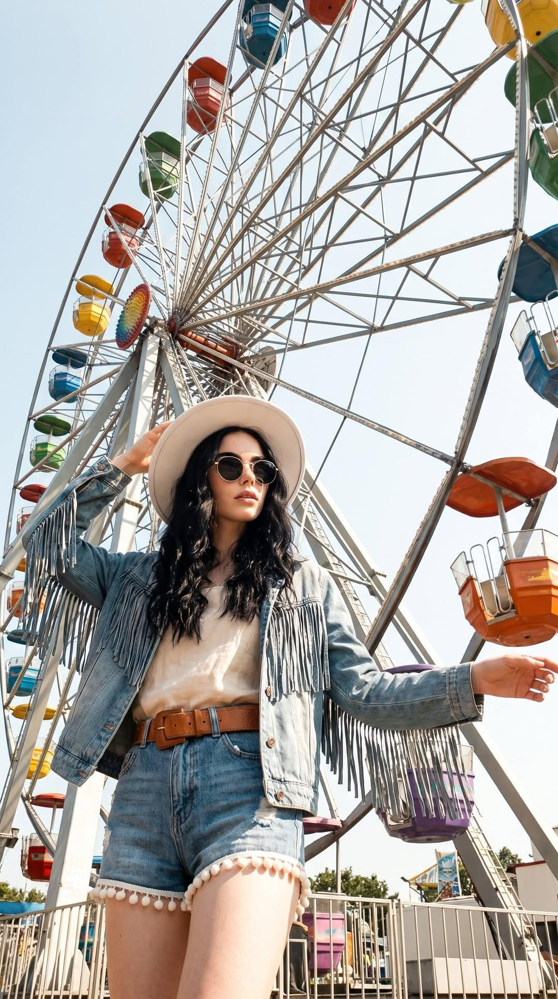

[← 返回全部 / Back]( ../README_zh.md )　|　[English](../README.md)

# No.47 · 摩天轮波西米亚夏日 / Ferris-Wheel Boho Summer

`人像与头像 / Portrait & Avatar`　`model: seedream-5.0-pro`

<div align="center">

 

</div>

## 📝 Prompt

```
Shot from a low-angle perspective. The woman is wearing a boho-chic outfit and standing in front of a giant Ferris wheel with colorful gondolas against a clear blue sky.
She is dressed in a light-colored crop top and shorts with pom-pom trim, layered with a fringed denim jacket, a wide leather belt, a white wide-brim hat, and round dark sunglasses. Her long wavy hair is loose.
She strikes a dynamic pose: one hand is holding the brim of her hat while the other is extended out to the side.
The background is filled with the metal spokes and framework of the Ferris wheel, with the colorful gondolas occupying much of the scene.
Realistic smartphone photo, taken on a hot summer day in bright direct sunlight, with warm color grading, slightly overexposed highlights, natural shadows, a strong sense of summer heat, natural-looking skin, subtle film grain, slightly sun-faded colors, and the feel of a candid, spontaneous snapshot.
The face, identity, appearance, age, and all unique characteristics of the person from the original photo must be preserved exactly. The person is not looking at the camera.
```

**👤 出处 / Credit:** [@ChillaiKalan__](https://x.com/ChillaiKalan__) · [source](https://x.com/ChillaiKalan__/status/2076205946674766094)

▶️ **用 API 跑这条 / Run via API** → [Velokey](https://velokey.ai?sourceChannel=github-awesome-seedream) (`seedream-5.0-pro`)
