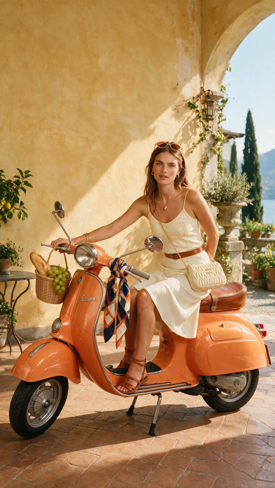

[← 返回全部 / Back]( ../README_zh.md )　|　[English](../README.md)

# No.6 · 湖边 Vespa 复古人像 / Lakeside Vespa Retro Portrait

`人像与头像 / Portrait & Avatar`　`model: seedream-5.0-pro`

<div align="center">

 

</div>

> 💡 对比 Nano Banana Pro

## 📝 Prompt

```
A straight-on medium-wide cinematic shot at eye-level, static locked frame, 4:5 vertical, captures a sun-bright late-morning inside a Lake Como villa courtyard room, camera perpendicular to the wall plane with no tilt, the atmosphere crisp and alive like the minute before heading out for gelato, the wall behind the scene a warm hand-troweled sable butter-yellow lime plaster slightly uneven with soft sun-bleach along the upper right edge, the floor matte burnt-terracotta chili tile grounding the frame, grout lines aged and dusty.

Centered lower in the frame, a fully restored 1965 Vespa Primavera in glossy melon-orange lacquer parked on its side stand parallel to the camera, full profile visible, polished chrome Vespa badge on the legshield catching light, round chrome headlamp glinting, chrome handlebars and mirrors, aged cognac brown leather saddle, a silk twill scarf in marine navy, chili orange, cream and cognac pattern loosely tied around the right handlebar with tails cascading down, a small wicker basket bag on the left handlebar spilling a baguette and green grapes.

The subject is a stunning World Cup beauty in her mid-twenties, with radiant sun-kissed skin and natural healthy glow, long silky dark chestnut brown hair loosely pulled into a soft low bun with gentle face-framing waves, striking hazel eyes with bright lively spark looking directly into the camera, high cheekbones, full lips in a soft warm cognac-rose shade with corners gently lifted in quiet joy. She is seated sideways on the Vespa saddle, body in a bright open three-quarter twist toward the camera, both legs crossed at the ankles on the same side, knees angled toward the lens, one hand resting lightly on the chrome handlebar, the other arm relaxed behind her on the rear of the saddle. Shoulders open and relaxed, natural breathing pose.

She wears a fitted cream football jersey with subtle gold embroidery and thin spaghetti straps, tucked into a flowing cream bias-cut midi skirt that falls mid-calf, a slim cognac leather belt at the waist, flat cognac leather Roman sandals with ankle ties, stack of thin gold bangles on one wrist, delicate gold chain with small gold-and-coral pendant, small gold hoop earrings. Miu Miu oval sunglasses with thin gold frames and warm cognac lenses pushed up on her head. A cream quilted Miu Miu matelassé crossbody bag with gold chain slung across her torso.

Natural skin texture with soft luminosity, gentle sheen on nose and lips, crisp morning sunlight, cinematic color grading, highly detailed, photorealistic, Slim Aarons style with modern World Cup energy.
```

**👤 出处 / Credit:** [@cso6709](https://x.com/cso6709) · [source](https://x.com/cso6709/status/2075046425277399261)

▶️ **用 API 跑这条 / Run via API** → [Velokey](https://velokey.ai?sourceChannel=github-awesome-seedream) (`seedream-5.0-pro`)
