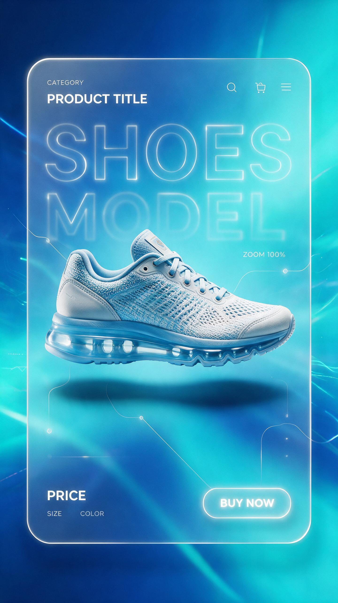

[← 返回全部 / Back]( ../README_zh.md )　|　[English](../README.md)

# No.8 · 未来运动鞋电商广告 / Futuristic Sneaker E-commerce Ad

`产品与质感 / Product & Materials`　`model: seedream-5.0-pro`

<div align="center">

 

</div>

## 📝 Prompt

```
Ultra-realistic premium sports footwear commercial advertisement featuring a modern running shoe floating horizontally at the center of a futuristic cyan and deep blue gradient background. The sneaker is displayed in a clean side profile with ultra-detailed breathable knit mesh texture, glossy air-cushion sole, realistic stitching, premium materials, and crisp branding. Soft cinematic studio lighting creates realistic reflections, shadows, and depth.

The composition is designed as a futuristic e-commerce product showcase inside a rounded glass-inspired interface with glowing white borders and translucent frosted panels. Large semi-transparent typography spelling the shoe model fills the background, creating depth without overpowering the product.

Minimal modern UI elements surround the shoe, including elegant category labels, product title, search icon, shopping bag icon, menu icon, zoom percentage indicator connected by thin curved lines, price tag, size selector, color option, and a glowing rounded “BUY NOW” button. Add subtle neon cyan highlights, holographic interface accents, floating particles, soft bloom, and glassmorphism effects.

Use a premium blue color palette with turquoise gradients, high-end sports branding aesthetics, luxury product presentation, Apple-inspired minimalism, futuristic web UI, perfect spacing, clean typography, ultra-sharp details, cinematic lighting, soft ambient glow, 3D depth, photorealistic textures, commercial advertising quality, Behance award-winning layout, 8K, HDR, octane render, Unreal Engine, global illumination, ray-traced reflections, ultra-realistic product photography.
```

**👤 出处 / Credit:** [@iamrealsnow](https://x.com/iamrealsnow) · [source](https://x.com/iamrealsnow/status/2075063569486598281)

▶️ **用 API 跑这条 / Run via API** → [Velokey](https://velokey.ai?sourceChannel=github-awesome-seedream) (`seedream-5.0-pro`)
