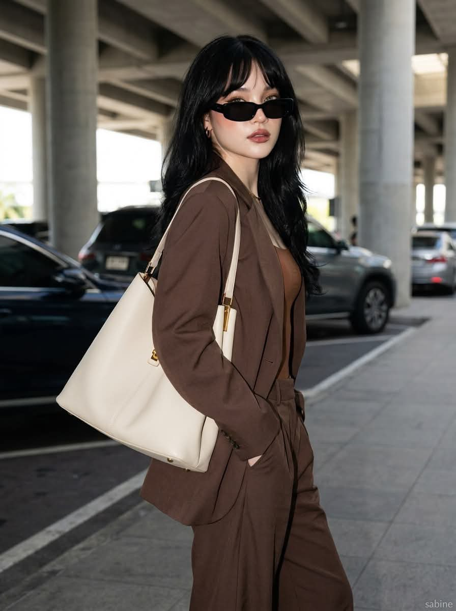

[← 返回全部 / Back]( ../README_zh.md )　|　[English](../README.md)

# No.9 · 静奢风街拍时尚 / Quiet-Luxury Street Fashion

`人像与头像 / Portrait & Avatar`　`model: seedream-5.0-pro`

<div align="center">

 

</div>

## 📝 Prompt

```
A stylish young woman with long layered black hair and soft curtain bangs, wearing sleek black rectangular sunglasses, an oversized chocolate-brown tailored blazer with matching wide-leg trousers, and a fitted mocha-brown camisole. She carries a large structured ivory leather tote bag with gold hardware over one shoulder. Standing confidently with one hand in her pocket, looking back over her shoulder. Shot in a modern open-air parking structure beneath a concrete overpass, with parked cars softly blurred in the background. Natural midday sunlight creates soft shadows and clean highlights. Minimalist luxury aesthetic, quiet luxury fashion, effortless street style, neutral earth-tone color palette, premium editorial photography, shallow depth of field, ultra-realistic skin texture, subtle makeup with glossy nude lips, high-end fashion campaign, cinematic composition, 85mm lens, f/2.0, soft bokeh, crisp focus, HDR, RAW, 8K, Vogue-style luxury editorial.
```

**👤 出处 / Credit:** [@ChillaiKalan__](https://x.com/ChillaiKalan__) · [source](https://x.com/ChillaiKalan__/status/2075071088137208063)

▶️ **用 API 跑这条 / Run via API** → [Velokey](https://velokey.ai?sourceChannel=github-awesome-seedream) (`seedream-5.0-pro`)
